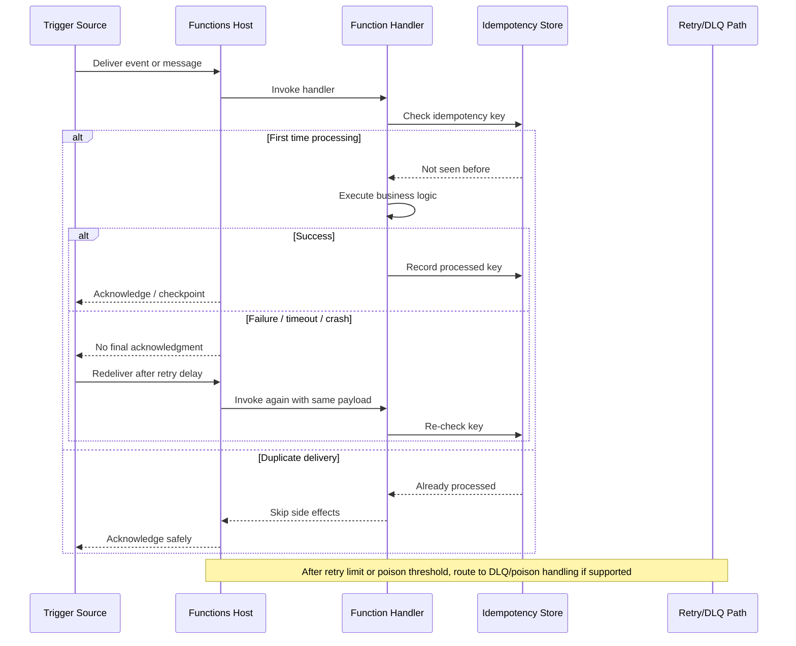

# Delivery Guarantees

Azure Functions does not give every trigger the same delivery contract. The practical question is not just "will my function run?" but also **how many times**, **in what order**, and **what happens after failure**. This page summarizes the most common trigger semantics so you can design for the real operational contract instead of assuming exactly-once behavior.

## Guarantee model in practice

### At-least-once

At-least-once means the platform will try hard not to lose work, even if that means the same event or message can be delivered more than once. Most event and message-driven triggers behave this way.

Use this mental model:

- Success acknowledges the event.
- Failure, timeout, lock loss, or host crash can cause redelivery.
- Your handler must tolerate duplicates.

### At-most-once

At-most-once means the platform does not intentionally redeliver on failure. You may miss work if the caller or upstream producer does not retry. HTTP-triggered functions are usually closest to this model because retry behavior is owned by the client, API gateway, or upstream system.

### Exactly-once

Exactly-once is usually a system-level goal, not a default trigger guarantee. In Azure Functions, you normally approximate it with:

- idempotent writes
- deduplication keys
- transactional outbox/inbox patterns
- external state that records "already processed"

That is why production guidance usually aims for **effectively-once** rather than literal exactly-once delivery.

## Trigger guarantee cheat sheet

| Trigger type | Typical delivery guarantee | Ordering guarantee | Retry behavior |
| --- | --- | --- | --- |
| HTTP | At-most-once from the Functions host perspective; caller may retry independently | Caller-controlled only | No host-managed event replay; retries usually come from clients, APIM, or upstream webhooks |
| Timer | At-least-once-ish for scheduled execution windows, but missed or delayed runs can happen during downtime | Chronological by schedule, not strict under outage/restart conditions | Monitor-based scheduling can attempt to catch up; code should tolerate overlap or delayed execution |
| Queue Storage | At-least-once | No strict ordering guarantee once scaled out; approximate FIFO per queue visibility pattern only | Failed messages reappear after visibility timeout; poison queue after max dequeue count |
| Blob | At-least-once | No strict ordering guarantee across blob arrivals | Retries depend on trigger source and storage polling/event processing; duplicate processing is possible |
| Event Grid | At-least-once | No ordering guarantee | Event Grid retries with backoff until delivery succeeds or retry policy expires/dead-letters |
| Service Bus | At-least-once by default; broker features can reduce duplicates but not erase them entirely | Queue/topic ordering only within entity/session constraints | Abandon, lock expiry, or failure causes redelivery; DLQ after max delivery count |
| Event Hub | At-least-once | Ordered within a partition, not across partitions | Checkpoint advances only after successful processing path; failures can replay a batch from last checkpoint |
| Cosmos DB Change Feed | At-least-once | Ordered within a logical partition feed range, not globally | Lease/checkpoint model can replay changes after failure or rebalancing |
| SignalR | At-most-once-ish for outbound notifications unless your app adds persistence/replay | No durable ordering guarantee across connections | Failed sends are usually application-level concerns; use durable backing store if delivery confirmation matters |
| SQL | At-least-once for change-driven processing patterns | Ordered within tracked change sequence, but not guaranteed as a global application ordering contract | Change tracking/checkpoint behavior can cause replay after restart; deduplication may still be required |

## At-least-once delivery flow

## How to get effectively-once processing

Exactly-once is rare; effectively-once is achievable.

### 1. Use stable idempotency keys

Derive a deterministic key from the business operation, not from transient runtime metadata.

Good examples:

- payment provider event ID
- upstream order ID plus event type
- file path plus content hash or ETag

### 2. Record processed work before repeating side effects

Store the operation key in a durable database, cache, or inbox table so retries can short-circuit duplicate work.

### 3. Make writes idempotent where possible

Prefer upsert, merge, conditional write, or compare-and-set semantics over blind inserts.

### 4. Separate transport retries from business retries

Transport retries are about delivery. Business retries are about domain failures such as a partner API returning `429` or `503`. Keep those concerns visible and bounded separately.

### 5. Expect reordering when scale-out happens

Ordering and delivery are different guarantees. If order matters, partition by key, use sessions where available, or route all related work through the same orchestrated path.

## Design tips by trigger family

- **HTTP**: return clear retry-safe status codes and require client-supplied idempotency keys for non-idempotent operations.
- **Queue / Service Bus**: assume duplicate delivery and move non-recoverable payloads to poison or dead-letter handling.
- **Event Hub / Cosmos DB Change Feed**: checkpoint only after downstream state is safe to replay.
- **Blob / Event Grid**: treat object metadata and event IDs as deduplication inputs.
- **Timer**: ensure recurring jobs are safe if delayed, overlapped, or run again after recovery.

## Related Links

- Azure Functions error handling and retries: https://learn.microsoft.com/azure/azure-functions/functions-bindings-error-pages
- HTTP trigger and bindings: https://learn.microsoft.com/azure/azure-functions/functions-bindings-http-webhook-trigger
- Timer trigger and bindings: https://learn.microsoft.com/azure/azure-functions/functions-bindings-timer
- Queue Storage trigger and bindings: https://learn.microsoft.com/azure/azure-functions/functions-bindings-storage-queue
- Blob trigger and bindings: https://learn.microsoft.com/azure/azure-functions/functions-bindings-storage-blob-trigger
- Event Grid trigger and bindings: https://learn.microsoft.com/azure/azure-functions/functions-bindings-event-grid-trigger
- Service Bus trigger and bindings: https://learn.microsoft.com/azure/azure-functions/functions-bindings-service-bus-trigger
- Event Hubs trigger and bindings: https://learn.microsoft.com/azure/azure-functions/functions-bindings-event-hubs-trigger
- Cosmos DB trigger and bindings: https://learn.microsoft.com/azure/azure-functions/functions-bindings-cosmosdb-v2-trigger
- Azure SignalR Service bindings for Azure Functions: https://learn.microsoft.com/azure/azure-functions/functions-bindings-signalr-service
- Azure SQL bindings for Azure Functions: https://learn.microsoft.com/azure/azure-functions/functions-bindings-azure-sql
