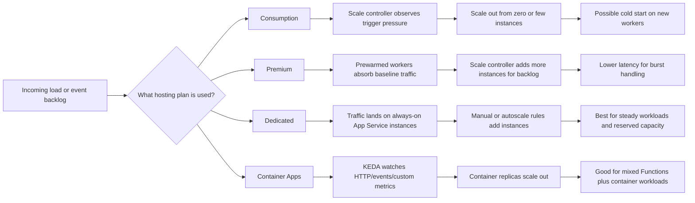

# Hosting Plans and Scale

Azure Functions can run on multiple hosting options, each with different scale behavior, latency, networking, and cost trade-offs. The right plan depends less on language preference and more on workload shape: bursty versus steady traffic, private networking needs, timeout tolerance, and whether you want a pure Functions hosting model or a broader container platform.

## Hosting plans at a glance

| Plan | Scale behavior | Max instances | Timeout | Cold start | VNet | Price model |
| --- | --- | --- | --- | --- | --- | --- |
| Consumption | Event-driven automatic scale from zero | Platform-managed, dynamic regional limits | Default 5 min, configurable up to 10 min for many triggers | Most likely | Limited compared with Premium; not the default choice for private networking-heavy workloads | Pay per execution and GB-seconds |
| Premium | Prewarmed workers plus event-driven scale-out | Platform-managed, higher scale envelope than Consumption | No 10-minute execution cap for standard function execution model | Reduced with prewarmed instances | Yes | Pay for allocated cores/memory and running instances |
| Dedicated (App Service) | Manual or autoscale on fixed App Service plan instances | Depends on App Service plan SKU | No Functions-specific execution timeout cap like Consumption | Minimal if always on | Yes | Pay for reserved App Service instances |
| Container Apps | KEDA-driven scale based on HTTP, events, and custom signals | Configurable within Container Apps environment limits | Container-app-managed request/job/runtime limits rather than classic Functions plan caps | Depends on min replicas and image startup | Yes | Pay for vCPU/memory usage and active replicas |

## Event-driven scaling model

## When to use each plan

### Consumption

Choose Consumption when:

- traffic is bursty or unpredictable
- cost efficiency at low utilization matters most
- short-lived event processing is the norm
- occasional cold start is acceptable

Avoid making it your default when you require long execution windows, predictable low latency, or deep private networking from day one.

### Premium

Choose Premium when:

- you need lower cold-start risk
- you need VNet integration and enterprise networking features
- workloads run longer or keep more memory warm
- you want event-driven scale without the tighter execution envelope of Consumption

Premium is often the safest default for production apps with strict latency or networking requirements.

### Dedicated

Choose Dedicated when:

- workload is steady enough that reserved capacity is economical
- you already standardize on App Service plans
- always-on behavior matters more than scale-to-zero savings
- you want explicit instance control and autoscale rules

Dedicated fits teams that prefer predictable reserved infrastructure over pure serverless elasticity.

### Container Apps

Choose Container Apps when:

- you need Functions plus sidecars, custom containers, or mixed microservices
- KEDA-based scaling across many event sources is attractive
- container-level control is more important than sticking to classic Functions hosting
- your app may grow beyond the Functions-only operational model

Container Apps is especially useful when Azure Functions is just one piece of a broader containerized architecture.

## Decision guide

| If your main requirement is... | Start with... | Why |
| --- | --- | --- |
| Lowest cost for sporadic traffic | Consumption | Best pay-per-use profile and scale-to-zero behavior. |
| Reduced cold starts with serverless scale | Premium | Prewarmed instances improve latency while keeping elastic scale. |
| Predictable reserved compute | Dedicated | Stable always-on capacity with App Service autoscale controls. |
| Functions inside a container-first platform | Container Apps | Strong fit for KEDA scaling, custom images, and mixed workloads. |
| Private networking plus event-driven scale | Premium | Usually the most balanced Functions-native choice. |
| Long-running or specialized containerized workers | Container Apps | Better match when you need broader container platform features. |

## Practical scale guidance

- Scale behavior depends on the **trigger type** as much as the plan. Queue backlog, partition ownership, and HTTP concurrency all influence instance count.
- Cold start matters most for **latency-sensitive HTTP** workloads. It matters less for buffered queue or stream processing.
- Max instances are best treated as **platform-controlled ceilings**, not precise architectural promises. Design for partitioning, idempotency, and retry behavior even when scale is high.
- If your app depends on private endpoints, hybrid connectivity, or consistently warm workers, narrow your choice quickly toward **Premium**, **Dedicated**, or **Container Apps**.

## Related Links

- Azure Functions hosting options: https://learn.microsoft.com/azure/azure-functions/functions-scale
- Azure Functions scale and hosting comparison: https://learn.microsoft.com/azure/azure-functions/functions-scale#overview-of-plans
- Azure Container Apps hosting for Azure Functions: https://learn.microsoft.com/azure/azure-functions/functions-container-apps-hosting
