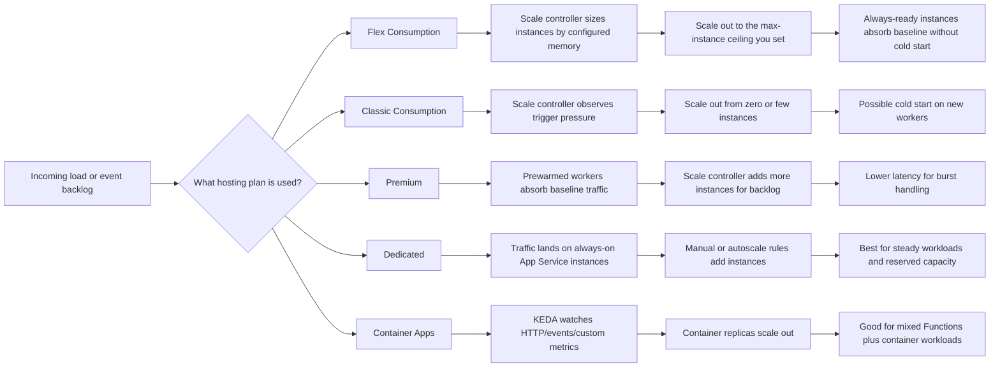

# Hosting Plans and Scale

Azure Functions can run on multiple hosting options, each with different scale behavior, latency, networking, and cost trade-offs. The right plan depends less on language preference and more on workload shape: bursty versus steady traffic, private networking needs, timeout tolerance, and whether you want a pure Functions hosting model or a broader container platform.

!!! tip "Start with Flex Consumption"
    **Flex Consumption is the recommended plan for new Python function apps.** It keeps
    scale-to-zero pricing while adding per-instance memory sizing, an explicit concurrency and
    max-instance ceiling, and VNet integration, which is what previously forced teams onto Premium.

    The **classic Linux Consumption** plan is on its way out: it retires on
    **30 September 2028**, receives no Python versions after 3.12, and should be treated as
    migrate-away rather than a default. See
    [Azure Functions supported languages](https://learn.microsoft.com/azure/azure-functions/supported-languages)
    for the current runtime support matrix.

## Hosting plans at a glance

| Plan | Scale behavior | Max instances | Timeout | Cold start | VNet | Price model |
| --- | --- | --- | --- | --- | --- | --- |
| **Flex Consumption** (recommended) | Event-driven scale from zero with per-instance concurrency control | Configurable ceiling you set per app | Default 30 min, configurable; no hard 10-minute cap | Reduced; optional always-ready instances remove it for a baseline | Yes | Pay per execution and GB-seconds, plus any always-ready instances |
| Consumption (classic Linux, retiring 30 Sep 2028) | Event-driven automatic scale from zero | Platform-managed, dynamic regional limits | Default 5 min, configurable up to 10 min for many triggers | Most likely | Limited compared with Premium; not the default choice for private networking-heavy workloads | Pay per execution and GB-seconds |
| Premium | Prewarmed workers plus event-driven scale-out | Platform-managed, higher scale envelope than Consumption | No 10-minute execution cap for standard function execution model | Reduced with prewarmed instances | Yes | Pay for allocated cores/memory and running instances |
| Dedicated (App Service) | Manual or autoscale on fixed App Service plan instances | Depends on App Service plan SKU | No Functions-specific execution timeout cap like Consumption | Minimal if always on | Yes | Pay for reserved App Service instances |
| Container Apps | KEDA-driven scale based on HTTP, events, and custom signals | Configurable within Container Apps environment limits | Container-app-managed request/job/runtime limits rather than classic Functions plan caps | Depends on min replicas and image startup | Yes | Pay for vCPU/memory usage and active replicas |

## Event-driven scaling model

```mermaid
flowchart LR
    A[Incoming load or event backlog] --> B{What hosting plan is used?}

    B --> G[Flex Consumption]
    B --> C[Classic Consumption]
    B --> D[Premium]
    B --> E[Dedicated]
    B --> F[Container Apps]

    G --> G1[Scale controller sizes instances by configured memory]
    G1 --> G2[Scale out to the max-instance ceiling you set]
    G2 --> G3[Always-ready instances absorb baseline without cold start]

    C --> C1[Scale controller observes trigger pressure]
    C1 --> C2[Scale out from zero or few instances]
    C2 --> C3[Possible cold start on new workers]

    D --> D1[Prewarmed workers absorb baseline traffic]
    D1 --> D2[Scale controller adds more instances for backlog]
    D2 --> D3[Lower latency for burst handling]

    E --> E1[Traffic lands on always-on App Service instances]
    E1 --> E2[Manual or autoscale rules add instances]
    E2 --> E3[Best for steady workloads and reserved capacity]

    F --> F1[KEDA watches HTTP/events/custom metrics]
    F1 --> F2[Container replicas scale out]
    F2 --> F3[Good for mixed Functions plus container workloads]
```

## When to use each plan

### Flex Consumption

Choose Flex Consumption when:

- you are starting a new Python function app (this is the default answer)
- you want scale-to-zero pricing but also want to cap concurrency and instance count
- you need VNet integration without paying for an always-on Premium plan
- you want per-instance memory sizing (512 MB, 2048 MB, or 4096 MB) to match the workload
- you want to keep a small always-ready pool to remove cold start on the hot path

Flex Consumption supersedes classic Linux Consumption for new work. Provisioning differs:
the runtime, scale, and deployment settings live in `properties.functionAppConfig` rather than in
app settings. See the [Flex Consumption Bicep snippet](../guides/iac-snippets.md#bicep-flex-consumption-http-function-app-recommended).

### Consumption (classic Linux)

!!! warning "Retiring 30 September 2028"
    Classic Linux Consumption receives no Python versions beyond 3.12 and retires on
    30 September 2028. Keep it only for existing apps and plan a migration to Flex Consumption.

Choose classic Consumption when:

- traffic is bursty or unpredictable
- cost efficiency at low utilization matters most
- short-lived event processing is the norm
- occasional cold start is acceptable

Avoid making it your default: for a new app, Flex Consumption gives you the same scale-to-zero pricing with longer execution windows, a current Python runtime, and private networking.

### Premium

Choose Premium when:

- you need lower cold-start risk
- you need VNet integration and enterprise networking features
- workloads run longer or keep more memory warm
- you want event-driven scale without the tighter execution envelope of Consumption

Premium still fits apps that need prewarmed instances with full App Service networking features, but check Flex Consumption first: it now covers VNet integration and always-ready instances at serverless pricing.

### Dedicated

Choose Dedicated when:

- workload is steady enough that reserved capacity is economical
- you already standardize on App Service plans
- always-on behavior matters more than scale-to-zero savings
- you want explicit instance control and autoscale rules

Dedicated fits teams that prefer predictable reserved infrastructure over pure serverless elasticity.

### Container Apps

Choose Container Apps when:

- you need Functions plus sidecars, custom containers, or mixed microservices
- KEDA-based scaling across many event sources is attractive
- container-level control is more important than sticking to classic Functions hosting
- your app may grow beyond the Functions-only operational model

Container Apps is especially useful when Azure Functions is just one piece of a broader containerized architecture.

## Decision guide

| If your main requirement is... | Start with... | Why |
| --- | --- | --- |
| A new Python function app, no special constraints | Flex Consumption | The current default: scale to zero, current runtimes, configurable scale ceiling. |
| Lowest cost for sporadic traffic | Flex Consumption | Pay-per-use with scale-to-zero, without the classic Consumption limits. |
| Reduced cold starts with serverless scale | Flex Consumption (always-ready instances) | Keeps a warm baseline without moving to a Premium plan. |
| Private networking plus event-driven scale | Flex Consumption | VNet integration is built in; Premium is only needed for App Service specific features. |
| Predictable reserved compute | Dedicated | Stable always-on capacity with App Service autoscale controls. |
| Functions inside a container-first platform | Container Apps | Strong fit for KEDA scaling, custom images, and mixed workloads. |
| Long-running or specialized containerized workers | Container Apps | Better match when you need broader container platform features. |
| An existing app on classic Linux Consumption | Plan a Flex Consumption migration | Classic Linux Consumption retires 30 September 2028. |

## Practical scale guidance

- Scale behavior depends on the **trigger type** as much as the plan. Queue backlog, partition ownership, and HTTP concurrency all influence instance count.
- Cold start matters most for **latency-sensitive HTTP** workloads. It matters less for buffered queue or stream processing.
- Max instances are best treated as **platform-controlled ceilings**, not precise architectural promises. Design for partitioning, idempotency, and retry behavior even when scale is high.
- If your app depends on private endpoints, hybrid connectivity, or consistently warm workers, narrow your choice quickly toward **Flex Consumption** (VNet plus always-ready instances), then **Premium**, **Dedicated**, or **Container Apps**.

## Related Links

- Azure Functions hosting options: https://learn.microsoft.com/azure/azure-functions/functions-scale
- Flex Consumption plan: https://learn.microsoft.com/azure/azure-functions/flex-consumption-plan
- Create and manage a Flex Consumption app: https://learn.microsoft.com/azure/azure-functions/flex-consumption-how-to
- Migrate from Consumption to Flex Consumption: https://learn.microsoft.com/azure/azure-functions/migration/migrate-plan-consumption-to-flex
- Azure Functions supported languages and runtime support dates: https://learn.microsoft.com/azure/azure-functions/supported-languages
- Azure Container Apps hosting for Azure Functions: https://learn.microsoft.com/azure/azure-functions/functions-container-apps-hosting

## Related pages

- [IaC Reference Snippets](../guides/iac-snippets.md)
- [Deployment Patterns](../guides/deployment-patterns.md)
