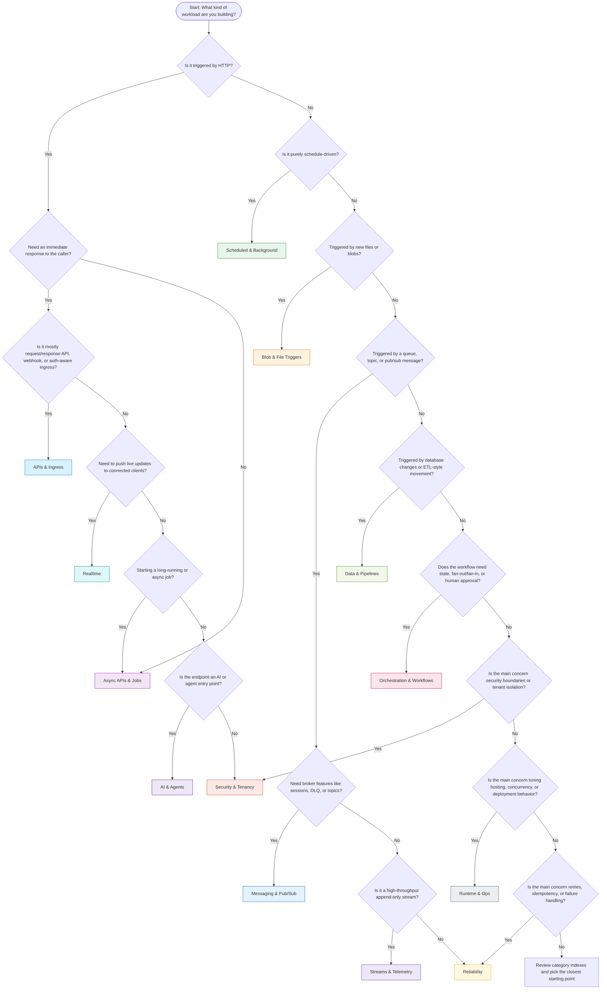

# Pattern Chooser

Use this page when you know the workload shape you need, but not yet which cookbook category to start with. The goal is not to force one "correct" design for every app. It is to narrow the first category to explore based on trigger shape, latency expectations, statefulness, and operational needs.

## Decision flow

## Category summary

| Use case | Recommended category | Why it fits |
| --- | --- | --- |
| Public HTTP APIs, internal APIs, webhook ingress | [APIs & Ingress](../patterns/apis-and-ingress/index.md) | Best starting point for request/response entry points and signed inbound calls. |
| Cron jobs, periodic cleanup, recurring sync work | [Scheduled & Background](../patterns/scheduled-and-background/index.md) | Timer-driven functions with no external caller. |
| Process uploaded files, image transforms, blob lifecycle events | [Blob & File Triggers](../patterns/blob-and-file-triggers/index.md) | Storage-native event handling for object changes. |
| Return `202 Accepted`, track jobs, poll for status later | [Async APIs & Jobs](../patterns/async-apis-and-jobs/index.md) | Separates synchronous ingress from background execution. |
| Queue workers, topic subscribers, broker-backed commands | [Messaging & Pub/Sub](../patterns/messaging-and-pubsub/index.md) | Best for buffered work, DLQ support, and decoupled producers/consumers. |
| Telemetry ingestion, append-only event streams, consumer groups | [Streams & Telemetry](../patterns/streams-and-telemetry/index.md) | Optimized for high-volume ordered event streams. |
| Change feed processors, ETL, data movement, enrichment | [Data & Pipelines](../patterns/data-and-pipelines/index.md) | Starts from database changes or pipeline-style transformation. |
| Multi-step durable workflows, approvals, fan-out/fan-in | [Orchestration & Workflows](../patterns/orchestration-and-workflows/index.md) | Use when state, checkpoints, and resumability matter. |
| Idempotency, retries, poison handling, safe reprocessing | [Reliability](../patterns/reliability/index.md) | Focuses on cross-trigger failure handling patterns. |
| Managed identity, tenant boundaries, auth isolation | [Security & Tenancy](../patterns/security-and-tenancy/index.md) | Use when access control and blast-radius boundaries drive design. |
| Blueprint structure, host tuning, concurrency, operational knobs | [Runtime & Ops](../patterns/runtime-and-ops/index.md) | Use when runtime behavior and deployment mechanics are the main concern. |
| Server push, connected clients, live dashboards, notifications | [Realtime](../patterns/realtime/index.md) | Best fit for low-latency outbound updates to active clients. |
| LLM workflows, agent tools, MCP, retrieval-oriented endpoints | [AI & Agents](../patterns/ai-and-agents/index.md) | Use when the function app hosts model- or agent-centric behavior. |

## Quick chooser by workload signal

| If you are asking... | Start here |
| --- | --- |
| "How do I expose an endpoint?" | [APIs & Ingress](../patterns/apis-and-ingress/index.md) |
| "How do I run this every hour?" | [Scheduled & Background](../patterns/scheduled-and-background/index.md) |
| "How do I react to a file landing in storage?" | [Blob & File Triggers](../patterns/blob-and-file-triggers/index.md) |
| "How do I accept a request now and finish later?" | [Async APIs & Jobs](../patterns/async-apis-and-jobs/index.md) |
| "How do I buffer work behind a queue or topic?" | [Messaging & Pub/Sub](../patterns/messaging-and-pubsub/index.md) |
| "How do I consume a firehose of events?" | [Streams & Telemetry](../patterns/streams-and-telemetry/index.md) |
| "How do I process database changes downstream?" | [Data & Pipelines](../patterns/data-and-pipelines/index.md) |
| "How do I coordinate many steps safely?" | [Orchestration & Workflows](../patterns/orchestration-and-workflows/index.md) |
| "How do I avoid duplicate side effects?" | [Reliability](../patterns/reliability/index.md) |
| "How do I remove secrets and isolate tenants?" | [Security & Tenancy](../patterns/security-and-tenancy/index.md) |
| "How do I tune scale, cold start, or host behavior?" | [Runtime & Ops](../patterns/runtime-and-ops/index.md) |
| "How do I push updates to browsers or apps in real time?" | [Realtime](../patterns/realtime/index.md) |
| "How do I host tool-calling or agent workflows?" | [AI & Agents](../patterns/ai-and-agents/index.md) |

## Practical guidance

- Start with the category that matches the **trigger or interaction boundary**, not the internal implementation detail.
- If two categories fit, begin with the one that defines the **entry point**. Example: HTTP request that starts queue work usually starts in **Async APIs & Jobs**, then links into **Messaging & Pub/Sub**.
- Add **Reliability** and **Runtime & Ops** as second-pass reading for almost every production design.
- Add **Security & Tenancy** whenever identity, tenant partitioning, or managed identity changes the architecture.

## Related Links

- Azure Functions overview: https://learn.microsoft.com/azure/azure-functions/functions-overview
- Azure Functions triggers and bindings concepts: https://learn.microsoft.com/azure/azure-functions/functions-triggers-bindings
- Choose between Azure messaging services: https://learn.microsoft.com/azure/service-bus-messaging/compare-messaging-services
