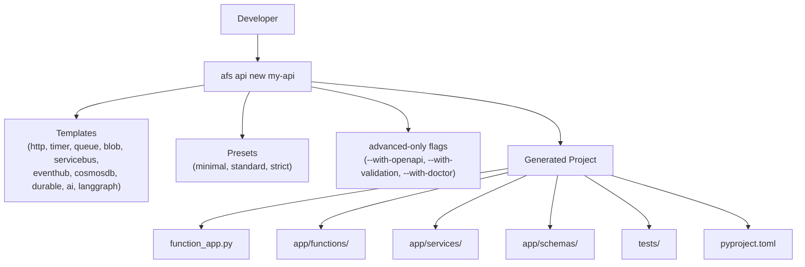

# Scaffold Quick Start

## Overview
`azure-functions-scaffold` (CLI name: `afs`) generates production-ready Azure Functions
Python v2 projects in one command.
It creates the full project layout, `function_app.py`, `host.json`, service modules,
schemas, tests, and tooling config, so you can start writing business logic immediately.

The CLI is organised around four task-oriented command groups plus a power-user group:

| Group | What it builds | Entry command |
| --- | --- | --- |
| `afs api` | REST API project (HTTP template) with OpenAPI, validation, and doctor pre-wired | `afs api new my-api` |
| `afs worker` | Background worker project for one trigger type | `afs worker queue my-worker` |
| `afs ai` | LangGraph agent project | `afs ai agent my-agent` |
| `afs advanced` | Any template plus explicit feature flags | `afs advanced new my-app --template timer` |

`afs new` is a shortcut for `afs api new`.

!!! warning "Renamed commands"
    `afs add` and `afs profiles` still exist but are deprecated. Use `afs api add`
    (HTTP functions) or `afs advanced add <trigger>` instead of `afs add`, and
    `afs presets` instead of `afs profiles`. There is no `--profile` flag and no
    `--with-db` flag: run `afs --help` to confirm the options your installed
    version exposes.

## When to Use
- You are starting a new Azure Functions project and want a proven layout.
- You want pre-wired integrations with the Azure Functions Python DX Toolkit.
- You need to add new triggers to an existing scaffolded project.

## Architecture


## Prerequisites
- Python 3.11–3.14 (`>=3.11,<3.15`)
- pip

```bash
pip install azure-functions-scaffold
afs --version
```

The PyPI distribution is `azure-functions-scaffold`; the source repository is
[`azure-functions-scaffold-python`](https://github.com/yeongseon/azure-functions-scaffold-python).

## Templates

`afs templates` prints the live list. As of scaffold `0.9.1`:

| Template | Use Case | Command |
| --- | --- | --- |
| http | REST APIs, webhooks | `afs api new my-api` |
| timer | Scheduled tasks, cron | `afs worker timer my-job` |
| queue | Storage Queue message processing | `afs worker queue my-worker` |
| blob | File processing | `afs worker blob my-blob` |
| servicebus | Enterprise messaging | `afs worker servicebus my-bus` |
| eventhub | Stream ingestion | `afs worker eventhub my-stream` |
| cosmosdb | Change feed processing | `afs advanced new my-feed --template cosmosdb` |
| durable | Durable Functions orchestrations | `afs advanced new my-flow --template durable` |
| ai | Azure OpenAI application | `afs advanced new my-ai --template ai` |
| langgraph | LangGraph agent deployment | `afs ai agent my-agent` |

## Presets

Presets choose the quality tooling wired into `pyproject.toml`. Run `afs presets`
for the live list:

| Preset | Tooling |
| --- | --- |
| `minimal` | none |
| `standard` | Ruff, pytest |
| `strict` | Ruff, mypy, pytest |

`afs api new` applies the `strict` preset and enables OpenAPI, validation, and doctor.
`afs worker *` and `afs ai agent` apply `standard`. Only `afs advanced new` lets you
pick a preset explicitly with `--preset`.

## Project Structure

`afs api new my-api` generates:

```text
my-api/
|- function_app.py             # Azure Functions v2 entrypoint
|- host.json                   # Runtime configuration
|- local.settings.json.example
|- pyproject.toml              # Dependencies and tooling config
|- requirements.txt
|- Makefile
|- .funcignore
|- app/
|  |- core/
|  |  |- config.py             # Settings read from environment variables
|  |  `- logging.py            # Structured JSON logging
|  |- dependencies/
|  |- functions/
|  |  |- health.py             # Health probe (Blueprint)
|  |  `- webhooks.py           # Inbound webhook route (Blueprint)
|  |- schemas/
|  |  |- health.py
|  |  `- webhooks.py           # Request/response models
|  `- services/
|     |- health_service.py
|     `- webhook_service.py    # Business logic
`- tests/
   |- test_health.py
   `- test_webhooks.py         # Pytest tests
```

## Implementation

**Create a REST API project (OpenAPI + validation + doctor, `strict` preset):**

```bash
afs api new my-api
# or the shortcut
afs new my-api
```

**Create a background worker:**

```bash
afs worker queue my-worker
afs worker timer my-job
afs worker blob my-blob
afs worker servicebus my-bus
afs worker eventhub my-stream
```

**Create a LangGraph agent project:**

```bash
afs ai agent my-agent
```

**Pick template, preset, and features explicitly:**

```bash
afs advanced new my-api \
  --template http \
  --preset strict \
  --with-openapi \
  --with-validation \
  --with-doctor
```

Other `afs advanced new` options worth knowing: `--python-version` (default `3.12`),
`--git`, `--github-actions`, `--azd`, `--destination`, `--dry-run`, and `--overwrite`
(which needs `-y` in a non-interactive shell).

### Expand an Existing Project

Add an HTTP function, a plain route, or a full CRUD resource to an API project:

```bash
afs api add get-user --project-root ./my-api
afs api add-route status --project-root ./my-api
afs api add-resource products --project-root ./my-api
```

Add any trigger type to any scaffolded project:

```bash
afs advanced add timer cleanup --project-root ./my-api
afs advanced add queue sync-jobs --project-root ./my-api
afs advanced add durable order-flow --project-root ./my-api
```

Supported `afs advanced add` triggers: `http`, `timer`, `queue`, `blob`, `servicebus`,
`eventhub`, `cosmosdb`, `durable`, `ai`.

Preview what will be generated:

```bash
afs api add get-user --project-root ./my-api --dry-run
```

## Run Locally
```bash
afs api new my-api
cd my-api
python -m venv .venv
source .venv/bin/activate
pip install -e .[dev]
func start
```

## Expected Output
```text
Functions:

    health: [GET] http://localhost:7071/api/health

    receive_webhook: [POST] http://localhost:7071/api/webhooks/inbound

    docs: [GET] http://localhost:7071/api/docs

    openapi_json: [GET] http://localhost:7071/api/openapi.json

    openapi_yaml: [GET] http://localhost:7071/api/openapi.yaml
```

```bash
curl http://localhost:7071/api/health
```

```json
{"status": "ok"}
```

`/api/health` is anonymous; `/api/webhooks/inbound` requires a function key.
Swagger UI is served at `http://localhost:7071/api/docs`.

## Production Considerations
- Review `host.json` and function auth levels before deploying.
- Set required app settings (connection strings, API keys) in the Azure portal.
- `WEBHOOK_SECRET` is required by the generated webhook route; until it is set the
  endpoint returns `503 Service Unavailable`.
- Run `pytest`, lint, and formatting checks before publishing.
- Use `func azure functionapp publish <APP_NAME>` to deploy.

## Related Patterns
- [Hello HTTP Minimal](../patterns/apis-and-ingress/hello-http-minimal.md)
- [DB Input and Output Bindings](../patterns/data-and-pipelines/db-input-output.md)
- [LangGraph Agent](../patterns/ai-and-agents/langgraph-agent.md)
