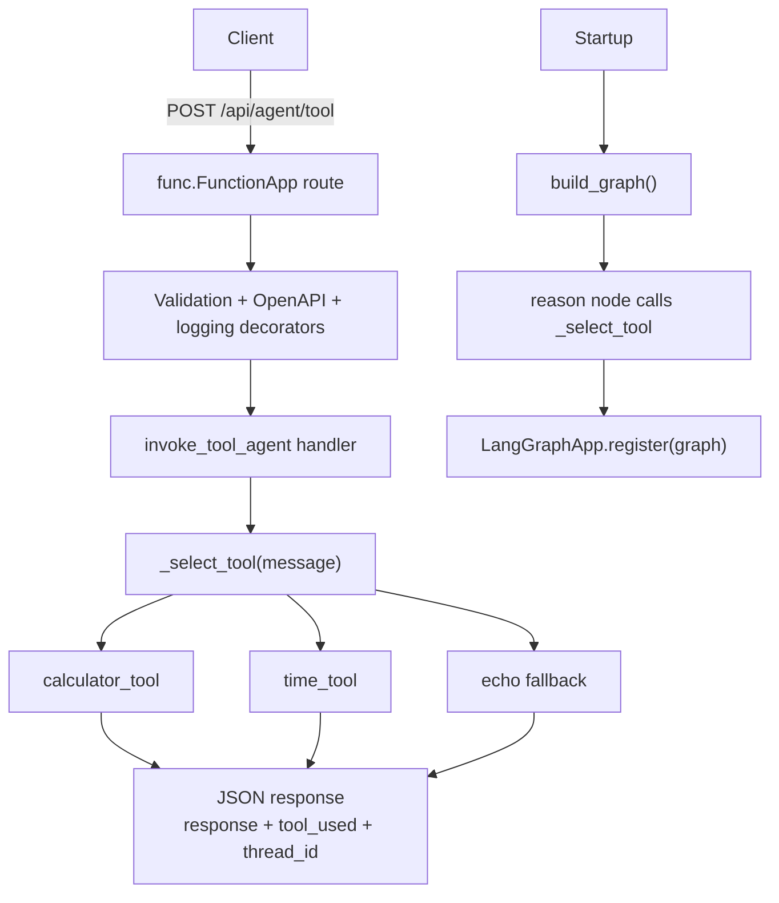

# Langgraph Tool Use

> **Trigger**: HTTP | **State**: stateless | **Guarantee**: at-most-once | **Difficulty**: advanced

## Overview
This recipe documents `examples/ai-and-agents/langgraph_tool_use/`.
It is the third LangGraph pattern in the cookbook, after
[LangGraph Agent](langgraph-agent.md) (plain chat) and
[LangGraph RAG Agent](langgraph-rag-agent.md) (retrieval).
Here a reasoning node inspects the incoming message and routes it to a callable **tool**,
a calculator or a UTC clock, before answering.

The point of the recipe is the routing seam, not the tools themselves. The tools are
deliberately trivial and dependency-free so you can run the sample with no API keys and
still see where an LLM-backed tool call would plug in.

## When to Use
- You want an agent endpoint that dispatches to deterministic functions instead of free-form text.
- You want LangGraph routing to live beside a normal Azure Functions HTTP surface.
- You need request validation, OpenAPI metadata, and structured logging around an agent route.
- You want to see which tool answered a request, for auditing or evaluation.

## When NOT to Use
- A single stateless HTTP function covers your use case; LangGraph adds no value there.
- You need durable multi-step workflows with checkpointing. Use Durable Functions, or see
  [Durable AI Pipeline](durable-ai-pipeline.md).
- You need streaming token output. See [Streaming AI Response](streaming-ai-response.md).
- You need conversation memory across requests; this sample keeps no state between calls.

## Architecture


> **Maps to** `examples/ai-and-agents/langgraph_tool_use/function_app.py`: `D` = `invoke_tool_agent`,
> `E` = `_select_tool`, `K`/`M` = `build_graph()` and `_langgraph_app.register(...)` at module load.
> The compiled graph and the HTTP handler both call the same `_select_tool` function, so routing
> behavior is identical whichever entry point you use.

## Prerequisites
- Python 3.11+
- Azure Functions Core Tools v4
- The `langgraph` and `azure-functions-langgraph` packages (both are hard dependencies)
- Pydantic for request and response models

## Project Structure
```text
examples/ai-and-agents/langgraph_tool_use/
├── function_app.py
├── host.json
├── local.settings.json.example
├── pyproject.toml
├── requirements.txt
└── README.md
```

## Implementation
Tool selection is one pure function. Keeping it outside both the graph node and the HTTP
handler is what lets the two entry points stay in agreement.

```python
def _select_tool(message: str) -> tuple[str, str]:
    """Route the message to a tool; return (tool_name, tool_output)."""
    lower = message.lower()
    if any(sym in message for sym in ("+", "-", "*")):
        return "calculator", calculator_tool(message)
    if "time" in lower:
        return "time", time_tool(message)
    return "none", f"No tool matched; echoing: {message}"
```

The graph wraps that function in a `reason` node and registers the compiled graph at import time:

```python
def build_graph() -> Any:
    class ToolState(TypedDict):
        message: str
        tool_used: str
        response: str

    def reason_node(state: ToolState) -> ToolState:
        tool_name, output = _select_tool(state["message"])
        logger.info("Tool routed", extra={"tool": tool_name})
        return {"tool_used": tool_name, "response": output}

    graph = StateGraph(ToolState)
    graph.add_node("reason", reason_node)
    graph.set_entry_point("reason")
    graph.add_edge("reason", END)
    return graph.compile()


graph = build_graph()
if graph is not None:
    _langgraph_app.register(graph=graph, name="langgraph_tool_use")
```

The HTTP route keeps the canonical decorator order and reports which tool answered:

```python
@app.route(route="agent/tool", methods=["POST"])
@openapi(
    summary="Invoke tool-use LangGraph agent",
    requests=InvokeRequest,
    responses={200: InvokeResponse},
    tags=["agent"],
)
@with_context(param="invocation_context")
@validate_http(body=InvokeRequest, response_model=InvokeResponse)
def invoke_tool_agent(
    req: func.HttpRequest, body: InvokeRequest, invocation_context: func.Context
) -> func.HttpResponse:
    thread_id = body.thread_id or str(uuid.uuid4())
    tool_name, output = _select_tool(body.message)
    ...
```

Key behavior:

- `thread_id` is echoed back, generated when the caller omits it, so clients can correlate turns.
- `tool_used` names the branch that answered: `calculator`, `time`, or `none`.
- The calculator handles `+`, `-`, and `*` on two operands and reports parse failures as text.
- The handler calls `_select_tool` directly rather than executing the compiled graph, which keeps
  the sample runnable with no model credentials.

## Run Locally
```bash
cd examples/ai-and-agents/langgraph_tool_use
pip install -e ".[dev]"
cp local.settings.json.example local.settings.json
func start
```

```bash
curl -X POST "http://localhost:7071/api/agent/tool?code=$FUNCTION_KEY" \
  -H "Content-Type: application/json" \
  -d '{"message": "12 * 3"}'
```

## Expected Output
```json
{"response": "36.0", "tool_used": "calculator", "thread_id": "9f1c..."}
```

```bash
curl -X POST "http://localhost:7071/api/agent/tool?code=$FUNCTION_KEY" \
  -H "Content-Type: application/json" \
  -d '{"message": "what time is it"}'
```

```json
{"response": "2026-10-07T04:21:09.512345+00:00", "tool_used": "time", "thread_id": "3b77..."}
```

## Production Considerations
- Authentication: the sample sets `http_auth_level=func.AuthLevel.FUNCTION`; issue and rotate keys,
  or front the route with APIM.
- Tool safety: real tools reach databases, payment APIs, or shell commands. Validate arguments and
  apply least-privilege credentials per tool rather than one shared identity.
- Never `eval` an expression from user input. The calculator here parses two operands explicitly for
  exactly that reason.
- Timeouts: a tool that calls a downstream service needs its own timeout and a fallback branch;
  the HTTP trigger timeout is not a substitute.
- Observability: `tool_used` belongs in your logs and dashboards. Routing drift is the first thing
  you will want to see when answers get worse.
- State: nothing persists between requests. Add a checkpointer before you promise conversation memory.

## Scaffold Starter
```bash
afs ai agent my-agent
cd my-agent
pip install -e .[dev]
func start
```

## Related Links
- [LangGraph documentation](https://langchain-ai.github.io/langgraph/)
- [azure-functions-langgraph](https://github.com/yeongseon/azure-functions-langgraph-python)
- [Azure Functions HTTP trigger reference](https://learn.microsoft.com/azure/azure-functions/functions-bindings-http-webhook-trigger)
- [LangGraph Agent](langgraph-agent.md)
- [LangGraph RAG Agent](langgraph-rag-agent.md)
