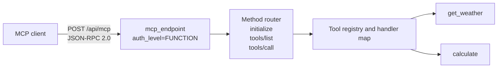
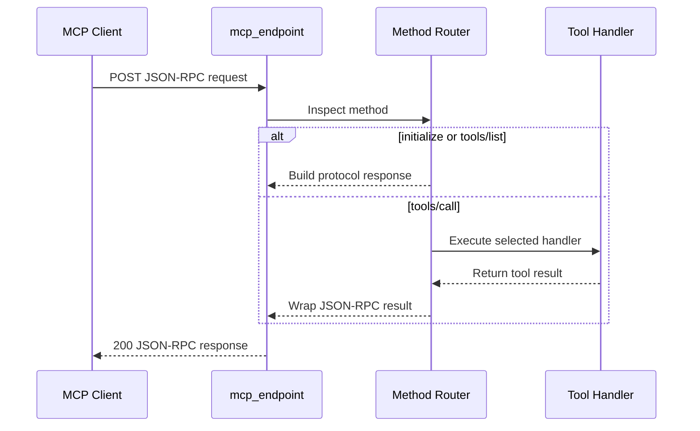

# MCP Server Example

> **Trigger**: HTTP | **State**: stateless | **Guarantee**: at-most-once | **Difficulty**: advanced

## Overview
This recipe documents a manual Model Context Protocol (MCP) server built on an Azure
Functions HTTP trigger.
The endpoint speaks JSON-RPC 2.0 and implements MCP-style methods for initialization,
tool discovery, and tool execution.

The example keeps protocol handling explicit in `function_app.py`.
A tool registry defines metadata and input schemas, and a handler map dispatches
`tools/call` requests to Python functions (`get_weather`, `calculate`).

## When to Use
- You need to host MCP-compatible tools behind Azure Functions quickly.
- You want full control over JSON-RPC request and error handling behavior.
- You need a reference architecture before adopting a dedicated MCP extension package.

## When NOT to Use
- You want a fully managed MCP platform with built-in session lifecycle features.
- You need long-running tool orchestration that exceeds a normal HTTP request budget.
- You prefer framework abstractions over manually handling JSON-RPC envelopes and method routing.

## Architecture


## Prerequisites
- Python 3.10+
- Azure Functions Core Tools v4
- Function key available locally (`auth_level=FUNCTION`)
- Basic JSON-RPC 2.0 request structure familiarity

## Project Structure
```text
examples/ai-and-agents/mcp_server_example/
|- function_app.py
|- host.json
|- local.settings.json.example
|- requirements.txt
`- README.md
```

## Implementation
The recipe defines tool metadata and schemas in a static registry.

```python
TOOLS = {
    "get_weather": {
        "description": "Get current weather for a location",
        "inputSchema": {
            "type": "object",
            "properties": {"location": {"type": "string"}},
            "required": ["location"],
        },
    },
    "calculate": {
        "description": "Evaluate a simple math expression",
        "inputSchema": {
            "type": "object",
            "properties": {"expression": {"type": "string"}},
            "required": ["expression"],
        },
    },
}
```

Tool handlers implement business logic.

```python
def _handle_get_weather(arguments: dict[str, Any]) -> str:
    location = arguments.get("location", "Unknown")
    return f"The weather in {location} is sunny, 22C."

def _handle_calculate(arguments: dict[str, Any]) -> str:
    expression = arguments.get("expression", "0")
    allowed = set("0123456789+-*/() .")
    if not all(c in allowed for c in expression):
        return "Error: expression contains invalid characters"
    ...
```

The HTTP trigger routes by JSON-RPC method.

```python
@app.route(route="mcp", methods=["POST"], auth_level=func.AuthLevel.FUNCTION)
def mcp_endpoint(req: func.HttpRequest) -> func.HttpResponse:
    body = req.get_json()
    method = body.get("method", "")
    if method == "initialize":
        result = {...}
    elif method == "tools/list":
        result = {"tools": tools_list}
    elif method == "tools/call":
        ...
```

JSON-RPC helper functions standardize response envelopes and errors.

```python
def _json_rpc_response(request_id: Any, result: Any) -> dict[str, Any]:
    return {"jsonrpc": "2.0", "id": request_id, "result": result}

def _json_rpc_error(request_id: Any, code: int, message: str) -> dict[str, Any]:
    return {"jsonrpc": "2.0", "id": request_id, "error": {"code": code, "message": message}}
```

## Behavior


## Run Locally
```bash
cd examples/ai-and-agents/mcp_server_example
pip install -r requirements.txt
func start
```

## Expected Output
```text
POST initialize -> 200
{
  "jsonrpc": "2.0",
  "id": 1,
  "result": {
    "protocolVersion": "2025-03-26",
    "capabilities": {"tools": {"listChanged": false}},
    "serverInfo": {"name": "azure-functions-mcp-example", "version": "0.1.0"}
  }
}

POST tools/call (calculate, expression="(2 + 3) * 4") -> result text "20"
```

## Production Considerations
- Scaling: keep tool handlers stateless and move expensive work to asynchronous backends.
- Retries: design clients to retry idempotent JSON-RPC calls on transient 5xx failures.
- Idempotency: make tool operations safe for repeated invocation by autonomous agents.
- Observability: log request id, method, tool name, latency, and error code consistently.
- Security: enforce auth keys, validate arguments strictly, and avoid unsafe evaluator inputs.

## Related Links
- [Azure Functions HTTP trigger reference](https://learn.microsoft.com/en-us/azure/azure-functions/functions-bindings-http-webhook-trigger)
