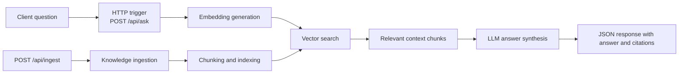
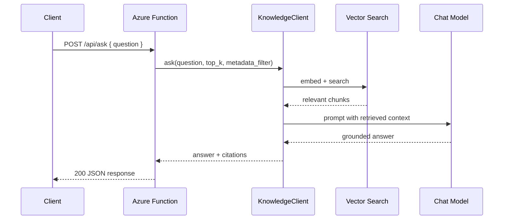

# RAG Knowledge API

> **Trigger**: HTTP | **State**: stateless | **Guarantee**: request-response | **Difficulty**: intermediate | **Showcase**: Azure AI Search + OpenAI

## Overview
This recipe builds a Retrieval-Augmented Generation (RAG) API on Azure Functions
using Azure AI Search and Azure OpenAI directly.

The function app exposes two HTTP endpoints:

- `POST /api/ask` — embed a question, retrieve matching knowledge chunks, and
  synthesize an answer.
- `POST /api/ingest` — submit new documents to the knowledge base for indexing.

The example also layers in `azure-functions-validation-python`,
`azure-functions-openapi-python`, and `azure-functions-logging-python` so the API has schema
validation, generated contracts, and structured telemetry.

The retrieval client is loaded via `try/except ImportError` with a fallback stub,
so the example imports and runs even without a live search backend.

## When to Use
- You want a thin serverless API in front of a vector-backed knowledge base.
- You need a simple RAG entry point without building the retrieval pipeline by hand.
- You want request validation and OpenAPI docs alongside AI endpoints.

## When NOT to Use
- You need long-running ingestion or document enrichment pipelines better handled asynchronously.
- You need durable multi-turn agent state instead of one request producing one grounded answer.
- You want to hand-tune every embedding, retrieval, and prompt orchestration step yourself.

## Integration Matrix
| Toolkit | Role in this recipe |
| --- | --- |
| `azure-functions-validation-python` | Validates `/ask` and `/ingest` request bodies and response models |
| `azure-functions-openapi-python` | Describes the API contract for client discovery and testing |
| `azure-functions-logging-python` | Adds structured logs for question, retrieval, and ingestion activity |

## Architecture


## Prerequisites
- Python 3.10+
- Azure Functions Core Tools v4
- `azure-functions-validation-python`
- `azure-functions-openapi-python`
- `azure-functions-logging-python`
- Azure AI Search and an LLM/embedding endpoint configured via environment variables

## Project Structure
```text
examples/ai-and-agents/rag_knowledge_api/
|- function_app.py
|- host.json
|- local.settings.json.example
|- pyproject.toml
`- README.md
```

## Implementation
The example uses a local fallback stub for retrieval. Wire in real Azure AI Search
and Azure OpenAI via environment variables to enable production RAG behavior.

```python
def _create_knowledge_client() -> object:
    return _FallbackKnowledgeClient()
```

Use the canonical decorator order for HTTP recipes in this repo:

```python
@app.route(route="ask", methods=["POST"])
@with_context
@openapi(...)
@validate_http(...)
def ask(...):
    ...
```

`/ask` forwards the request into the RAG pipeline and returns grounded output.

```python
result = client.ask(
    question=body.question,
    top_k=body.top_k,
    metadata_filter=body.metadata_filter,
)
```

`/ingest` accepts a batch of documents and passes them to the knowledge store.

```python
result = client.ingest_documents(
    [document.model_dump() for document in body.documents]
)
```

## Behavior


## Run Locally
```bash
cd examples/ai-and-agents/rag_knowledge_api
pip install -e ".[dev]"
cp local.settings.json.example local.settings.json
func start
```

## Expected Output
```text
Functions:

    ask:    [POST] http://localhost:7071/api/ask
    ingest: [POST] http://localhost:7071/api/ingest
```

Example ask request:

```bash
curl -X POST http://localhost:7071/api/ask \
  -H "Content-Type: application/json" \
  -d '{"question": "How does Azure Functions scale?", "top_k": 3}'
```

```json
{
  "answer": "Azure Functions scales automatically by adding compute instances when request volume increases.",
  "citations": [
    {
      "id": "doc-1",
      "title": "Azure Functions overview",
      "chunk": "Azure Functions automatically scales based on demand."
    }
  ],
  "matches": 1
}
```

## Production Considerations
- Authentication: use `FUNCTION` or stronger auth in production; `ANONYMOUS` is for local demos.
- Ingestion: large document imports should move to queue-backed or durable workflows.
- Retrieval quality: tune chunk size, `top_k`, filters, and embedding model selection to your corpus.
- Observability: log question length, result count, latency, and fallback mode without logging sensitive prompts verbatim.
- Secrets: prefer managed identity or Key Vault-backed configuration over raw API keys.

## Related Links
- [Azure AI Search](https://learn.microsoft.com/en-us/azure/search/search-what-is-azure-search)
- [Azure Functions HTTP trigger reference](https://learn.microsoft.com/en-us/azure/azure-functions/functions-bindings-http-webhook-trigger)
