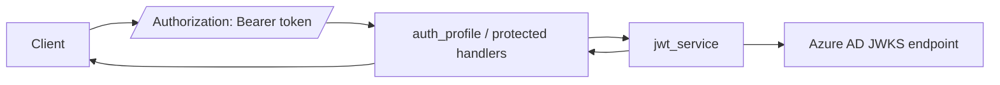
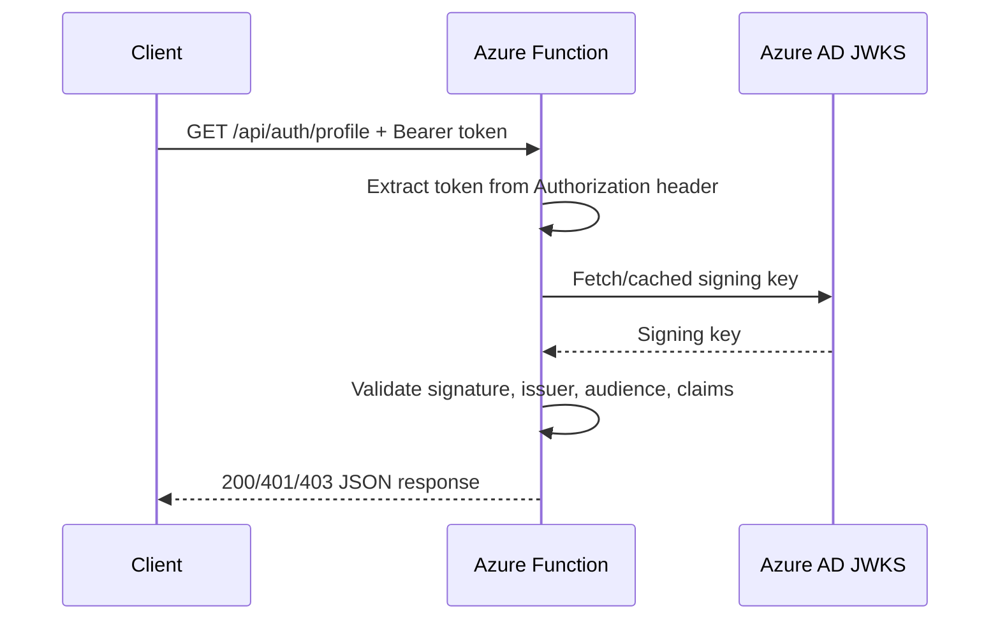

# JWT Bearer Validation

> **Trigger**: HTTP | **State**: stateless | **Guarantee**: at-most-once | **Difficulty**: intermediate

## Overview

This recipe demonstrates how to validate JWT Bearer tokens against Azure AD
(Entra ID) JWKS endpoints in an Azure Functions Python v2 application. Unlike
the EasyAuth recipe which relies on App Service to handle authentication, this
pattern validates tokens directly in your function code — useful for scenarios
where EasyAuth is not available (local development, container deployments,
API Management frontends).

The example extracts Bearer tokens from the `Authorization` header, validates
them against Azure AD's JWKS endpoint using RS256, and implements claim-based
access control.

## When to Use

- Your Function App runs outside App Service (containers, Kubernetes, local dev).
- You need to validate tokens from Azure AD or any OIDC provider with a JWKS endpoint.
- You want fine-grained claim checks beyond what EasyAuth provides.
- You need to support multiple token issuers or audiences.

## When NOT to Use

- You already run behind EasyAuth and do not need custom token handling.
- You only need function keys instead of identity-based access control.
- You need full API gateway concerns such as throttling, token transformation, or central policy enforcement.

## Architecture



## Behavior



## Project Structure

```text
examples/apis-and-ingress/auth_jwt_validation/
├── function_app.py
├── app/
│   ├── core/
│   │   └── logging.py
│   ├── functions/
│   │   └── auth.py
│   └── services/
│       └── jwt_service.py
├── tests/
│   └── test_jwt.py
├── host.json
├── local.settings.json.example
├── pyproject.toml
├── Makefile
└── README.md
```

## Implementation

### Extracting the Bearer token

```python
def extract_bearer_token(auth_header: str | None) -> str | None:
    if not auth_header or not auth_header.startswith("Bearer "):
        return None
    token = auth_header[7:].strip()
    return token if token else None
```

### Validating the JWT

The `validate_jwt` function fetches signing keys from Azure AD's JWKS endpoint,
validates the token signature (RS256), and checks issuer and audience claims.
`PyJWKClient` is constructed with `cache_keys=True` to cache signing keys and
reduce calls to the JWKS endpoint:

```python
def validate_jwt(token: str, *, tenant_id: str, audience: str, jwks_uri: str | None = None) -> dict | None:
    if jwks_uri is None:
        jwks_uri = f"https://login.microsoftonline.com/{tenant_id}/discovery/v2.0/keys"
    try:
        jwks_client = PyJWKClient(jwks_uri, cache_keys=True)
        signing_key = jwks_client.get_signing_key_from_jwt(token)
        decoded = jwt.decode(
            token, signing_key.key,
            algorithms=["RS256"],
            audience=audience,
            issuer=f"https://login.microsoftonline.com/{tenant_id}/v2.0",
        )
        return decoded
    except (jwt.InvalidTokenError, jwt.PyJWKClientError):
        return None
```

### Claim-based access control

The `require_claim` decorator validates specific claims before the handler runs.
The `has_claim` function handles both string and boolean claim values:

```python
@require_claim("roles", "api.read")
def get_protected_response(claims: dict) -> tuple[dict, int]:
    return {"message": "Access granted to protected resource.", "subject": claims.get("sub")}, 200
```

### Route handlers

- `GET /api/auth/profile` — returns decoded JWT claims for any valid token.
- `GET /api/auth/protected` — requires `roles=api.read` claim, returns 403 otherwise.

Both endpoints return 401 for missing or invalid tokens.

## Run Locally

Prerequisites:

- Python 3.10+
- Azure Functions Core Tools v4
- `azure-functions` and `PyJWT[crypto]>=2.8.0` packages
- An Azure AD (Entra ID) app registration with `AZURE_TENANT_ID` and `AZURE_CLIENT_ID`

```bash
cd examples/apis-and-ingress/auth_jwt_validation
python -m venv .venv
source .venv/bin/activate
pip install -e .
cp local.settings.json.example local.settings.json
# Edit local.settings.json with your Azure AD tenant and client IDs
func start
```

## Expected Output

```bash
# With a valid Azure AD token:
curl -s "http://localhost:7071/api/auth/profile" \
  -H "Authorization: Bearer <your-jwt-token>" | python -m json.tool
```

```json
{
    "subject": "abc123",
    "name": "Alice",
    "email": "alice@example.com",
    "claims": {
        "sub": "abc123",
        "name": "Alice",
        "email": "alice@example.com"
    }
}
```

## Production Considerations

- **JWKS caching**: `PyJWKClient` is constructed with `cache_keys=True` to cache signing keys. For high-throughput scenarios, consider making the client a module-level singleton to share the cache across requests within the same worker.
- **Token expiry**: `jwt.decode` checks `exp` automatically. Do not disable this check in production.
- **Audience validation**: Always validate the `aud` claim to prevent token reuse across applications.
- **Issuer validation**: The issuer URL format differs between v1 (`sts.windows.net`) and v2 (`login.microsoftonline.com/.../v2.0`) endpoints. Match your app registration configuration.
- **Multi-tenant**: For multi-tenant apps, the issuer includes the specific tenant ID. Use the `auth-multitenant` recipe for tenant allowlist patterns.
- **Error handling**: Return 401 for authentication failures (missing/invalid token) and 403 for authorization failures (insufficient claims). Never leak validation error details to clients.
- **Observability**: Log JWT validation failures with correlation IDs for debugging, but never log token values.

## Related Links

- [Microsoft identity platform access tokens](https://learn.microsoft.com/en-us/azure/active-directory/develop/access-tokens)
- [EasyAuth Claims Extraction](./auth-easyauth-claims.md)
- [Multi-Tenant Auth](./auth-multitenant.md)
- [HTTP Auth Levels](./http-auth-levels.md)
