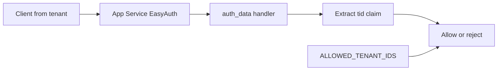
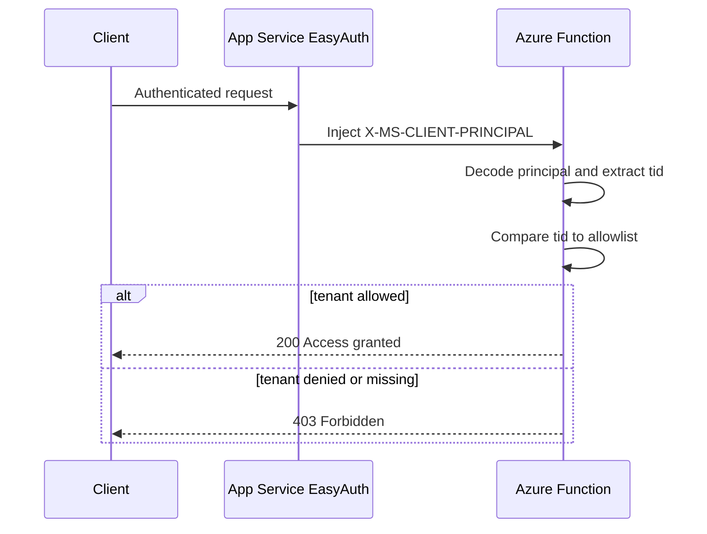

# Multi-Tenant Auth

> **Trigger**: HTTP | **State**: stateless | **Guarantee**: at-most-once | **Difficulty**: intermediate

## Overview

This recipe demonstrates how to implement multi-tenant access control in an
Azure Functions Python v2 application. It builds on the EasyAuth principal
extraction pattern by adding tenant ID validation against a configurable
allowlist. Only requests from approved Azure AD tenants are permitted.

The tenant ID (`tid` claim) is extracted from the `X-MS-CLIENT-PRINCIPAL`
header and checked against a comma-separated list of allowed tenant IDs
stored in an environment variable.

## When to Use

- Your Function App serves multiple Azure AD tenants and you need to restrict access.
- You want to control which organizations can access your API.
- You need a simple tenant allowlist without a full RBAC engine.
- You are using EasyAuth and need tenant-level authorization on top of authentication.

## When NOT to Use

- Your app is single-tenant and should reject all external organizations at the identity-provider level.
- You need dynamic policy decisions based on subscriptions, groups, or entitlements instead of a static allowlist.
- You are not using EasyAuth and need direct token validation inside the function.

## Architecture



## Behavior



## Project Structure

```text
examples/apis-and-ingress/auth_multitenant/
├── function_app.py
├── app/
│   ├── core/
│   │   └── logging.py
│   ├── functions/
│   │   └── auth.py
│   └── services/
│       └── tenant_service.py
├── tests/
│   └── test_tenant.py
├── host.json
├── local.settings.json.example
├── pyproject.toml
├── Makefile
└── README.md
```

## Implementation

### Decoding the principal and extracting tenant ID

The principal is decoded identically to the EasyAuth recipe. The decoded JSON
contains `auth_typ`, `name_typ`, `role_typ`, and a `claims` array. The tenant
ID is extracted from the `tid` claim (or its full URI form):

```python
def extract_tenant_id(principal: dict) -> str | None:
    for claim in principal.get("claims", []):
        typ = claim.get("typ", "")
        if typ in ("tid", "http://schemas.microsoft.com/identity/claims/tenantid"):
            val = claim.get("val", "")
            if val:
                return val
    return None
```

### Parsing and checking the tenant allowlist

The allowlist is loaded from the `ALLOWED_TENANT_IDS` environment variable
as a comma-separated string:

```python
def parse_allowed_tenants(raw: str) -> list[str]:
    if not raw:
        return []
    return [t.strip() for t in raw.split(",") if t.strip()]

def is_tenant_allowed(tenant_id: str, allowed_tenants: list[str]) -> bool:
    return tenant_id in allowed_tenants
```

### Route handler

The `GET /api/auth/data` endpoint combines all checks:

1. Decode `X-MS-CLIENT-PRINCIPAL` — return 401 if missing.
2. Extract `tid` claim — return 403 if not found.
3. Check against allowlist — return 403 if tenant is not allowed.
4. Return tenant-scoped response on success.

## Run Locally

Prerequisites:

- Python 3.10+
- Azure Functions Core Tools v4
- `azure-functions` package
- App Service Authentication (EasyAuth) enabled on the Function App
- `ALLOWED_TENANT_IDS` environment variable configured

```bash
cd examples/apis-and-ingress/auth_multitenant
python -m venv .venv
source .venv/bin/activate
pip install -e .
cp local.settings.json.example local.settings.json
# Edit local.settings.json: set ALLOWED_TENANT_IDS
func start
```

> **Note:** Locally, the `X-MS-CLIENT-PRINCIPAL` header is not injected by
> App Service. Test by manually passing a base64-encoded principal in the header.

## Expected Output

```bash
# Encode a test principal with tenant ID (matches real Azure format)
PRINCIPAL=$(echo -n '{"auth_typ":"aad","name_typ":"","role_typ":"","claims":[{"typ":"tid","val":"tenant-id-1"},{"typ":"name","val":"Alice"},{"typ":"http://schemas.xmlsoap.org/ws/2005/05/identity/claims/nameidentifier","val":"user-1"}]}' | base64)

# Access tenant-scoped data (tenant-id-1 is in the allowlist)
curl -s "http://localhost:7071/api/auth/data" \
  -H "X-MS-CLIENT-PRINCIPAL: $PRINCIPAL" | python -m json.tool
```

```json
{
    "message": "Access granted.",
    "tenant_id": "tenant-id-1",
    "user_id": "user-1",
    "identity_provider": "aad"
}
```

```bash
# Request from unauthorized tenant
PRINCIPAL_BAD=$(echo -n '{"auth_typ":"aad","name_typ":"","role_typ":"","claims":[{"typ":"tid","val":"unknown-tenant"}]}' | base64)
curl -s "http://localhost:7071/api/auth/data" \
  -H "X-MS-CLIENT-PRINCIPAL: $PRINCIPAL_BAD" | python -m json.tool
```

```json
{
    "error": "Tenant 'unknown-tenant' is not authorized."
}
```

## Production Considerations

- **Scaling**: Tenant ID checking is a simple list lookup with no external calls. No scaling concerns.
- **Allowlist management**: Store `ALLOWED_TENANT_IDS` in Azure App Configuration or Key Vault for dynamic updates without redeployment.
- **Empty allowlist**: An empty allowlist means no tenants are allowed. This is a secure default — fail closed.
- **Claim formats**: Azure AD may emit the tenant ID as `tid` (short form) or `http://schemas.microsoft.com/identity/claims/tenantid` (full URI). The service checks both.
- **Multi-tenant app registrations**: If your Azure AD app registration is multi-tenant, any tenant can authenticate. The allowlist provides the authorization layer on top.
- **Observability**: Log rejected tenant IDs for monitoring unauthorized access attempts. Include `auth_typ` and user identifier claims for audit trails.
- **Security**: This pattern is defense-in-depth. Always combine with EasyAuth (authentication) and network controls (VNet, private endpoints).

## Related Links

- [Convert an app to be multi-tenant](https://learn.microsoft.com/en-us/azure/active-directory/develop/howto-convert-app-to-be-multi-tenant)
- [EasyAuth Claims Extraction](./auth-easyauth-claims.md)
- [JWT Bearer Validation](./auth-jwt-validation.md)
- [HTTP Auth Levels](./http-auth-levels.md)
