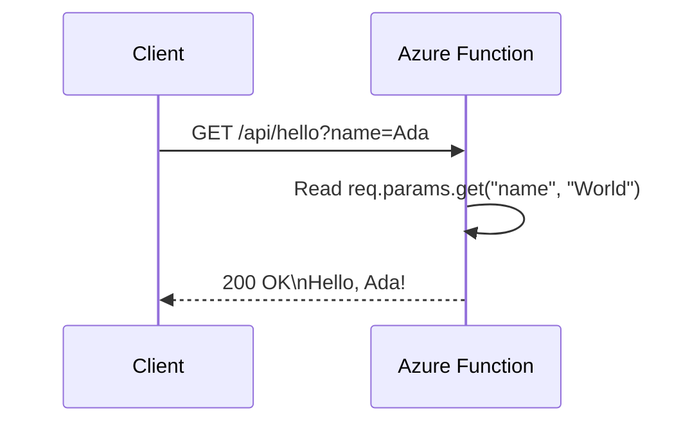

# Hello HTTP Minimal

> **Trigger**: HTTP | **State**: stateless | **Guarantee**: at-most-once | **Difficulty**: beginner

## Overview
This recipe documents the smallest practical HTTP-triggered Azure Function in `examples/apis-and-ingress/hello_http_minimal/`.
It is intentionally tiny: one `FunctionApp`, one route, one handler, and one string response.

Use it as a baseline when you want to validate your local Functions setup,
teach trigger fundamentals,
or start a new service with minimal moving parts.

Because the endpoint is anonymous and stateless,
it is ideal for quick smoke tests,
health-style responses,
and demos.

## When to Use
- You need a first Azure Functions endpoint to prove local and CI runtime health.
- You want a starter pattern for a simple GET API with query-string input.
- You need a minimal reproducible example before adding bindings, auth, or state.

## When NOT to Use
- You need authenticated or tenant-aware access control.
- You need complex routing, body validation, or CRUD-style API behavior.
- You need durable state, background processing, or long-running work.

## Architecture
```mermaid
flowchart LR
    client[Client]
    route[/GET /api/hello]
    fn[hello(req)]
    response[Plain text greeting]

    client --> route --> fn --> response
```

## Behavior


## Project Structure
```text
examples/apis-and-ingress/hello_http_minimal/
├── function_app.py
├── host.json
├── local.settings.json.example
├── pyproject.toml
└── README.md
```

## Implementation
The app object is defined once,
then decorated with a single route.
The key behavior is fallback logic for `name` and a plain text response.

```python
import azure.functions as func

app = func.FunctionApp()

@app.route(route="hello", methods=["GET"], auth_level=func.AuthLevel.ANONYMOUS)
def hello(req: func.HttpRequest) -> func.HttpResponse:
    """Return a greeting. Accepts an optional 'name' query parameter."""
    name = req.params.get("name", "World")
    return func.HttpResponse(f"Hello, {name}!")
```

Important details from `function_app.py`:

- `methods=["GET"]` narrows this function to read-style requests.
- `auth_level=func.AuthLevel.ANONYMOUS` means no key is required.
- `req.params.get("name", "World")` ensures deterministic output even without query input.
- The response body is plain text, so no JSON serialization helper is needed.
- Route value `"hello"` becomes `/api/hello` under default host configuration.

Request behavior examples:

```text
GET /api/hello              -> Hello, World!
GET /api/hello?name=Ada     -> Hello, Ada!
GET /api/hello?name=Linus   -> Hello, Linus!
```

Local testing commands:

```bash
curl "http://localhost:7071/api/hello"
curl "http://localhost:7071/api/hello?name=Ada"
```

## Run Locally
Prerequisites:

- Python 3.10+
- Azure Functions Core Tools v4
- `azure-functions` dependency from `pyproject.toml`
- Optional: `curl` for local endpoint checks
- Local storage emulator (Azurite) is not required for this example

```bash
cd examples/apis-and-ingress/hello_http_minimal
pip install -e ".[dev]"
func start
```

## Expected Output
```text
Functions:

    hello: [GET] http://localhost:7071/api/hello

Executing 'Functions.hello' (Reason='This function was programmatically called via the host APIs.', Id=...)
Executed 'Functions.hello' (Succeeded, Id=..., Duration=...ms)

HTTP response body:
Hello, Ada!
```

## Production Considerations
- Scaling: HTTP triggers scale with request volume; keep handlers lightweight and CPU-bound work short.
- Retries: HTTP clients should own retry strategy with backoff because failed requests are not auto-replayed by trigger.
- Idempotency: For read endpoints this is straightforward, but still avoid side effects in GET handlers.
- Observability: Add request correlation IDs and structured logs if this endpoint evolves beyond a toy example.
- Security: Avoid anonymous access for sensitive routes; move to `FUNCTION` or upstream auth when needed.

## Related Links

- [Azure Functions HTTP trigger](https://learn.microsoft.com/en-us/azure/azure-functions/functions-bindings-http-webhook-trigger)
- [HTTP Routing Query Body](./http-routing-query-body.md)
- [HTTP Auth Levels](./http-auth-levels.md)
- [Queue Producer](../messaging-and-pubsub/queue-producer.md)
