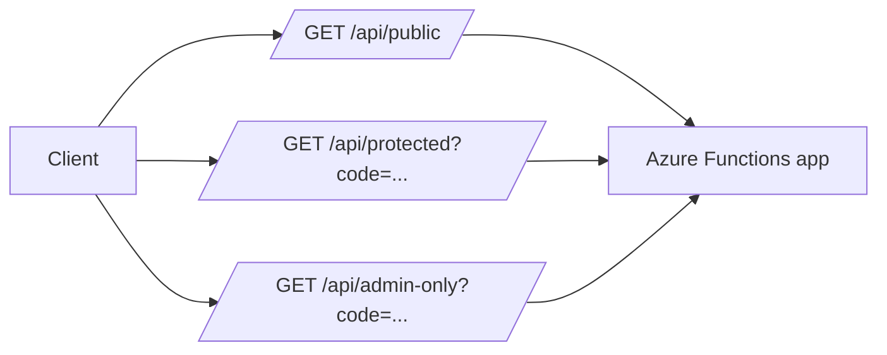
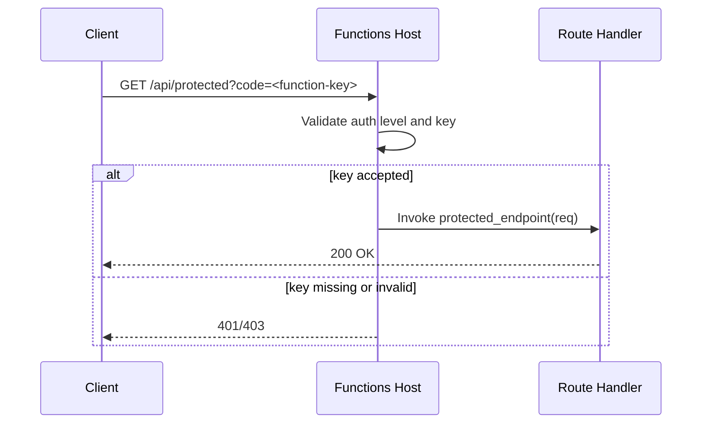

# HTTP Auth Levels

> **Trigger**: HTTP | **State**: stateless | **Guarantee**: at-most-once | **Difficulty**: beginner

## Overview
This recipe explains how `examples/apis-and-ingress/http_auth_levels/` demonstrates three HTTP authorization levels
inside one Azure Functions Python app.

The sample keeps logic intentionally simple so you can focus on auth behavior:
one public endpoint,
one function-key endpoint,
and one admin-key endpoint.

It is useful when you need to validate key-based access controls quickly,
before integrating full identity providers.

## When to Use
- You want to compare `ANONYMOUS`, `FUNCTION`, and `ADMIN` access behavior side by side.
- You need a small reference for key-protected internal APIs.
- You want a migration step before introducing OAuth or API Management.

## When NOT to Use
- You need user identity, delegated permissions, or tenant-specific authorization.
- You need external client authentication that should be centrally managed by an identity provider.
- You need fine-grained policy enforcement beyond route-level keys.

## Architecture


## Behavior


## Project Structure
```text
examples/apis-and-ingress/http_auth_levels/
├── function_app.py
├── host.json
├── local.settings.json.example
├── requirements.txt
└── README.md
```

## Implementation
Each endpoint is nearly identical except `auth_level`,
which makes this file an excellent auth-focused comparison.

Public route:

```python
@app.route(route="public", methods=["GET"], auth_level=func.AuthLevel.ANONYMOUS)
def public_endpoint(req: func.HttpRequest) -> func.HttpResponse:
    """No key required — open to anyone."""
    return func.HttpResponse("This endpoint is public (anonymous).")
```

Function-key route:

```python
@app.route(route="protected", methods=["GET"], auth_level=func.AuthLevel.FUNCTION)
def protected_endpoint(req: func.HttpRequest) -> func.HttpResponse:
    """Requires a function-level API key in the query string or header."""
    return func.HttpResponse("This endpoint requires a function key.")
```

Admin-key route:

```python
@app.route(route="admin-only", methods=["GET"], auth_level=func.AuthLevel.ADMIN)
def admin_endpoint(req: func.HttpRequest) -> func.HttpResponse:
    """Requires the master (admin) key."""
    return func.HttpResponse("This endpoint requires the admin/master key.")
```

Behavior notes:

- `ANONYMOUS` accepts calls with no key material.
- `FUNCTION` requires a function key (`?code=` or `x-functions-key`).
- `ADMIN` requires host master key and is typically reserved for operational routes.
- Auth enforcement occurs before handler logic executes.
- Key rotation and distribution become operational concerns as usage grows.

Quick test matrix:

```text
GET /api/public                       -> 200 without key
GET /api/protected                    -> 401/403 without function key
GET /api/protected?code=<function>    -> 200
GET /api/admin-only?code=<master>     -> 200
```

## Run Locally
Prerequisites:

- Python 3.10+
- Azure Functions Core Tools v4
- `azure-functions` package from `requirements.txt`
- Access to local or deployed host keys for protected routes
- `curl` or equivalent client to pass query/header keys

```bash
cd examples/apis-and-ingress/http_auth_levels
pip install -r requirements.txt
func start
```

## Expected Output
```text
Functions:

    public_endpoint:    [GET] http://localhost:7071/api/public
    protected_endpoint: [GET] http://localhost:7071/api/protected
    admin_endpoint:     [GET] http://localhost:7071/api/admin-only

Sample response from /api/public:
This endpoint is public (anonymous).
```

## Production Considerations
- Scaling: Key validation overhead is small, but centralized key management is critical across environments.
- Retries: Clients should retry transient `5xx` failures, not authorization failures caused by missing or wrong keys.
- Idempotency: Keep key-protected GET endpoints side-effect free for safe replay.
- Observability: Track auth failures by route and caller identity metadata where available.
- Security: Prefer managed identity or federated auth for external clients; reserve `ADMIN` endpoints for strict internal use.

## Related Links

- [Azure Functions HTTP trigger](https://learn.microsoft.com/en-us/azure/azure-functions/functions-bindings-http-webhook-trigger)
- [Hello HTTP Minimal](./hello-http-minimal.md)
- [HTTP Routing Query Body](./http-routing-query-body.md)
- [Webhook GitHub](./webhook-github.md)
