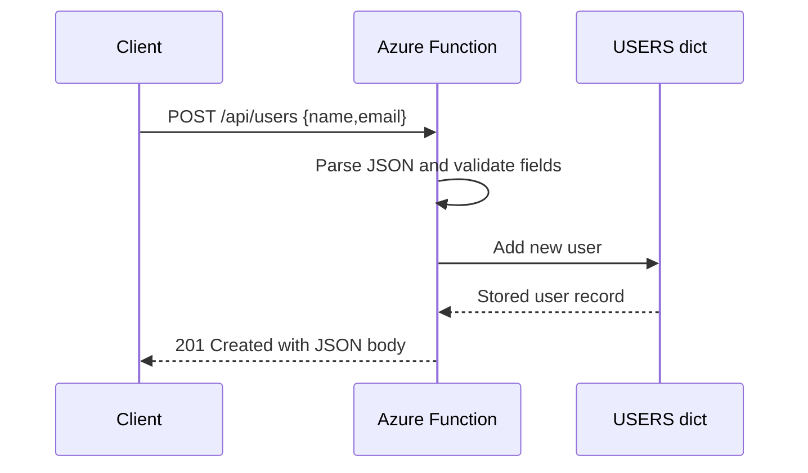

# HTTP Routing Query Body

> **Trigger**: HTTP | **State**: stateless | **Guarantee**: at-most-once | **Difficulty**: beginner

## Overview
This recipe covers a multi-endpoint HTTP API in `examples/apis-and-ingress/http_routing_query_body/`
that demonstrates route parameters,
query strings,
JSON request parsing,
and conventional REST status codes.

The sample keeps state in an in-memory `USERS` dictionary,
which makes it ideal for learning endpoint behavior and request validation
without adding database complexity.

It includes list,
lookup,
create,
update,
delete,
and search flows in one `function_app.py`.

## When to Use
- You need a compact reference for HTTP CRUD patterns in Python Azure Functions.
- You want examples of combining route params, query params, and JSON body parsing.
- You need status-code handling (`200`, `201`, `204`, `400`, `404`, `409`) in one sample.

## When NOT to Use
- You need shared or durable state across restarts and scale-out instances.
- You expect large datasets, server-side pagination, or database-backed querying.
- You need advanced API governance such as OAuth, rate limiting, or schema contracts.

## Architecture
```mermaid
flowchart LR
    client[Client]
    routes[/HTTP routes\n/users\n/users/{user_id}\n/search/]
    handlers[Handlers + helpers]
    store[(In-memory USERS dict)]

    client --> routes --> handlers --> store
    handlers --> client
```

## Behavior


## Project Structure
```text
examples/apis-and-ingress/http_routing_query_body/
├── function_app.py
├── host.json
├── local.settings.json.example
├── pyproject.toml
└── README.md
```

## Implementation
The example defines reusable helpers first,
then composes six route handlers around an in-memory `USERS` store.

Shared state and JSON helper:

```python
USERS: dict[str, dict[str, str]] = {
    "1": {"id": "1", "name": "Ada Lovelace", "email": "ada@example.com"},
    "2": {"id": "2", "name": "Grace Hopper", "email": "grace@example.com"},
}

def _json_response(body: object, status_code: int = 200) -> func.HttpResponse:
    return func.HttpResponse(
        json.dumps(body),
        status_code=status_code,
        mimetype="application/json",
    )
```

Robust JSON parsing:

```python
def _parse_json_body(req: func.HttpRequest) -> dict[str, Any] | None:
    try:
        payload = req.get_json()
    except ValueError:
        return None
    return payload if isinstance(payload, dict) else None
```

List and single-resource retrieval use route and store lookups:

```python
@app.route(route="users", methods=["GET"], auth_level=func.AuthLevel.ANONYMOUS)
def list_users(req: func.HttpRequest) -> func.HttpResponse:
    del req
    return _json_response({"users": list(USERS.values())})

@app.route(route="users/{user_id}", methods=["GET"], auth_level=func.AuthLevel.ANONYMOUS)
def get_user(req: func.HttpRequest) -> func.HttpResponse:
    user_id = req.route_params.get("user_id", "")
    user = USERS.get(user_id)
    if user is None:
        return _json_response({"error": f"User '{user_id}' not found."}, status_code=404)
    return _json_response(user)
```

Create endpoint validates fields and conflict cases:

```python
@app.route(route="users", methods=["POST"], auth_level=func.AuthLevel.ANONYMOUS)
def create_user(req: func.HttpRequest) -> func.HttpResponse:
    payload = _parse_json_body(req)
    if payload is None:
        return _json_response({"error": "Request body must be a JSON object."}, status_code=400)
    name = str(payload.get("name", "")).strip()
    email = str(payload.get("email", "")).strip()
    if not name or not email:
        return _json_response({"error": "Fields 'name' and 'email' are required."}, status_code=400)
```

Update,
delete,
and search extend the same pattern:

- `update_user` fetches by `user_id`, validates body shape, and returns `200`.
- `delete_user` removes existing entries and returns `204` with empty body.
- `search_users` reads `q` and `limit`, validates integer conversion, and slices matches.

Example paths exposed by this app:

```text
GET    /api/users
GET    /api/users/{user_id}
POST   /api/users
PUT    /api/users/{user_id}
DELETE /api/users/{user_id}
GET    /api/search?q=ada&limit=5
```

## Run Locally
Prerequisites:

- Python 3.10+
- Azure Functions Core Tools v4
- `azure-functions` dependency from `pyproject.toml`
- HTTP client tool such as `curl` or Postman
- Understanding that in-memory state resets when the host restarts

```bash
cd examples/apis-and-ingress/http_routing_query_body
pip install -e ".[dev]"
func start
```

## Expected Output
```text
GET /api/users
-> 200 OK
{"users":[{"id":"1","name":"Ada Lovelace","email":"ada@example.com"},...]}

POST /api/users with {"name":"Lin","email":"lin@example.com"}
-> 201 Created
{"id":"3","name":"Lin","email":"lin@example.com"}

DELETE /api/users/3
-> 204 No Content
```

## Production Considerations
- Scaling: Replace in-memory `USERS` with durable storage because scale-out instances do not share process memory.
- Retries: HTTP callers should retry transient `5xx` responses; avoid blind retries on `409`/`400` validation failures.
- Idempotency: Design `PUT` and `DELETE` semantics for safe replay and use deterministic IDs when clients can retry.
- Observability: Log route name, status code, and validation failures as structured fields for API diagnostics.
- Security: Upgrade auth level and enforce authn/authz before exposing user CRUD externally.

## Related Links

- [Azure Functions HTTP trigger](https://learn.microsoft.com/en-us/azure/azure-functions/functions-bindings-http-webhook-trigger)
- [Hello HTTP Minimal](./hello-http-minimal.md)
- [HTTP Auth Levels](./http-auth-levels.md)
- [Webhook GitHub](./webhook-github.md)
