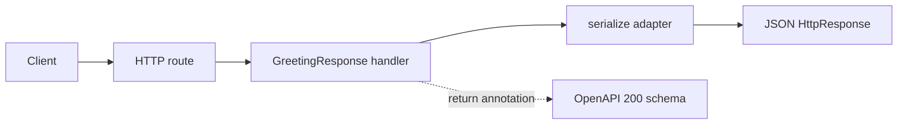

# OpenAPI Return-Type Inference

> **Trigger**: HTTP | **State**: stateless | **Guarantee**: request-response | **Difficulty**: intermediate

## Overview

This recipe demonstrates how `azure-functions-openapi` infers an OpenAPI `200`
response schema from a handler's Pydantic return-type annotation. The example in
`examples/apis-and-ingress/openapi_inference/` documents a greeting response
without declaring an explicit `responses={...}` mapping.

## When to Use

- Your handler naturally returns a Pydantic response model.
- You want the Python return annotation to be the source of the OpenAPI `200` schema.
- You want to avoid duplicating the same response model in `responses=` metadata.

## When NOT to Use

- The handler is annotated with `func.HttpResponse`, `None`, or a bare scalar such as `int`.
- You need to document a response status or body that cannot be inferred from the annotation.
- You prefer an explicit `responses=` contract for the endpoint.

## Architecture



## Implementation

The route keeps `GreetingResponse` as the handler's return annotation so the
OpenAPI decorator can infer its schema. The `serialize` adapter preserves that
annotation with `functools.wraps` and converts the model to the JSON
`func.HttpResponse` required by the Azure Functions worker.

```python
@app.route(route="openapi/inference/greeting", methods=["GET"])
@serialize
@openapi(
    summary="Return-type inference demo",
    description="The 200 response schema is inferred from the return annotation.",
    route="/api/openapi/inference/greeting",
    method="get",
    tags=["openapi-inference"],
)
def inferred_greeting(req: func.HttpRequest) -> GreetingResponse:
    name = req.params.get("name", "Azure Functions")
    return GreetingResponse(message=f"Hello, {name}!", source="return_annotation")
```

Inference is silently skipped when the return annotation cannot be converted to
a schema. Use an explicit `responses=` mapping for those handlers.

## Run Locally

```bash
cd examples/apis-and-ingress/openapi_inference
python3 -m venv .venv
source .venv/bin/activate
pip install -e ".[dev]"
cp local.settings.json.example local.settings.json
func start
```

```bash
curl "http://localhost:7071/api/openapi/inference/greeting?name=Ada"
```

The endpoint returns a JSON greeting whose `source` is `return_annotation`.

## Production Considerations

- Keep the model annotation visible through every wrapper so inference can inspect it.
- Treat missing inference as silent: inspect the generated document or declare `responses=` explicitly.
- Keep runtime serialization aligned with the documented Pydantic model.

## Related Links

- [OpenAPI Validation Supersedes Inference](./openapi-supersedes.md)
- [Recipe source](https://github.com/yeongseon/azure-functions-cookbook-python/tree/main/examples/apis-and-ingress/openapi_inference)
