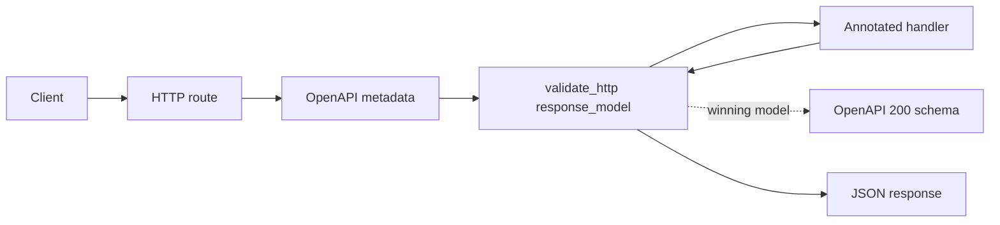

# OpenAPI Validation Supersedes Inference

> **Trigger**: HTTP | **State**: stateless | **Guarantee**: request-response | **Difficulty**: intermediate

## Overview

This recipe demonstrates response-schema precedence when return-type inference
and validation metadata are both present. In
`examples/apis-and-ingress/openapi_supersedes/`, the handler annotation points
to `InferredGreetingResponse`, while `@validate_http` supplies the richer
`ExplicitGreetingResponse`. The validation `response_model` wins the OpenAPI
`200` schema.

## When to Use

- Validation already owns response serialization through `response_model`.
- The validated response contract is more specific than the handler annotation.
- You need predictable precedence when combining validation and OpenAPI decorators.

## When NOT to Use

- The return annotation alone is the intended response contract.
- The validation model and return annotation disagree accidentally rather than by design.
- You do not use `azure-functions-validation` response serialization.

## Architecture



## Implementation

`InferredGreetingResponse` contains only `message`. The explicit validation
model extends it with `source` and `precedence`, making the winning schema easy
to distinguish from the inferred fallback.

```python
@app.route(route="openapi/supersedes/greeting", methods=["GET"])
@openapi(
    summary="Validation supersedes inference",
    description="The validation response_model wins the 200 schema over the return annotation.",
    route="/api/openapi/supersedes/greeting",
    method="get",
    tags=["openapi-supersedes"],
)
@validate_http(response_model=ExplicitGreetingResponse)
def supersedes_greeting(req: func.HttpRequest) -> InferredGreetingResponse:
    name = req.params.get("name", "Azure Functions")
    return ExplicitGreetingResponse(
        message=f"Hello, {name}!",
        source="validation_response_model",
        precedence="validation > return annotation",
    )
```

The canonical decorator order is `@app.route`, `@openapi`, then
`@validate_http`. The validation decorator also serializes the returned model,
so this recipe does not need the manual adapter used by return-type inference.

## Run Locally

```bash
cd examples/apis-and-ingress/openapi_supersedes
python3 -m venv .venv
source .venv/bin/activate
pip install -e ".[dev]"
cp local.settings.json.example local.settings.json
func start
```

```bash
curl "http://localhost:7071/api/openapi/supersedes/greeting?name=Ada"
```

The response identifies `validation_response_model` as its source and
`validation > return annotation` as its precedence.

## Production Considerations

- Keep decorator order consistent so validation metadata is visible to OpenAPI generation.
- Make intentional differences between inferred and explicit models clear to maintainers.
- Keep the validation model aligned with the value returned by the handler.

## Related Links

- [OpenAPI Return-Type Inference](./openapi-inference.md)
- [Recipe source](https://github.com/yeongseon/azure-functions-cookbook-python/tree/main/examples/apis-and-ingress/openapi_supersedes)
