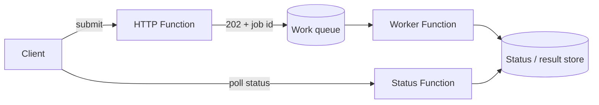

# Async APIs & Jobs

Use this category for request-accept patterns where work continues after the initial response. It will collect recipes for status polling, deferred processing, and job-style APIs.

## Category map

| Recipe | Trigger | Difficulty |
| --- | --- | --- |
| [Async HTTP 202 Polling](./async-http-202-polling.md) | HTTP + Queue + Durable | Intermediate |
| [Queue-Backed Job](./queue-backed-job.md) | HTTP + Queue | Beginner |
| [Callback Completion](./callback-completion.md) | HTTP + Durable | Intermediate |
