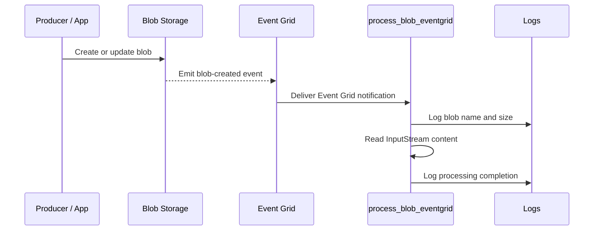

# Blob Event Grid Trigger

> **Trigger**: Blob (Event Grid) | **State**: stateless | **Guarantee**: at-least-once | **Difficulty**: beginner

## Overview
The `examples/blob-and-file-triggers/blob_eventgrid_trigger/` example shows a blob trigger configured with
`source="EventGrid"` on `events/{name}`. Instead of relying on periodic blob scans, the host reacts
to push notifications from Event Grid, significantly reducing detection latency.

This model fits ingestion pipelines where end-to-end freshness matters, such as media processing,
near-real-time analytics, or compliance workflows that must react immediately after object creation.
The function remains simple while benefiting from event-driven delivery semantics.

## When to Use
- You need low-latency processing right after blob updates.
- You want to reduce polling overhead on large storage accounts.
- Your platform already uses Event Grid subscriptions and event routing.

## When NOT to Use
- You want the simplest possible blob trigger with minimal Event Grid setup.
- You do not control or trust the Event Grid subscription path.
- Polling latency is acceptable and operational simplicity matters more than freshness.

## Architecture
```mermaid
flowchart LR
    producer[Producer / App] -->|write blob| blob[Blob Storage\nevents/{name}]
    blob -->|event| grid[Event Grid\nSystem Topic / Subscription]
    grid --> host[Azure Functions Host\nBlob Trigger\nsource=EventGrid]
    host --> handler[process_blob_eventgrid]
```

## Behavior


## Implementation
The trigger declaration is the key difference: `source="EventGrid"` changes delivery mode from
polling pull to event push. The function still receives `func.InputStream` and can process content
the same way as a standard blob trigger.

### Prerequisites
- Python 3.10+
- Azure Functions Core Tools v4
- Azure Storage account with Event Grid integration
- Storage extension bundle supporting Blob trigger Event Grid source (5.x+)

### Project Structure
```text
examples/blob-and-file-triggers/blob_eventgrid_trigger/
|-- function_app.py
|-- host.json
|-- local.settings.json.example
|-- requirements.txt
`-- README.md
```

```python
@app.blob_trigger(
    arg_name="myblob",
    path="events/{name}",
    connection="AzureWebJobsStorage",
    source="EventGrid",
)
def process_blob_eventgrid(myblob: func.InputStream) -> None:
    blob_name = myblob.name
    blob_size = int(myblob.length)
    logger.info("Event Grid blob trigger received %s (%d bytes)", blob_name, blob_size)
```

The example logs completion to highlight deterministic processing checkpoints that can be traced
in Application Insights or log aggregation systems.

```python
logger.info("Blob processing (Event Grid) complete for %s", blob_name)
```

Use this recipe when latency matters, and keep a fallback operational plan for event subscription
misconfiguration because the function depends on Event Grid delivery.

## Run Locally
```bash
cd examples/blob-and-file-triggers/blob_eventgrid_trigger
pip install -r requirements.txt
func start
```

## Expected Output
```text
[Information] Executing 'Functions.process_blob_eventgrid' (Reason='Blob event trigger')
[Information] Event Grid blob trigger received events/new-image.jpg (481923 bytes)
[Information] Blob processing (Event Grid) complete for events/new-image.jpg
[Information] Executed 'Functions.process_blob_eventgrid' (Succeeded)
```

## Production Considerations
- Scaling: Event Grid delivery enables fast fan-out; tune downstream throughput to avoid saturation.
- Retries: Event Grid and Functions both retry on transient failures; design handlers to be replay-safe.
- Idempotency: track processed blob URLs or ETags to avoid duplicate side effects.
- Observability: emit blob path and correlation data to trace event-to-processing latency.
- Security: use RBAC and scoped Event Grid subscriptions; avoid broad storage account permissions.

## Related Links
- Microsoft Learn: https://learn.microsoft.com/en-us/azure/azure-functions/functions-bindings-storage-blob-trigger
- [Blob Upload Processor](./blob-upload-processor.md)
- [Managed Identity (Storage)](../security-and-tenancy/managed-identity-storage.md)
- [host.json Tuning](../runtime-and-ops/host-json-tuning.md)
