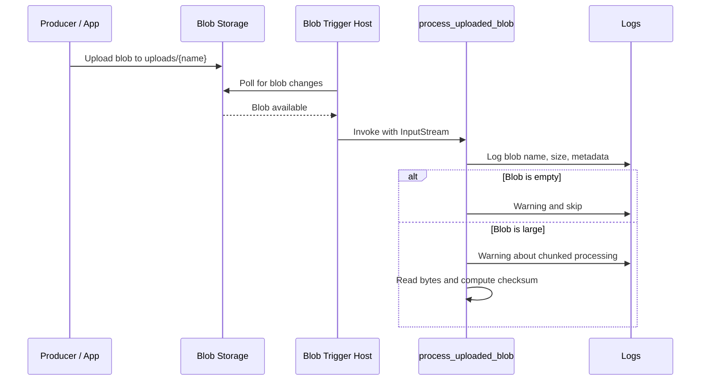

# Blob Upload Processor

> **Trigger**: Blob | **State**: stateless | **Guarantee**: at-least-once | **Difficulty**: beginner

## Overview
The `examples/blob-and-file-triggers/blob_upload_processor/` project implements a polling-based blob trigger on
`uploads/{name}` and demonstrates defensive processing for common storage edge cases.
It logs blob metadata, skips empty blobs, and warns when files are large enough to require chunking.

This pattern is useful when your workflow is storage-first and upstream producers only need to upload
files to a container. The function host scans for blob changes and invokes your handler with an
`InputStream`, so you can implement validation, checksums, and routing without writing custom polling code.

## When to Use
- You need automatic processing when files land in Blob Storage.
- You want to validate upload quality before downstream processing.
- You can accept polling latency and prefer a simple trigger model.

## When NOT to Use
- You need near-immediate reaction time after blob creation.
- You want to avoid polling overhead on large or high-churn storage accounts.
- You need richer routing, filtering, or fan-out than a single blob-triggered function provides.

## Architecture
```mermaid
flowchart LR
    producer[Producer / App] -->|upload| blob[Blob Storage\nuploads/{name}]
    blob -->|polling scan| host[Azure Functions Host\nBlob Trigger]
    host --> handler[process_uploaded_blob]
    handler --> empty[Empty blob guard]
    handler --> large[Large blob warning]
    handler --> checksum[SHA-256 checksum]
```

## Behavior


## Implementation
The trigger listens on `uploads/{name}` through `@app.blob_trigger(...)`. The handler reads blob
attributes from `func.InputStream`, logs context, and exits early for empty uploads.

### Prerequisites
- Python 3.10+
- Azure Functions Core Tools v4
- Azure Storage account or Azurite
- `AzureWebJobsStorage` configured in local settings or app settings

### Project Structure
```text
examples/blob-and-file-triggers/blob_upload_processor/
|-- function_app.py
|-- host.json
|-- local.settings.json.example
|-- pyproject.toml
`-- README.md
```

```python
@app.blob_trigger(arg_name="myblob", path="uploads/{name}", connection="AzureWebJobsStorage")
def process_uploaded_blob(myblob: func.InputStream) -> None:
    blob_name = myblob.name or "unknown"
    blob_size = int(myblob.length or 0)
    blob_metadata = dict(getattr(myblob, "metadata", {}) or {})

    logger.info("Blob trigger fired for %s (size=%d bytes)", blob_name, blob_size)
    logger.info("Blob metadata: %s", blob_metadata)

    if blob_size == 0:
        logger.warning("Blob %s is empty. Skipping processing.", blob_name)
        return
```

Large uploads are not rejected, but the function surfaces operational risk with a warning.
It then reads bytes and computes a deterministic checksum snippet for traceability.

```python
if blob_size > LARGE_BLOB_BYTES:
    logger.warning(
        "Blob %s is large (%d bytes). Consider chunked processing.",
        blob_name,
        blob_size,
    )

blob_bytes = myblob.read()
result = _process_blob(
    blob_name=blob_name, blob_size=blob_size, metadata=blob_metadata, data=blob_bytes
)

def _process_blob(blob_name: str, blob_size: int, metadata: dict[str, str], data: bytes) -> str:
    checksum = hashlib.sha256(data).hexdigest()[:16]
    metadata_keys = sorted(metadata.keys())
    return f"Processed '{blob_name}' ({blob_size} bytes), metadata_keys={metadata_keys}, checksum={checksum}"
```

## Run Locally
```bash
cd examples/blob-and-file-triggers/blob_upload_processor
pip install -e ".[dev]"
func start
```

## Expected Output
```text
[Information] Blob trigger fired for uploads/report.csv (size=24576 bytes)
[Information] Blob metadata: {'source': 'partner-a'}
[Warning] Blob uploads/empty.txt is empty. Skipping processing.
[Warning] Blob uploads/archive.tar is large (15728640 bytes). Consider chunked processing.
[Information] Blob processing completed for uploads/report.csv:
Processed 'uploads/report.csv' (24576 bytes), metadata_keys=['source'], checksum=ab12cd34ef56aa90
```

## Production Considerations
- Scaling: polling-based blob triggers can fan out across instances, but tune storage account limits.
- Retries: failed invocations are retried by the runtime; keep processing side effects safe for retries.
- Idempotency: use blob name + ETag/checksum as a dedupe key in downstream systems.
- Observability: log blob path, size, and checksum so operators can correlate with storage events.
- Security: lock down `AzureWebJobsStorage` access and prefer private endpoints for sensitive data.

## Related Links
- Microsoft Learn: https://learn.microsoft.com/en-us/azure/azure-functions/functions-bindings-storage-blob-trigger
- [Blob Event Grid Trigger](./blob-eventgrid-trigger.md)
- [Retry and Idempotency](../reliability/retry-and-idempotency.md)
- [Concurrency Tuning](../runtime-and-ops/concurrency-tuning.md)
