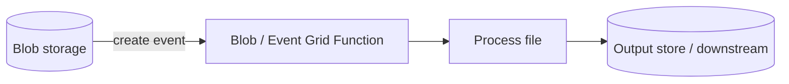

# Blob & File Triggers

Use this category for storage-driven ingestion and file processing flows. These recipes show how to react to object creation events and process files with minimal polling logic.

## Category map

| Recipe | Trigger | Difficulty |
| --- | --- | --- |
| [Blob Upload Processor](./blob-upload-processor.md) | Blob trigger | Intermediate |
| [Blob Event Grid Trigger](./blob-eventgrid-trigger.md) | Event Grid for blob events | Intermediate |
| Coming Soon | Blob / file event | Coming Soon |
