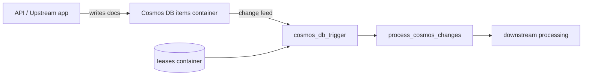
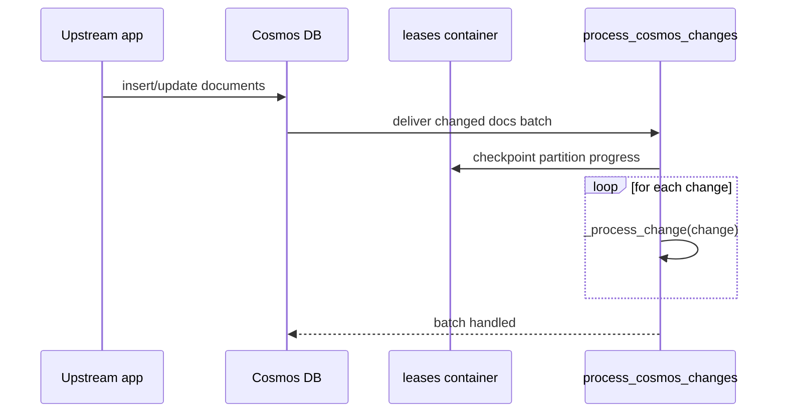

# Change Feed Processor

> **Trigger**: Cosmos DB | **State**: stateless | **Guarantee**: at-least-once | **Difficulty**: intermediate

## Overview
The `examples/data-and-pipelines/change_feed_processor/` sample listens to Cosmos DB changes in
`maindb/items` and processes changed documents in batches. It configures a lease container so
the runtime can coordinate checkpoints and partition ownership across instances.

This recipe is a strong fit for data synchronization, denormalization, audit pipelines, and
downstream event projection where inserts and updates in Cosmos DB should trigger asynchronous work.

## When to Use
- You need to react to document inserts and updates without polling manually.
- You want scalable, partition-aware processing with checkpointing.
- You are building eventual-consistency projections from operational data.

## When NOT to Use
- You need synchronous request/response behavior immediately after each write.
- Deletes must be observed directly and your projection cannot infer them from document state.
- The downstream system cannot tolerate replayed batches or at-least-once delivery.

## Architecture


## Behavior


## Prerequisites
- Python 3.10+
- Azure Functions Core Tools v4
- Azure Cosmos DB account with database `maindb` and container `items`
- Lease container `leases` (or permission to create it automatically)

## Project Structure
```text
examples/data-and-pipelines/change_feed_processor/
|-- function_app.py
|-- host.json
|-- local.settings.json.example
|-- requirements.txt
`-- README.md
```

## Implementation
The trigger binding defines both source and lease containers. The runtime passes a list of changed
documents, allowing batch-oriented processing while preserving per-document handling inside the loop.

```python
@app.cosmos_db_trigger(
    arg_name="docs",
    database_name="maindb",
    container_name="items",
    connection="CosmosDBConnection",
    lease_container_name="leases",
    create_lease_container_if_not_exists=True,
)
def process_cosmos_changes(docs: list[dict[str, Any]]) -> None:
    if not docs:
        logger.info("No documents found in this change feed batch.")
        return
```

Each changed document is mapped into a simple business summary in `_process_change`, which is where
you would typically add idempotent writes, enrichment, or event publication.

```python
logger.info("Received %d changed document(s) from Cosmos DB.", len(docs))
for change in docs:
    outcome = _process_change(change)
    logger.info("Processed change: %s", outcome)

def _process_change(change: dict[str, Any]) -> str:
    document_id = str(change.get("id", "unknown-id"))
    category = str(change.get("category", "uncategorized"))
    return f"id={document_id} category={category} status=synced"
```

## Run Locally
```bash
cd examples/data-and-pipelines/change_feed_processor
pip install -r requirements.txt
func start
```

## Expected Output
```text
[Information] Received 2 changed document(s) from Cosmos DB.
[Information] Processed change: id=order-1001 category=retail status=synced
[Information] Processed change: id=order-1002 category=wholesale status=synced
[Information] No documents found in this change feed batch.
```

## Production Considerations
- Scaling: partition strategy and RU budget determine maximum change-feed throughput.
- Retries: transient errors can replay batches; treat handlers as replay-safe.
- Idempotency: use document `id` plus `_etag` or version fields to prevent duplicate side effects.
- Observability: track lease lag, batch size, and processing duration per invocation.
- Security: scope Cosmos DB access with least privilege and private networking where required.

## Related Links
- [DB Input Output](./db-input-output.md)
- [Event Hub Consumer](../streams-and-telemetry/eventhub-consumer.md)
- [Retry and Idempotency](../reliability/retry-and-idempotency.md)
- [Cosmos DB trigger documentation](https://learn.microsoft.com/en-us/azure/azure-functions/functions-bindings-cosmosdb-v2-trigger)
