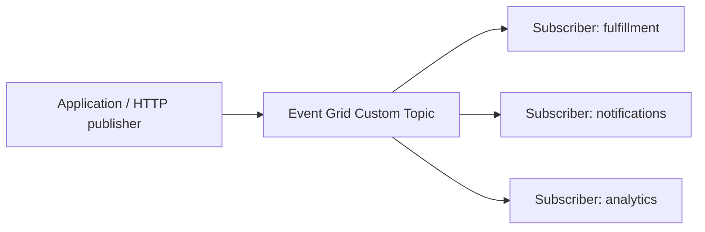
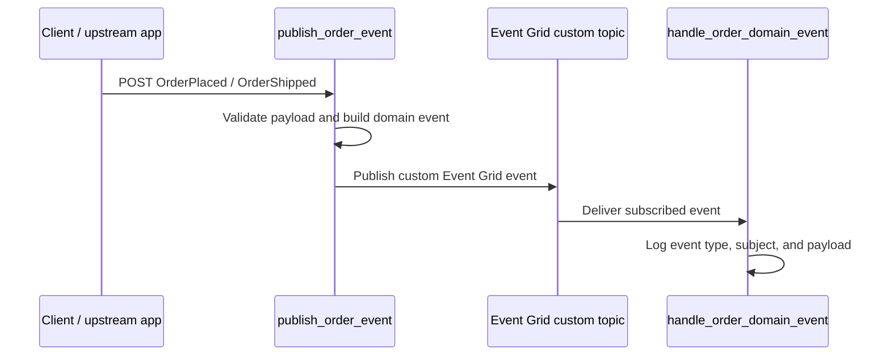

# Event Grid Domain Events

> **Trigger**: HTTP + Event Grid Output | **State**: stateless | **Guarantee**: at-least-once | **Difficulty**: intermediate

## Overview
The `examples/messaging-and-pubsub/eventgrid_domain_events/` project shows how an HTTP-triggered Azure Function can
publish custom domain events such as `OrderPlaced` and `OrderShipped` to an Event Grid custom topic, while an Event
Grid-triggered subscriber handles those events with structured logging.

This pattern is useful when you want business actions inside a function app to emit integration-friendly domain events
without coupling publishers directly to every downstream subscriber.

## When to Use
- You want one function endpoint to accept business commands and emit domain events.
- You want subscribers to react independently to the same event stream.
- You want lightweight, stateless event publishing with Event Grid custom topics.

## When NOT to Use
- You need strict exactly-once guarantees.
- You need ordered, session-aware, or broker-side dead-letter semantics better served by Service Bus.
- You need long-running workflow coordination or stateful sagas inside the same recipe.

## Architecture


## Behavior


## Implementation
The publisher uses an HTTP trigger plus `@app.event_grid_output(...)` to emit a `func.EventGridOutputEvent` to a custom
topic. The subscriber uses `@app.event_grid_trigger(...)` to receive those events after an Event Grid subscription is
configured.

### Prerequisites
- Python 3.10+
- Azure Functions Core Tools v4
- An Event Grid custom topic and access key
- An Event Grid subscription that points the custom topic at the subscriber function

### Project Structure
```text
examples/messaging-and-pubsub/eventgrid_domain_events/
|-- function_app.py
|-- host.json
|-- local.settings.json.example
|-- pyproject.toml
`-- README.md
```

The HTTP function turns an incoming business payload into a domain event envelope:

```python
@app.route(route="orders/events", methods=["POST"], auth_level=func.AuthLevel.ANONYMOUS)
@app.event_grid_output(
    arg_name="output_event",
    topic_endpoint_uri="MyEventGridTopicUriSetting",
    topic_key_setting="MyEventGridTopicKeySetting",
)
def publish_order_event(
    req: func.HttpRequest,
    output_event: func.Out[func.EventGridOutputEvent],
) -> func.HttpResponse:
    payload = req.get_json()
    output_event.set(
        func.EventGridOutputEvent(
            id="...",
            subject=f"/orders/{payload['order_id']}",
            event_type="Contoso.Orders.OrderPlaced",
            event_time=datetime.datetime.utcnow(),
            data=_build_event_payload(payload),
            data_version="1.0",
        )
    )
    return func.HttpResponse(status_code=202)
```

The subscriber reacts to the custom topic event and logs the business context:

```python
@app.event_grid_trigger(arg_name="event")
def handle_order_domain_event(event: func.EventGridEvent) -> None:
    payload = event.get_json() or {}
    logger.info(
        "Handled order domain event",
        extra={
            "event_id": event.id,
            "event_type": event.event_type,
            "subject": event.subject,
            "order_id": payload.get("orderId"),
        },
    )
```

## Configuration
Set these values in `local.settings.json` when running locally:

| Variable | Purpose |
|----------|---------|
| `AzureWebJobsStorage` | Local/runtime storage used by Azure Functions Core Tools |
| `FUNCTIONS_WORKER_RUNTIME` | Must be `python` |
| `MyEventGridTopicUriSetting` | Event Grid custom topic endpoint URI |
| `MyEventGridTopicKeySetting` | Event Grid custom topic access key |

## Run Locally
```bash
cd examples/messaging-and-pubsub/eventgrid_domain_events
python -m venv .venv
source .venv/bin/activate
pip install -e ".[dev]"
cp local.settings.json.example local.settings.json
func start
```

Publish a sample domain event:

```bash
curl -X POST "http://localhost:7071/api/orders/events" \
  -H "Content-Type: application/json" \
  -d '{"event_type":"OrderPlaced","order_id":"ORD-1001","customer_id":"C-42","amount":149.99,"currency":"USD"}'
```

To exercise the subscriber locally, post a sample Event Grid payload to the webhook endpoint:

```bash
curl -X POST "http://localhost:7071/runtime/webhooks/EventGrid?functionName=handle_order_domain_event" \
  -H "Content-Type: application/json" \
  -d '[{"id":"evt-1001","topic":"demo","subject":"/orders/ORD-1001","eventType":"Contoso.Orders.OrderPlaced","eventTime":"2026-01-01T00:00:00Z","data":{"orderId":"ORD-1001","customerId":"C-42","amount":149.99,"currency":"USD"},"dataVersion":"1.0","metadataVersion":"1"}]'
```

## Expected Output
```text
Accepted order domain event publication {"event_type":"Contoso.Orders.OrderPlaced","order_id":"ORD-1001",...}
Handled order domain event {"event_type":"Contoso.Orders.OrderPlaced","subject":"/orders/ORD-1001",...}
```

## Production Considerations
- Idempotency: Event Grid is at-least-once, so subscribers must tolerate duplicate delivery.
- Contracts: keep event names, subjects, and payload fields stable for downstream consumers.
- Filtering: use Event Grid subscription filters when only some subscribers need selected event types.
- Observability: log `event_id`, `event_type`, `subject`, and business identifiers like `order_id`.
- Security: store the topic URI and key in app settings or use identity-based connections when supported.

## Related Links
- [Event Grid custom topics](https://learn.microsoft.com/en-us/azure/event-grid/custom-topics)
- [Azure Event Grid output binding for Azure Functions](https://learn.microsoft.com/en-us/azure/azure-functions/functions-bindings-event-grid-output)
- [Event Grid trigger](https://learn.microsoft.com/en-us/azure/azure-functions/functions-bindings-event-grid-trigger)
