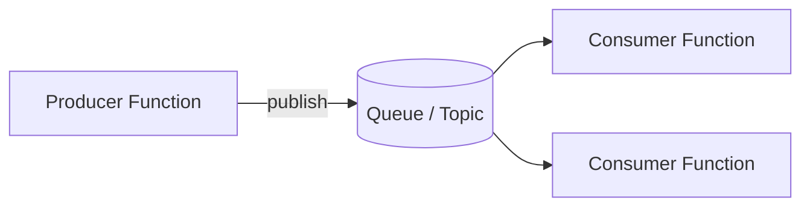

# Messaging & Pub/Sub

Use this category for queue-backed decoupling and broker-based asynchronous communication. These recipes focus on producers, consumers, and message-driven scaling behavior.

## Category map

| Recipe | Trigger | Difficulty |
| --- | --- | --- |
| [Queue Producer](./queue-producer.md) | HTTP to Storage Queue output | Beginner |
| [Queue Consumer](./queue-consumer.md) | Storage Queue trigger | Beginner |
| [Service Bus Worker](./servicebus-worker.md) | Service Bus trigger | Intermediate |
| [Event Grid Event Router](./eventgrid-event-router.md) | Event Grid trigger | Intermediate |
| [Service Bus Topic Fanout](./servicebus-topic-fanout.md) | Service Bus topic | Intermediate |
| [Service Bus Sessions](./servicebus-sessions.md) | Service Bus session | Advanced |
| [Service Bus DLQ Replay](./servicebus-dlq-replay.md) | Service Bus DLQ + HTTP | Advanced |
| [Event Grid Domain Events](./eventgrid-domain-events.md) | Event Grid domain | Intermediate |
