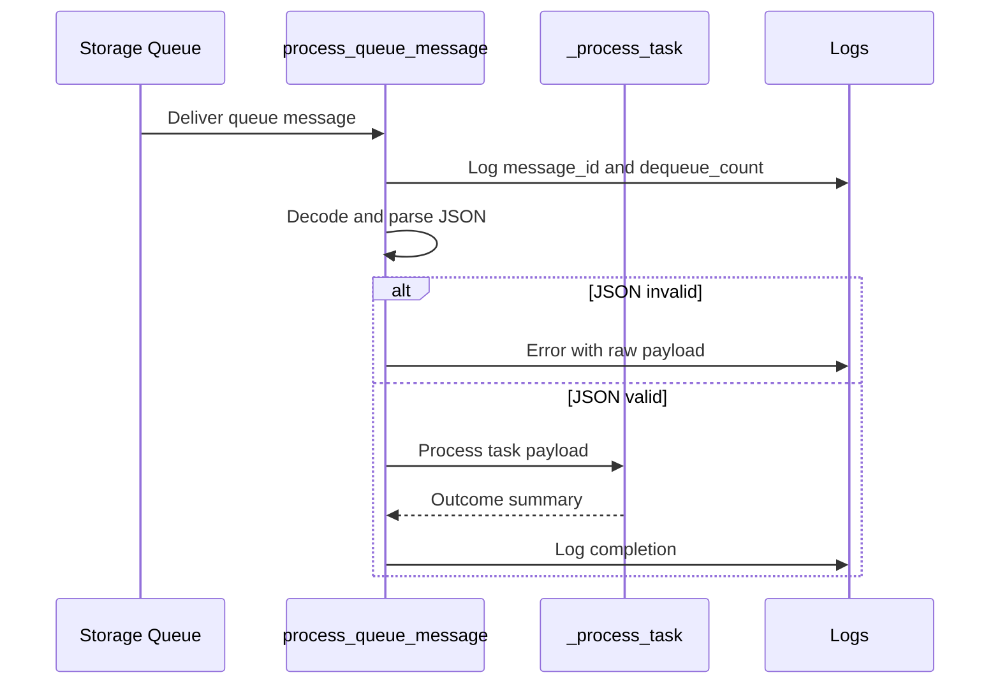

# Queue Consumer

> **Trigger**: Queue Storage | **State**: stateless | **Guarantee**: at-least-once | **Difficulty**: beginner

## Overview
The `examples/messaging-and-pubsub/queue_consumer/` sample reads messages from `outbound-tasks`, parses JSON payloads,
logs retry context (`dequeue_count`), and dispatches to `_process_task` for business handling.
It demonstrates safe message parsing and structured logging for queue-based workers.

Queue consumers are a core pattern for reliable asynchronous processing. This recipe highlights
what to log and how to structure handlers so retries and poison-message analysis are practical.

## When to Use
- You process background jobs from Azure Storage Queue.
- You need visibility into retries and malformed payloads.
- You want a simple worker baseline for task-type dispatch.

## When NOT to Use
- You need ordered sessions, duplicate detection, or dead-letter queues built into the broker.
- You need strong request/response coupling with the original caller.
- You cannot make downstream side effects safe across retries and poison-message handling.

## Architecture
```mermaid
flowchart LR
    queue[Storage Queue\noutbound-tasks] --> handler[process_queue_message]
    handler --> parse[Decode + parse JSON]
    parse -->|valid| worker[_process_task()]
    parse -->|invalid| error[Log error + return]
    worker --> done[Log completion]
```

## Behavior


## Implementation
The trigger reads message text and logs delivery metadata useful during retries and incident triage.

### Prerequisites
- Python 3.10+
- Azure Functions Core Tools v4
- Azure Storage account or Azurite with queue `outbound-tasks`
- Producer path such as `examples/messaging-and-pubsub/queue_producer/` for message generation

### Project Structure
```text
examples/messaging-and-pubsub/queue_consumer/
|-- function_app.py
|-- host.json
|-- local.settings.json.example
|-- pyproject.toml
`-- README.md
```

```python
@app.queue_trigger(
    arg_name="msg",
    queue_name="outbound-tasks",
    connection="AzureWebJobsStorage",
)
def process_queue_message(msg: func.QueueMessage) -> None:
    message_text = msg.get_body().decode("utf-8", errors="replace")
    dequeue_count = int(getattr(msg, "dequeue_count", 1))
    message_id = getattr(msg, "id", "unknown")
```

Malformed payloads are logged and skipped safely so a single bad message does not crash the worker.

```python
try:
    payload: dict[str, Any] = json.loads(message_text)
except json.JSONDecodeError:
    logger.error(
        "Invalid JSON in message %s (dequeue_count=%d): %s",
        message_id,
        dequeue_count,
        message_text,
    )
    return
```

Valid messages are passed into `_process_task`, which can be replaced with domain-specific handlers.

```python
outcome = _process_task(payload)
logger.info("Queue message %s processed: %s", message_id, outcome)

def _process_task(task: dict[str, Any]) -> str:
    task_type = str(task.get("task_type", "unknown"))
    details = task.get("payload", {})
    return f"Task '{task_type}' completed with payload keys: {sorted(details.keys())}"
```

## Run Locally
```bash
cd examples/messaging-and-pubsub/queue_consumer
pip install -e ".[dev]"
func start
```

## Expected Output
```text
[Information] Processing queue message id=9f7... dequeue_count=1 task_type=email
[Information] Queue message 9f7... processed: Task 'email' completed with payload keys: ['to']
[Error] Invalid JSON in message 413... (dequeue_count=3): {bad-json
```

## Production Considerations
- Scaling: tune batch/concurrency to match downstream capacity and avoid hot partitions.
- Retries: high `dequeue_count` indicates repeated failure; route poison messages for investigation.
- Idempotency: use message/business IDs to prevent duplicate side effects during redelivery.
- Observability: log `message_id`, `dequeue_count`, and task type as structured fields.
- Security: avoid logging sensitive payload content; apply data minimization in worker logs.

## Related Links
- Microsoft Learn: https://learn.microsoft.com/en-us/azure/azure-functions/functions-bindings-storage-queue-trigger
- [Queue Producer](./queue-producer.md)
- [Retry and Idempotency](../reliability/retry-and-idempotency.md)
- [Concurrency Tuning](../runtime-and-ops/concurrency-tuning.md)
