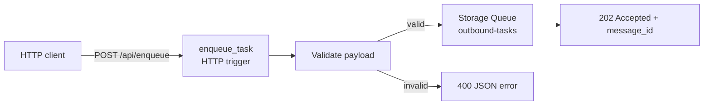
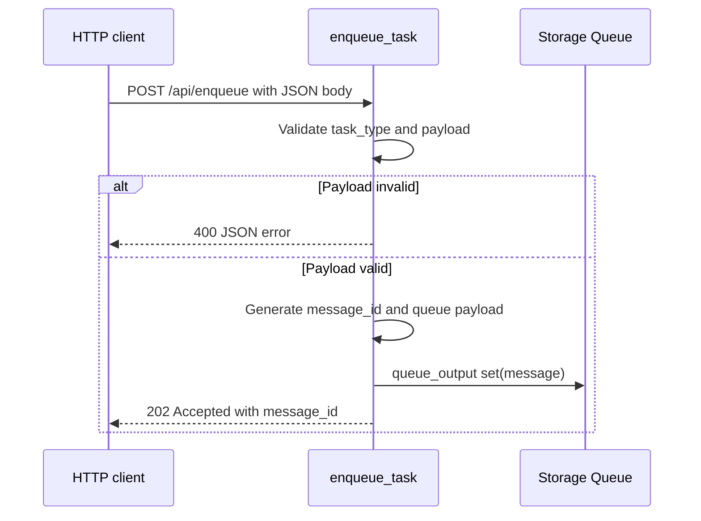

# Queue Producer

> **Trigger**: Queue Storage | **State**: stateless | **Guarantee**: at-least-once | **Difficulty**: beginner

## Overview
The `examples/messaging-and-pubsub/queue_producer/` project exposes an HTTP endpoint at `/api/enqueue` that validates
JSON payloads and writes accepted tasks to the `outbound-tasks` Storage Queue via output binding.
It returns `202 Accepted` with a generated `message_id` so callers can track asynchronous execution.

This is a common front-door pattern for decoupling user-facing APIs from background work.
The producer handles contract validation while workers consume queue messages independently.

## When to Use
- You need asynchronous task submission over HTTP.
- You want schema validation before messages reach workers.
- You want queue-backed buffering between API and processing tiers.

## When NOT to Use
- You need the caller to wait for business work to complete synchronously.
- You need advanced broker features such as sessions, duplicate detection, or dead-letter queues.
- You cannot tolerate eventual processing after the HTTP request has already been accepted.

## Architecture


## Behavior


## Implementation
The function combines HTTP trigger and queue output binding in one handler.

### Prerequisites
- Python 3.10+
- Azure Functions Core Tools v4
- Azure Storage account or Azurite with queue `outbound-tasks`
- HTTP client for testing (`curl`, Postman, or integration tests)

### Project Structure
```text
examples/messaging-and-pubsub/queue_producer/
|-- function_app.py
|-- host.json
|-- local.settings.json.example
|-- requirements.txt
`-- README.md
```

```python
@app.route(route="enqueue", methods=["POST"], auth_level=func.AuthLevel.ANONYMOUS)
@app.queue_output(
    arg_name="msg",
    queue_name="outbound-tasks",
    connection="AzureWebJobsStorage",
)
def enqueue_task(req: func.HttpRequest, msg: func.Out[str]) -> func.HttpResponse:
    payload: dict[str, Any] = req.get_json()
    is_valid, error_message = _validate_payload(payload)
```

After validation, it generates a UUID, shapes the queue message, and enqueues it through binding.

```python
message_id = str(uuid4())
queue_message = {
    "message_id": message_id,
    "task_type": payload["task_type"],
    "payload": payload.get("payload", {}),
}
msg.set(json.dumps(queue_message))
return _json_response(
    {"status": "accepted", "message_id": message_id, "queue": "outbound-tasks"},
    status_code=202,
)
```

Validation enforces a non-empty `task_type` and optional object `payload`, keeping queue data clean.

## Run Locally
```bash
cd examples/messaging-and-pubsub/queue_producer
pip install -r requirements.txt
func start
```

## Expected Output
```text
POST /api/enqueue {"task_type":"email","payload":{"to":"user@example.com"}}
-> 202 {"status":"accepted","message_id":"<uuid>","queue":"outbound-tasks"}

POST /api/enqueue {"task_type":""}
-> 400 {"error":"Field 'task_type' is required and must be a non-empty string."}
```

## Production Considerations
- Scaling: API and queue scale independently; monitor queue backlog and response latency together.
- Retries: clients may retry on 5xx/timeouts, so ensure submission is idempotent where needed.
- Idempotency: accept client-supplied idempotency keys to prevent duplicate queue submissions.
- Observability: log `message_id`, `task_type`, and request correlation identifiers.
- Security: tighten auth level in production and validate/limit payload sizes.

## Related Links
- Microsoft Learn: https://learn.microsoft.com/en-us/azure/azure-functions/functions-bindings-storage-queue-trigger
- [Queue Consumer](./queue-consumer.md)
- [Output Binding vs SDK](../runtime-and-ops/output-binding-vs-sdk.md)
- [Retry and Idempotency](../reliability/retry-and-idempotency.md)
