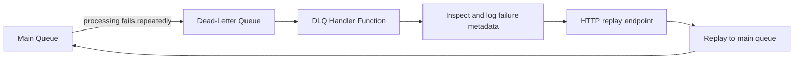
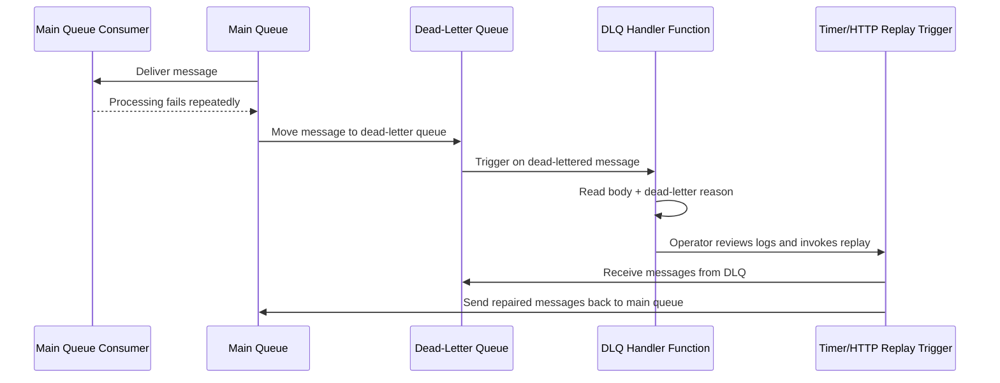

# Service Bus DLQ Replay

> **Trigger**: Service Bus (DLQ) | **State**: stateless | **Guarantee**: at-least-once | **Difficulty**: intermediate

## Overview
The `examples/messaging-and-pubsub/servicebus_dlq_replay/` recipe monitors dead-letter queue messages,
captures failure context, and replays repaired messages back to the main queue. Use it when operators need
to inspect why messages failed, fix the underlying issue, and safely return those messages to normal processing.

This recipe combines a DLQ-triggered logging function with an HTTP replay endpoint powered by the Service Bus SDK.
That split keeps inspection lightweight while giving operators an explicit replay action.

## When to Use
- You need operational visibility into messages that exceeded max delivery attempts.
- You want a controlled replay mechanism after fixing malformed payloads, dependencies, or downstream outages.
- You need to preserve tracing metadata such as `message_id`, `correlation_id`, and dead-letter reason.

## When NOT to Use
- You can automatically recover transient failures through normal retries without operator intervention.
- You need exactly-once side effects and cannot make downstream processing idempotent.
- You want to discard poison messages permanently instead of investigating and replaying them.

## Architecture


## Behavior


## Implementation
The example has two entry points:

1. `log_dead_lettered_message` uses `@app.service_bus_queue_trigger` bound to `orders/$DeadLetterQueue`.
   It logs `message_id`, `correlation_id`, `delivery_count`, `dead_letter_reason`, and a safe body preview.
2. `replay_dead_letter_queue` is an HTTP-triggered function that connects through `azure-servicebus`, reads a
   small DLQ batch, publishes cloned messages back to the main queue, and completes the DLQ copies.

`azure_functions_logging` keeps logs structured so failures and replay decisions are easy to query.

```python
@app.service_bus_queue_trigger(
    arg_name="msg",
    queue_name=f"{QUEUE_NAME}/$DeadLetterQueue",
    connection="ServiceBusConnection",
)
def log_dead_lettered_message(msg: func.ServiceBusMessage) -> None:
    logger.warning(
        "Dead-lettered Service Bus message detected",
        extra={
            "message_id": getattr(msg, "message_id", None),
            "dead_letter_reason": getattr(msg, "dead_letter_reason", None),
            "delivery_count": int(getattr(msg, "delivery_count", 1)),
        },
    )
```

Replay uses the SDK because output bindings are not a good fit for iterating over and completing DLQ messages.

```python
with client.get_queue_receiver(
    queue_name=QUEUE_NAME,
    sub_queue=ServiceBusSubQueue.DEAD_LETTER,
) as receiver, client.get_queue_sender(queue_name=QUEUE_NAME) as sender:
    messages = receiver.receive_messages(max_message_count=batch_size, max_wait_time=5)
    for message in messages:
        sender.send_messages(_build_replay_message(message))
        receiver.complete_message(message)
```

## Project Structure
```text
examples/messaging-and-pubsub/servicebus_dlq_replay/
|-- function_app.py
|-- host.json
|-- local.settings.json.example
|-- requirements.txt
`-- README.md
```

## Config
- `ServiceBusConnection`: Service Bus connection string for local development.
- `SERVICEBUS_QUEUE_NAME`: Main queue name. Defaults to `orders`.
- `DLQ_REPLAY_BATCH_SIZE`: Default number of messages to replay per HTTP request.
- `AzureWebJobsStorage`: Storage account used by the Functions host.

## Run Locally
```bash
cd examples/messaging-and-pubsub/servicebus_dlq_replay
python -m venv .venv
source .venv/bin/activate
pip install -r requirements.txt
cp local.settings.json.example local.settings.json
func start
```

Replay a batch:

```bash
curl -X POST "http://localhost:7071/api/servicebus/dlq/replay?code=<function-key>&limit=5"
```

## Expected Output
```text
[Warning] Dead-lettered Service Bus message detected {'message_id': 'ord-42', 'dead_letter_reason': 'MaxDeliveryCountExceeded', 'delivery_count': 10}
[Information] Replayed dead-lettered Service Bus message {'original_message_id': 'ord-42', 'replayed_message_id': 'ord-42-replay-a1b2c3d4'}
```

## Production Considerations
- Idempotency: replayed messages can be delivered again, so consumers must tolerate duplicates.
- Safety: gate replay behind Function or higher auth and consider approval workflows for sensitive queues.
- Throughput: replay in bounded batches to avoid flooding downstream services after an outage.
- Observability: emit dead-letter reason, replay operator, and replay counts to dashboards and alerts.
- Repair policy: fix root causes before replaying or messages will cycle back into the DLQ.

## Related Links
- [Dead-letter queues](https://learn.microsoft.com/en-us/azure/service-bus-messaging/service-bus-dead-letter-queues)
