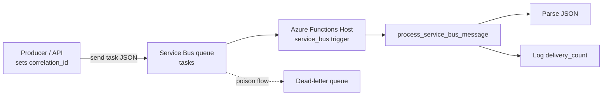
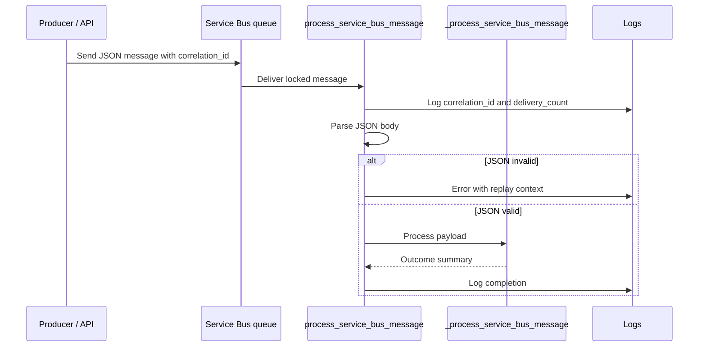

# Service Bus Worker

> **Trigger**: Service Bus | **State**: stateless | **Guarantee**: at-least-once | **Difficulty**: beginner

## Overview
The `examples/messaging-and-pubsub/servicebus_worker/` recipe consumes messages from the `tasks` queue using
`@app.service_bus_queue_trigger`. It extracts delivery metadata (`correlation_id`, `delivery_count`),
parses JSON safely, and routes valid payloads to a processing helper.

Service Bus is appropriate when you need durable messaging, lock-based processing, dead-lettering,
and enterprise integration features. This sample focuses on operational visibility and failure handling
patterns that are important for production background workers.

## When to Use
- You need reliable queue processing with built-in delivery semantics.
- You want message metadata for tracing, retries, and diagnostics.
- You require dead-letter queues for poison message isolation.

## When NOT to Use
- Azure Storage Queue is sufficient and you do not need broker features such as locks or DLQs.
- You need immediate synchronous feedback to the original requester.
- You cannot design handlers to tolerate redelivery before max delivery sends a message to the DLQ.

## Architecture


## Behavior


## Implementation
The function binds directly to `tasks` and reads both payload and transport metadata before doing
business logic. This makes retries and diagnostics explicit.

### Prerequisites
- Python 3.10+
- Azure Functions Core Tools v4
- Azure Service Bus namespace with queue `tasks`
- `ServiceBusConnection` app setting (connection string or identity-based config)

### Project Structure
```text
examples/messaging-and-pubsub/servicebus_worker/
|-- function_app.py
|-- host.json
|-- local.settings.json.example
|-- pyproject.toml
`-- README.md
```

```python
@app.service_bus_queue_trigger(
    arg_name="msg",
    queue_name="tasks",
    connection="ServiceBusConnection",
)
def process_service_bus_message(msg: func.ServiceBusMessage) -> None:
    raw_body = msg.get_body().decode("utf-8", errors="replace")
    correlation_id = getattr(msg, "correlation_id", None)
    delivery_count = int(getattr(msg, "delivery_count", 1))
```

The parser guards against invalid JSON and logs context that operators need to evaluate whether
the message should be fixed and replayed from dead-letter storage.

```python
try:
    payload: dict[str, Any] = json.loads(raw_body)
except json.JSONDecodeError:
    logger.error(
        "Invalid Service Bus JSON (correlation_id=%s delivery_count=%d): %s",
        correlation_id,
        delivery_count,
        raw_body,
    )
    return

outcome = _process_service_bus_message(payload)
logger.info("Service Bus processing complete: %s", outcome)
```

`delivery_count` should inform alerting and remediation. When it approaches your max delivery policy,
the message may dead-letter and require manual or automated replay.

## Run Locally
```bash
cd examples/messaging-and-pubsub/servicebus_worker
pip install -e ".[dev]"
func start
```

## Expected Output
```text
[Information] Service Bus message received correlation_id=req-142 delivery_count=1
[Information] Service Bus processing complete: task=generate_report priority=high status=processed
[Error] Invalid Service Bus JSON (correlation_id=req-188 delivery_count=5): {bad payload}
[Warning] Message likely to dead-letter after max delivery attempts
```

## Production Considerations
- Scaling: increase instance count and `maxConcurrentCalls` for I/O-bound handlers.
- Retries: rely on Service Bus lock + redelivery; avoid swallowing transient exceptions silently.
- Idempotency: use message ID or business key to avoid duplicate side effects on redelivery.
- Observability: always log `correlation_id`, `delivery_count`, and processing outcome.
- Security: prefer managed identity with least-privilege `Azure Service Bus Data Receiver` role.

## Related Links
- Microsoft Learn: https://learn.microsoft.com/en-us/azure/azure-functions/functions-bindings-service-bus-trigger
- [Managed Identity (Service Bus)](../security-and-tenancy/managed-identity-servicebus.md)
- [Retry and Idempotency](../reliability/retry-and-idempotency.md)
- [host.json Tuning](../runtime-and-ops/host-json-tuning.md)
