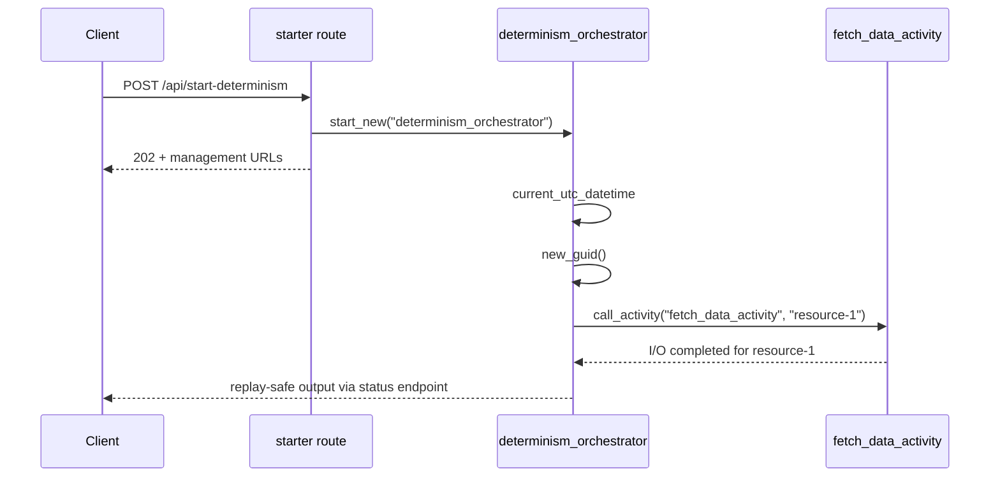

# Durable Determinism Gotchas

> **Trigger**: HTTP (starter) | **State**: durable | **Guarantee**: at-least-once | **Difficulty**: advanced

## Overview
This recipe explains replay-safe orchestrator coding in Durable Functions Python.
The example contrasts incorrect patterns (`datetime.now()`, `uuid.uuid4()`, direct I/O)
with correct durable APIs (`context.current_utc_datetime`, `context.new_guid()`,
activity delegation).

Durable orchestrators are not ordinary functions.
They are deterministic state machines reconstructed from event history.
If orchestrator code depends on non-deterministic values, replay diverges and instances fail.

## When to Use
- You are debugging `NonDeterministicOrchestrationException` style failures.
- You need a checklist for replay-safe orchestrator implementation.
- You are reviewing team code and want concrete right-vs-wrong examples.

## When NOT to Use
- You only need beginner onboarding material and not a replay-safety deep dive.
- The workflow has no orchestrator and all work already happens in regular triggers.
- You want to perform direct I/O in control flow instead of isolating it inside activities.

## Architecture
```mermaid
flowchart LR
    client[Client] -->|POST /api/start-determinism| starter[starter route]
    starter -->|202 + status URLs| client
    starter -->|start_new()| orch[determinism_orchestrator]
    orch --> safe[replay-safe values]
    safe --> activity[fetch_data_activity]
    activity --> result[Completed output]
```

## Behavior


## Prerequisites
- Python 3.10+
- Azure Functions Core Tools v4
- Durable backend storage for orchestration event sourcing
- Familiarity with generator-based orchestrator syntax (`yield` tasks)

## Project Structure
```text
examples/orchestration-and-workflows/durable_determinism_gotchas/
|- function_app.py
|- host.json
|- local.settings.json.example
|- pyproject.toml
`- README.md
```

## Implementation
The starter endpoint is standard durable boilerplate.

```python
@bp.route(route="start-determinism", methods=["POST"], auth_level=func.AuthLevel.ANONYMOUS)
@bp.durable_client_input(client_name="client")
async def start_determinism_demo(req: func.HttpRequest, client: df.DurableOrchestrationClient) -> func.HttpResponse:
    instance_id = await client.start_new("determinism_orchestrator")
    return client.create_check_status_response(req, instance_id)
```

Core orchestrator excerpt:

```python
@bp.orchestration_trigger(context_name="context")
def determinism_orchestrator(context: df.DurableOrchestrationContext):
    safe_timestamp = context.current_utc_datetime.isoformat()
    safe_identifier = str(context.new_guid())
    io_result = yield context.call_activity("fetch_data_activity", "resource-1")
    return {
        "timestamp": safe_timestamp,
        "operation_id": safe_identifier,
        "data": io_result,
    }
```

Replay safety rules demonstrated in the file comments:

- Use `context.current_utc_datetime` instead of wall-clock `datetime.now()`.
- Use `context.new_guid()` instead of random `uuid.uuid4()`.
- Move I/O into activities rather than calling network or disk directly in orchestrators.

Activity boundary used by the example:

```python
@bp.activity_trigger(input_name="payload")
def fetch_data_activity(payload: str) -> str:
    return f"I/O completed for {payload}"
```

## Run Locally
```bash
cd examples/orchestration-and-workflows/durable_determinism_gotchas
pip install -e ".[dev]"
func start
```

## Expected Output
```text
POST /api/start-determinism -> 202 Accepted

Completed output shape:
{
  "timestamp": "2026-...Z",
  "operation_id": "<durable-guid>",
  "data": "I/O completed for resource-1"
}

Timestamp and operation_id are replay-safe for that orchestration history.
```

## Production Considerations
- Scaling: deterministic orchestrators replay fast, enabling high control-plane throughput.
- Retries: combine deterministic orchestration with activity retries for transient dependency errors.
- Idempotency: ensure activity implementations are idempotent under retries and re-execution.
- Observability: monitor replay counts, execution duration, and orchestration failure reasons.
- Security: sanitize payloads passed to activities before they touch external systems.

## Related Links
- [Durable Retry Pattern](./durable-retry-pattern.md)
- [Durable Human Interaction](./durable-human-interaction.md)
- [Durable Hello Sequence](./durable-hello-sequence.md)
- [Durable Functions overview](https://learn.microsoft.com/en-us/azure/azure-functions/durable/durable-functions-overview)
- [Durable Functions application patterns](https://learn.microsoft.com/en-us/azure/azure-functions/durable/durable-functions-overview#application-patterns)
