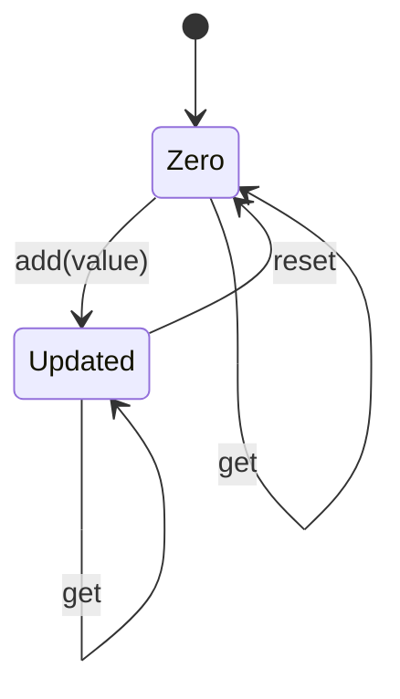

# Durable Entity Counter

> **Trigger**: HTTP (starter) | **State**: durable | **Guarantee**: at-least-once | **Difficulty**: advanced

## Overview
This recipe shows a stateful Durable Entity that behaves like a distributed counter.
The entity trigger supports `add`, `reset`, and `get` operations and is controlled by
HTTP routes that signal entity operations or read current state.

Unlike orchestrators, durable entities model long-lived mutable state with serialized
operation execution.
They are useful when you need lightweight state coordination without building a separate
database-centric lock or transaction workflow.

## When to Use
- You need simple state transitions (`add/reset/get`) with durable consistency.
- You need command-style updates and query-style reads through HTTP endpoints.
- You want to coordinate small shared counters across distributed function instances.

## When NOT to Use
- You need high-throughput analytical counting where a database or cache is a better fit.
- Operations span multiple entities and require transactional guarantees beyond a single entity key.
- The state is ephemeral and does not need durable coordination.

## Architecture
```mermaid
flowchart LR
    client[Client] -->|POST /api/counter/add?value=3| signal[signal_counter route]
    signal -->|signal_entity()| entity[counter_entity trigger]
    entity -->|state persisted durably| store[(Entity state)]
    client -->|GET /api/counter| read[get_counter route]
    read -->|read_entity_state()| store
    read --> client
```

## Behavior


## Prerequisites
- Python 3.10+
- Azure Functions Core Tools v4
- Durable backend storage configured for entity state persistence
- JSON client for passing optional `{ "value": n }` payloads

## Project Structure
```text
examples/orchestration-and-workflows/durable_entity_counter/
|- function_app.py
|- host.json
|- local.settings.json.example
|- pyproject.toml
`- README.md
```

## Implementation
The entity function receives a `DurableEntityContext` and dispatches by operation name.

```python
@bp.entity_trigger(context_name="context")
def counter_entity(context: df.DurableEntityContext) -> None:
    current_value = context.get_state(lambda: 0)
    operation = context.operation_name
    if operation == "add":
        amount = context.get_input() or 1
        current_value += int(amount)
        context.set_state(current_value)
        context.set_result(current_value)
        return
    if operation == "reset":
        context.set_state(0)
        context.set_result(0)
        return
    if operation == "get":
        context.set_result(current_value)
        return
    context.set_result({"error": f"Unsupported operation: {operation}"})
```

Signal route accepts `value` from query string or JSON body, then calls `signal_entity`.

```python
entity_id = df.EntityId("counter_entity", "counter")
signal_value = value if operation == "add" else None
await client.signal_entity(entity_id, operation, signal_value)
```

Read route uses `read_entity_state` and normalizes missing state to zero.

```python
state_response = await client.read_entity_state(entity_id)
if not state_response.entity_exists:
    return func.HttpResponse(json.dumps({"value": 0}), mimetype="application/json", status_code=200)
return func.HttpResponse(json.dumps({"value": state_response.entity_state}), mimetype="application/json", status_code=200)
```

Replay model note:
entities are operation-driven and persisted by the Durable runtime.
Treat each operation handler as deterministic for the provided input.

## Run Locally
```bash
cd examples/orchestration-and-workflows/durable_entity_counter
pip install -e ".[dev]"
func start
```

## Expected Output
```text
POST /api/counter/add?value=3   -> Signaled 'add' operation...
POST /api/counter/add?value=2   -> Signaled 'add' operation...
GET  /api/counter               -> {"value": 5}
POST /api/counter/reset         -> Signaled 'reset' operation...
GET  /api/counter               -> {"value": 0}
```

## Production Considerations
- Scaling: entities serialize operations per entity key; shard with multiple keys when needed.
- Retries: client-side retries for signaling are safe when operations are idempotent by design.
- Idempotency: define command semantics carefully, especially for repeated `add` requests.
- Observability: log entity key, operation, and resulting state for auditability.
- Security: validate caller permissions before allowing state mutation operations.

## Related Links
- [Durable Human Interaction](./durable-human-interaction.md)
- [Durable Retry Pattern](./durable-retry-pattern.md)
- [Durable Unit Testing](./durable-unit-testing.md)
- [Durable Functions overview](https://learn.microsoft.com/en-us/azure/azure-functions/durable/durable-functions-overview)
- [Durable Functions application patterns](https://learn.microsoft.com/en-us/azure/azure-functions/durable/durable-functions-overview#application-patterns)
