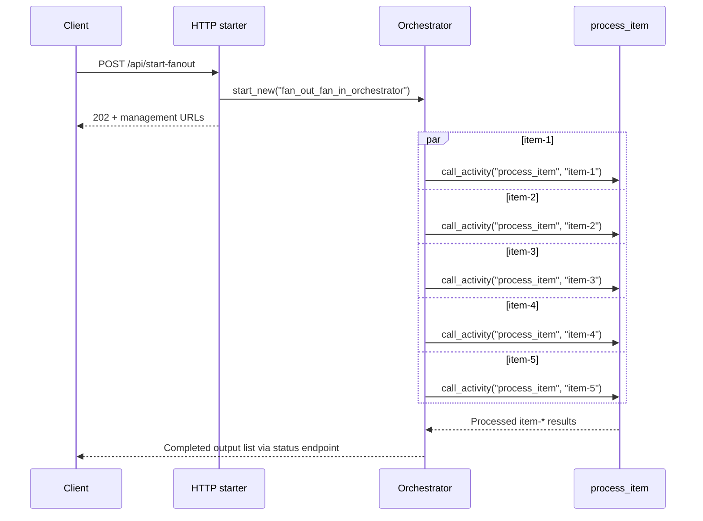

# Durable Fan-Out Fan-In

> **Trigger**: HTTP (starter) | **State**: durable | **Guarantee**: at-least-once | **Difficulty**: intermediate

## Overview
This recipe documents the parallel orchestration pattern where one orchestrator schedules
multiple activities and waits for all of them with `context.task_all()`.
The example starts from an HTTP endpoint, creates five work items, and processes them
simultaneously.

Durable replay still applies.
The orchestrator does not execute work itself; it only schedules activity tasks and
deterministically awaits completion.
This gives parallel throughput while preserving fault-tolerant history semantics.

## When to Use
- You have independent units of work that can run safely in parallel.
- You want to reduce total workflow latency compared with sequential activity chaining.
- You need checkpointed orchestration so partial completion survives host restarts.

## When NOT to Use
- Each step depends on the previous step's output and cannot run concurrently.
- Downstream services cannot tolerate bursty parallel execution.
- A simple queue consumer is sufficient and orchestration history adds unnecessary overhead.

## Architecture
```mermaid
flowchart LR
    client[Client] -->|POST /api/start-fanout| starter[HTTP starter]
    starter -->|202 + status URLs| client
    starter -->|start_new()| orch[fan_out_fan_in_orchestrator]
    orch --> item1[process item-1]
    orch --> item2[process item-2]
    orch --> item3[process item-3]
    orch --> item4[process item-4]
    orch --> item5[process item-5]
    item1 --> gather[task_all gathers results]
    item2 --> gather
    item3 --> gather
    item4 --> gather
    item5 --> gather
    gather --> result[results[5] returned]
```

## Behavior


## Prerequisites
- Python 3.10+
- Azure Functions Core Tools v4
- Durable storage configured in local settings
- `azure-functions` and `azure-functions-durable` dependencies installed

## Project Structure
```text
examples/orchestration-and-workflows/durable_fan_out_fan_in/
|- function_app.py
|- host.json
|- local.settings.json.example
|- pyproject.toml
`- README.md
```

## Implementation
The app uses the same durable blueprint registration pattern used across durable examples.

```python
app = func.FunctionApp()
bp = df.Blueprint()
...
app.register_functions(bp)
```

The starter endpoint creates the instance by orchestrator name.

```python
@bp.route(route="start-fanout", methods=["POST"], auth_level=func.AuthLevel.ANONYMOUS)
@bp.durable_client_input(client_name="client")
async def start_fanout(req: func.HttpRequest, client: df.DurableOrchestrationClient) -> func.HttpResponse:
    instance_id = await client.start_new("fan_out_fan_in_orchestrator")
    return client.create_check_status_response(req, instance_id)
```

The orchestrator creates five item IDs, schedules one activity per item,
then blocks on `task_all` to gather all outputs.

```python
@bp.orchestration_trigger(context_name="context")
def fan_out_fan_in_orchestrator(context: df.DurableOrchestrationContext):
    items = [f"item-{index}" for index in range(1, 6)]
    tasks = [context.call_activity("process_item", item) for item in items]
    results = yield context.task_all(tasks)
    return results
```

The activity is intentionally small so orchestration behavior is clear.

```python
@bp.activity_trigger(input_name="payload")
def process_item(payload: str) -> str:
    return f"Processed {payload}"
```

Replay model note:
`task_all` does not violate determinism because the task list is built from fixed input.
Do not inject random values or direct network I/O in the orchestrator body.

## Run Locally
```bash
cd examples/orchestration-and-workflows/durable_fan_out_fan_in
pip install -e ".[dev]"
func start
```

## Expected Output
```text
POST /api/start-fanout -> 202 Accepted

Final orchestration output:
[
  "Processed item-1",
  "Processed item-2",
  "Processed item-3",
  "Processed item-4",
  "Processed item-5"
]
```

## Production Considerations
- Scaling: cap batch size to protect downstream systems from excessive parallel fan-out.
- Retries: wrap each activity with retry options for transient failures.
- Idempotency: each `process_item` execution should tolerate retries and duplicate delivery.
- Observability: emit per-item correlation IDs and aggregate completion metrics.
- Security: avoid exposing anonymous starter endpoints in shared or public environments.

## Related Links
- [Durable Hello Sequence](./durable-hello-sequence.md)
- [Durable Retry Pattern](./durable-retry-pattern.md)
- [Durable Human Interaction](./durable-human-interaction.md)
- [Durable Functions overview](https://learn.microsoft.com/en-us/azure/azure-functions/durable/durable-functions-overview)
- [Durable Functions application patterns](https://learn.microsoft.com/en-us/azure/azure-functions/durable/durable-functions-overview#application-patterns)
