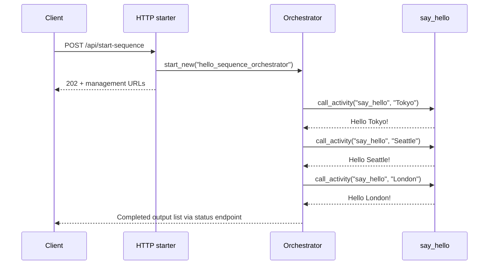

# Durable Hello Sequence

> **Trigger**: HTTP (starter) | **State**: durable | **Guarantee**: at-least-once | **Difficulty**: intermediate

## Overview
This recipe shows the canonical Durable Functions orchestration chain in Python v2 using
`df.Blueprint()` and `app.register_functions(bp)`.
The HTTP starter launches an orchestrator that calls one activity three times in order,
returning a deterministic list of greetings.

The pattern is intentionally small, but it teaches the most important Durable concept:
the orchestrator is replayed from history and must only coordinate durable tasks.
Every activity call is scheduled with `yield context.call_activity(...)` so execution can
checkpoint and replay safely.

## When to Use
- You need ordered multi-step workflows where each step depends on the previous result.
- You want a starter template for Python durable orchestration with minimal ceremony.
- You need deterministic, replay-safe flow control without adding external state stores.

## When NOT to Use
- You only need a single synchronous HTTP handler with no durable state.
- Each step can run independently and does not need orchestration history.
- The workflow can be expressed more simply with a queue trigger or direct function call.

## Architecture
```mermaid
flowchart LR
    client[Client] -->|POST /api/start-sequence| starter[HTTP starter function]
    starter -->|202 + status URLs| client
    starter -->|client.start_new()| orch[hello_sequence_orchestrator]
    orch -->|yield call_activity| activity[say_hello activity]
    activity --> orch
    orch --> result[Final result list]
```

## Behavior


## Prerequisites
- Python 3.10+
- Azure Functions Core Tools v4
- Durable Functions extension bundles enabled through `host.json`
- `azure-functions` and `azure-functions-durable` from `pyproject.toml`

## Project Structure
```text
examples/orchestration-and-workflows/durable_hello_sequence/
|- function_app.py
|- host.json
|- local.settings.json.example
|- pyproject.toml
`- README.md
```

## Implementation
The file defines a durable blueprint and registers it on the app.

```python
app = func.FunctionApp()
bp = df.Blueprint()
...
app.register_functions(bp)
```

The starter endpoint creates a new orchestration instance and returns management URLs.

```python
@bp.route(route="start-sequence", methods=["POST"], auth_level=func.AuthLevel.ANONYMOUS)
@bp.durable_client_input(client_name="client")
async def start_sequence(req: func.HttpRequest, client: df.DurableOrchestrationClient) -> func.HttpResponse:
    instance_id = await client.start_new("hello_sequence_orchestrator")
    return client.create_check_status_response(req, instance_id)
```

The orchestrator chains activities in sequence.
Each `yield context.call_activity(...)` records an event in durable history.
On replay, the runtime rehydrates previously completed outputs and continues deterministically.

```python
@bp.orchestration_trigger(context_name="context")
def hello_sequence_orchestrator(context: df.DurableOrchestrationContext):
    cities = ["Tokyo", "Seattle", "London"]
    results = []
    for city in cities:
        greeting = yield context.call_activity("say_hello", city)
        results.append(greeting)
    return results
```

The activity remains pure and side-effect scoped.

```python
@bp.activity_trigger(input_name="payload")
def say_hello(payload: str) -> str:
    return f"Hello {payload}!"
```

## Run Locally
```bash
cd examples/orchestration-and-workflows/durable_hello_sequence
pip install -e ".[dev]"
func start
```

## Expected Output
```text
POST /api/start-sequence -> 202 Accepted

Status query eventually returns:
{
  "runtimeStatus": "Completed",
  "output": [
    "Hello Tokyo!",
    "Hello Seattle!",
    "Hello London!"
  ]
}
```

## Production Considerations
- Scaling: activity functions scale out independently while orchestrator replays remain lightweight.
- Retries: add `call_activity_with_retry` when greeting logic calls external systems.
- Idempotency: keep activity side effects idempotent because retries or replays can happen.
- Observability: log `instance_id`, city, and activity latency for each step.
- Security: switch starter auth from `ANONYMOUS` to `FUNCTION` or managed front-door auth.

## Related Links
- [Durable Fan-Out Fan-In](./durable-fan-out-fan-in.md)
- [Durable Retry Pattern](./durable-retry-pattern.md)
- [Durable Unit Testing](./durable-unit-testing.md)
- [Durable Functions overview](https://learn.microsoft.com/en-us/azure/azure-functions/durable/durable-functions-overview)
- [Durable Functions application patterns](https://learn.microsoft.com/en-us/azure/azure-functions/durable/durable-functions-overview#application-patterns)
