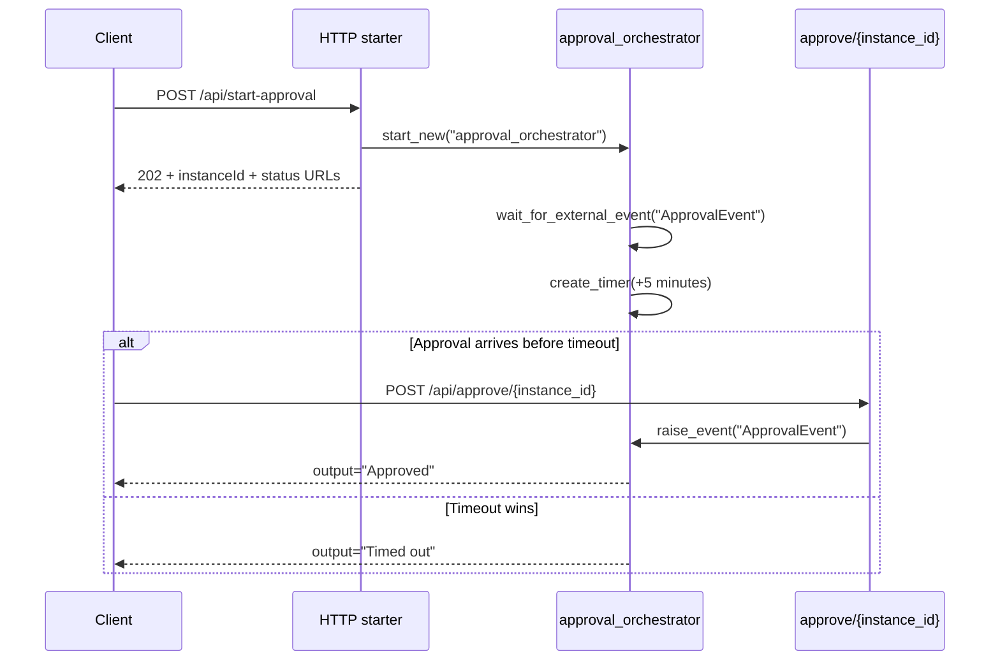

# Durable Human Interaction

> **Trigger**: HTTP (starter) | **State**: durable | **Guarantee**: at-least-once | **Difficulty**: advanced

## Overview
This recipe demonstrates a common approval workflow using external events.
An orchestrator waits for `ApprovalEvent` while a five-minute durable timer runs,
then returns either `Approved` or `Timed out`.

The key pattern is `context.task_any([event_task, timeout_task])`.
This race lets a human or external API complete the process, while still enforcing
a deterministic timeout boundary inside the orchestrator replay model.

## When to Use
- You need human approval before a workflow can continue.
- You need a deterministic timeout fallback if no event arrives in time.
- You need durable waiting without keeping a worker process continuously active.

## When NOT to Use
- Approval must complete synchronously within a single HTTP request.
- You do not control the external event source and cannot reliably raise events back to the instance.
- A normal queue-based retry or delay workflow is enough and no human gate is required.

## Architecture
```mermaid
flowchart LR
    client[Client] -->|POST /api/start-approval| starter[HTTP starter]
    starter -->|202 with instanceId| client
    starter -->|start_new()| orch[approval_orchestrator]
    orch --> wait[wait_for_external_event]
    orch --> timer[create_timer +5 minutes]
    approver[Approve API] -->|raise_event ApprovalEvent| orch
    timer --> timeout[Timed out]
    wait --> approved[Approved]
```

## Behavior


## Prerequisites
- Python 3.10+
- Azure Functions Core Tools v4
- Durable Functions storage connection in local settings
- Ability to call two local HTTP endpoints (`start-approval` and `approve/{id}`)

## Project Structure
```text
examples/orchestration-and-workflows/durable_human_interaction/
|- function_app.py
|- host.json
|- local.settings.json.example
|- requirements.txt
`- README.md
```

## Implementation
The project exposes two HTTP endpoints through a durable blueprint.

```python
app = func.FunctionApp()
bp = df.Blueprint()
...
app.register_functions(bp)
```

Starter endpoint:

```python
@bp.route(route="start-approval", methods=["POST"], auth_level=func.AuthLevel.ANONYMOUS)
@bp.durable_client_input(client_name="client")
async def start_approval(req: func.HttpRequest, client: df.DurableOrchestrationClient) -> func.HttpResponse:
    instance_id = await client.start_new("approval_orchestrator")
    return client.create_check_status_response(req, instance_id)
```

Approval endpoint raises the external event for a specific orchestration instance.

```python
@bp.route(route="approve/{instance_id}", methods=["POST"], auth_level=func.AuthLevel.ANONYMOUS)
@bp.durable_client_input(client_name="client")
async def approve_instance(req: func.HttpRequest, client: df.DurableOrchestrationClient) -> func.HttpResponse:
    instance_id = req.route_params["instance_id"]
    await client.raise_event(instance_id, "ApprovalEvent", "Approved by API")
    return func.HttpResponse(f"ApprovalEvent raised for instance {instance_id}.")
```

Orchestrator race pattern:

```python
@bp.orchestration_trigger(context_name="context")
def approval_orchestrator(context: df.DurableOrchestrationContext):
    timeout_at = context.current_utc_datetime + timedelta(minutes=5)
    event_task = context.wait_for_external_event("ApprovalEvent")
    timeout_task = context.create_timer(timeout_at)
    winner = yield context.task_any([event_task, timeout_task])
    if winner == event_task:
        if not timeout_task.is_completed:
            timeout_task.cancel()
        return "Approved"
    return "Timed out"
```

Replay model note:
`context.current_utc_datetime` is replay-safe.
Using `datetime.now()` here would cause non-deterministic decisions during replay.

## Run Locally
```bash
cd examples/orchestration-and-workflows/durable_human_interaction
pip install -r requirements.txt
func start
```

## Expected Output
```text
1) POST /api/start-approval -> 202 Accepted with instanceId and status URLs
2) POST /api/approve/<instanceId> within 5 minutes -> "ApprovalEvent raised ..."
3) Status query eventually shows runtimeStatus=Completed and output="Approved"

If step 2 is skipped for 5 minutes:
output="Timed out"
```

## Production Considerations
- Scaling: waiting orchestrations are cheap, but event endpoints may need burst handling.
- Retries: event sender should retry transient 5xx responses when raising approvals.
- Idempotency: external systems may submit duplicate approvals; keep event handling safe.
- Observability: track approval latency and timeout rate by workflow type.
- Security: protect both start and approve routes with keys or upstream identity.

## Related Links
- [Durable Entity Counter](./durable-entity-counter.md)
- [Durable Determinism Gotchas](./durable-determinism-gotchas.md)
- [Durable Retry Pattern](./durable-retry-pattern.md)
- [Durable Functions overview](https://learn.microsoft.com/en-us/azure/azure-functions/durable/durable-functions-overview)
- [Durable Functions application patterns](https://learn.microsoft.com/en-us/azure/azure-functions/durable/durable-functions-overview#application-patterns)
