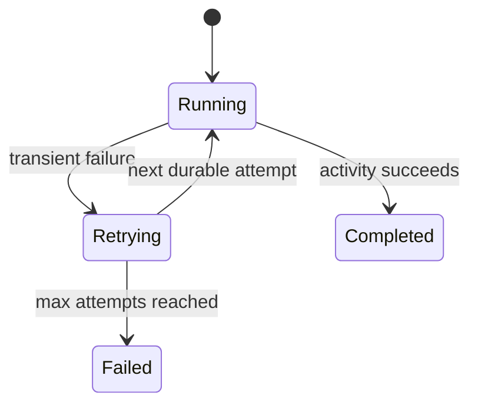

# Durable Retry Pattern

> **Trigger**: HTTP (starter) | **State**: durable | **Guarantee**: at-least-once | **Difficulty**: intermediate

## Overview
This recipe captures durable retry behavior with `RetryOptions` and
`context.call_activity_with_retry(...)`.
The sample starts an orchestration that invokes a flaky activity with up to three attempts
and five-second delay between retries.

The activity intentionally fails randomly to emulate transient dependency failures.
Durable Functions persists retry state and replays orchestrator decisions deterministically,
so recovery remains consistent across host restarts.

## When to Use
- Your workflow calls external systems that fail intermittently.
- You want retry policy at orchestration level instead of ad-hoc activity loops.
- You need consistent retry history for troubleshooting and audit purposes.

## When NOT to Use
- Failures are permanent validation errors and retries will never succeed.
- The activity causes non-idempotent side effects that cannot tolerate repeat execution.
- A normal trigger-level retry policy is enough and full orchestration is unnecessary.

## Architecture
```mermaid
flowchart LR
    client[Client] -->|POST /api/start-retry| starter[HTTP starter]
    starter -->|202 + status URLs| client
    starter -->|start_new()| orch[retry_orchestrator]
    orch --> retry[RetryOptions 5s max=3]
    retry --> activity[flaky_activity(payload)]
    activity -->|success| done[Completed output]
    activity -->|transient failure| retry
```

## Behavior


## Prerequisites
- Python 3.10+
- Azure Functions Core Tools v4
- Durable storage connection for orchestration history
- Test client (`curl` or Postman) to trigger retries repeatedly

## Project Structure
```text
examples/orchestration-and-workflows/durable_retry_pattern/
|- function_app.py
|- host.json
|- local.settings.json.example
|- requirements.txt
`- README.md
```

## Implementation
Starter function launches `retry_orchestrator` with default input.

```python
@bp.route(route="start-retry", methods=["POST"], auth_level=func.AuthLevel.ANONYMOUS)
@bp.durable_client_input(client_name="client")
async def start_retry(req: func.HttpRequest, client: df.DurableOrchestrationClient) -> func.HttpResponse:
    instance_id = await client.start_new("retry_orchestrator", None, {"input": "demo"})
    return client.create_check_status_response(req, instance_id)
```

The orchestrator constructs retry policy and delegates execution.

```python
@bp.orchestration_trigger(context_name="context")
def retry_orchestrator(context: df.DurableOrchestrationContext):
    input_data = context.get_input() or {"input": "default"}
    retry_opts = df.RetryOptions(
        first_retry_interval_in_milliseconds=5000,
        max_number_of_attempts=3,
    )
    result = yield context.call_activity_with_retry("flaky_activity", retry_opts, input_data)
    return result
```

The activity simulates transient failure.

```python
@bp.activity_trigger(input_name="payload")
def flaky_activity(payload: dict[str, str]) -> str:
    failure_roll = random.random()
    if failure_roll < 0.6:
        raise RuntimeError("Transient activity failure. Please retry.")
    return f"Succeeded with payload: {payload['input']}"
```

Replay model note:
retry attempts are tracked in durable history.
Do not put random retry decisions in the orchestrator itself; keep randomness in activities.

## Run Locally
```bash
cd examples/orchestration-and-workflows/durable_retry_pattern
pip install -r requirements.txt
func start
```

## Expected Output
```text
POST /api/start-retry -> 202 Accepted

Common status progression:
- Running (while retries are in flight)
- Completed with output "Succeeded with payload: demo"

If all attempts fail:
- runtimeStatus: Failed
- output/error includes "Transient activity failure"
```

## Production Considerations
- Scaling: retries increase load; size concurrency and downstream quotas accordingly.
- Retries: tune interval and max attempts per dependency SLA, not one-size-fits-all values.
- Idempotency: activity side effects must tolerate retries to avoid duplicate external writes.
- Observability: emit retry count, final status, and dependency error codes.
- Security: never return raw internal stack traces from activity exceptions to public callers.

## Related Links
- [Durable Fan-Out Fan-In](./durable-fan-out-fan-in.md)
- [Durable Determinism Gotchas](./durable-determinism-gotchas.md)
- [Durable Unit Testing](./durable-unit-testing.md)
- [Durable Functions overview](https://learn.microsoft.com/en-us/azure/azure-functions/durable/durable-functions-overview)
- [Durable Functions application patterns](https://learn.microsoft.com/en-us/azure/azure-functions/durable/durable-functions-overview#application-patterns)
