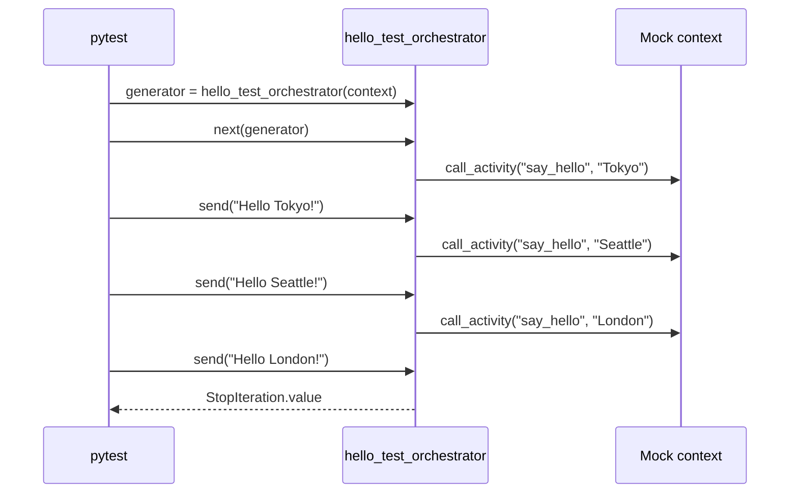

# Durable Unit Testing

> **Trigger**: HTTP (starter) | **State**: durable | **Guarantee**: at-least-once | **Difficulty**: advanced

## Overview
This recipe shows how to unit test a Python durable orchestrator as a generator.
Instead of running the full Azure Functions host, the test imports the orchestrator,
mocks orchestration context behavior, and advances execution with `next()` and `send()`.

The approach is fast and deterministic.
It validates orchestration flow, yielded tasks, and final return value while avoiding
infrastructure dependencies.
This is ideal for CI pipelines and tight local feedback loops.

## When to Use
- You need quick tests for orchestrator control flow and activity call order.
- You want CI-safe tests without Azurite or full host startup.
- You need to guard against accidental orchestrator logic regressions.

## When NOT to Use
- You need to verify binding configuration, storage integration, or end-to-end host behavior.
- The logic under test is mostly activity code rather than orchestrator coordination.
- You need confidence in replay history behavior that requires higher-level integration tests.

## Architecture
```mermaid
flowchart LR
    pytest[pytest test process] -->|import orchestrator| app[function_app.py]
    pytest -->|mock context.call_activity| generator[orchestrator generator]
    generator --> yields[yield call_activity(...)]
    yields --> assertions[assert call order and final value]
```

## Behavior


## Prerequisites
- Python 3.10+
- Azure Functions Core Tools v4
- `pytest` for running unit tests
- `unittest.mock` familiarity for context stubbing

## Project Structure
```text
examples/orchestration-and-workflows/durable_unit_testing/
|- function_app.py
|- test_orchestrator.py
|- host.json
|- local.settings.json.example
|- requirements.txt
`- README.md
```

## Implementation
The orchestrator mirrors the hello-sequence pattern and yields three activity calls.

```python
@bp.orchestration_trigger(context_name="context")
def hello_test_orchestrator(context: df.DurableOrchestrationContext):
    names = ["Tokyo", "Seattle", "London"]
    outputs = []
    for name in names:
        result = yield context.call_activity("say_hello", name)
        outputs.append(result)
    return outputs
```

The test configures a mock context and manually advances the generator.

```python
context = Mock()
context.call_activity.side_effect = ["task-1", "task-2", "task-3"]
generator = hello_test_orchestrator(context)

first_yield = next(generator)
second_yield = generator.send("Hello Tokyo!")
third_yield = generator.send("Hello Seattle!")
```

Final completion is captured from `StopIteration.value`.

```python
try:
    generator.send("Hello London!")
except StopIteration as stop:
    final_value = stop.value

assert final_value == ["Hello Tokyo!", "Hello Seattle!", "Hello London!"]
```

The test also verifies call order precisely.

```python
assert context.call_activity.call_args_list == [
    call("say_hello", "Tokyo"),
    call("say_hello", "Seattle"),
    call("say_hello", "London"),
]
```

Replay model note:
this style works because durable orchestrators are generators that emit task descriptors.
Unit tests assert orchestration decisions without executing remote activities.

## Run Locally
```bash
cd examples/orchestration-and-workflows/durable_unit_testing
pip install -r requirements.txt
func start
```

## Expected Output
```text
For runtime endpoint tests:
POST /api/start-unit-test -> 202 Accepted

For unit tests:
python -m pytest test_orchestrator.py
================== 1 passed in ...s ==================
```

## Production Considerations
- Scaling: keep orchestration logic simple so tests remain stable as workflow count grows.
- Retries: add dedicated tests for retry branches when using `call_activity_with_retry`.
- Idempotency: test duplicate input paths to ensure orchestration remains side-effect safe.
- Observability: assert log/event emission strategy in higher-level integration tests.
- Security: unit tests should not require real secrets or production connection strings.

## Related Links
- [Durable Hello Sequence](./durable-hello-sequence.md)
- [Durable Retry Pattern](./durable-retry-pattern.md)
- [Durable Determinism Gotchas](./durable-determinism-gotchas.md)
- [Durable Functions overview](https://learn.microsoft.com/en-us/azure/azure-functions/durable/durable-functions-overview)
- [Durable Functions application patterns](https://learn.microsoft.com/en-us/azure/azure-functions/durable/durable-functions-overview#application-patterns)
