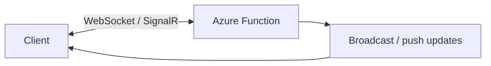

# Realtime

Use this category for push-style messaging and low-latency user updates. It will collect recipes for websockets and other live interaction patterns.

## Category map

| Recipe | Trigger | Difficulty |
| --- | --- | --- |
| [WebSocket Proxy](./websocket-proxy.md) | HTTP | Intermediate |
