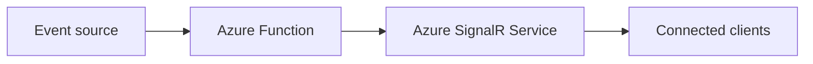
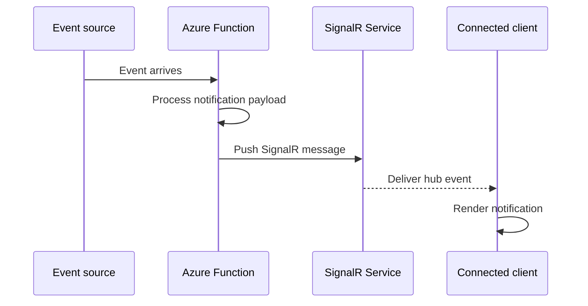

# SignalR Notifications

> **Trigger**: Event Grid / Service Bus | **State**: stateless | **Guarantee**: at-least-once | **Difficulty**: intermediate

## Overview
The `examples/realtime/signalr_notifications/` project shows how to push real-time notifications to connected clients via the Azure SignalR Service output binding.
An HTTP negotiate endpoint returns connection info for clients, while an event-driven function receives backend events and publishes hub messages without managing WebSocket infrastructure directly.

This pattern fits backend-to-frontend notifications such as order updates, job completion alerts, and operational status changes.

## When to Use
- You need to push low-latency updates from Azure Functions to browser or mobile clients.
- You want Azure SignalR Service to handle connections and fan-out.
- You already have events from Event Grid, Service Bus, or similar backend sources.
- You want a lightweight binding-based implementation instead of a custom SignalR SDK integration.

## When NOT to Use
- You need durable delivery confirmation or replay for offline clients.
- You need complex hub lifecycle management beyond negotiate and simple broadcasts.
- You only need polling or infrequent refreshes where realtime adds unnecessary cost and complexity.
- You need strict end-to-end exactly-once notification delivery.

## Architecture


## Behavior


## Implementation
The example has two functions in one app:

1. `negotiate_signalr` is an HTTP endpoint using the SignalR connection info input binding.
2. `publish_notification` is an Event Grid-triggered function using the SignalR output binding.

The notification function maps incoming event metadata into the SignalR message contract:

```python
signalr.set(json.dumps({
    "target": "notificationReceived",
    "arguments": [notification],
}))
```

The negotiate endpoint returns the binding-generated payload directly:

```python
@app.route(route="signalr/negotiate", methods=["POST"])
@app.signalr_connection_info_input(...)
def negotiate_signalr(req: func.HttpRequest, connection_info: str) -> func.HttpResponse:
    return func.HttpResponse(connection_info, mimetype="application/json")
```

## Project Structure
```text
examples/realtime/signalr_notifications/
|-- function_app.py
|-- host.json
|-- local.settings.json.example
|-- pyproject.toml
`-- README.md
```

## Config
Required settings for local development:

- `AzureWebJobsStorage`: storage connection for Functions runtime
- `AzureSignalRConnectionString`: Azure SignalR Service connection string
- `SIGNALR_HUB_NAME`: hub name used by both negotiate and publish functions
- `SIGNALR_NEGOTIATE_USER_ID`: fallback user identifier for local negotiate requests

## Run Locally
```bash
cd examples/realtime/signalr_notifications
python -m venv .venv
source .venv/bin/activate
pip install -e ".[dev]"
cp local.settings.json.example local.settings.json
func start
```

Then:

1. POST to `/api/signalr/negotiate` to get SignalR connection info.
2. POST an Event Grid payload to the local webhook endpoint for `publish_notification`.
3. Observe the connected client receive `notificationReceived` from the configured hub.

## Expected Output
```text
POST /api/signalr/negotiate
-> 200 {"url":"https://<signalr>.service.signalr.net/client/?hub=notifications",...}

POST /runtime/webhooks/EventGrid?functionName=publish_notification
-> 202 Accepted

Client receives:
notificationReceived {
  "eventId": "evt-1001",
  "eventType": "Contoso.Orders.OrderReady",
  "subject": "/orders/1001",
  "message": "New notification for /orders/1001"
}
```

## Production Considerations
- Delivery semantics: the source trigger may retry, so duplicate notifications are possible; make client handlers idempotent.
- Authorization: require authenticated callers for negotiate and derive `userId` or group membership from validated identity claims.
- Fan-out scope: use `userId` or `groupName` in the SignalR message payload when broadcasts are too broad.
- Event contracts: keep notification payloads compact and versioned so clients can evolve safely.
- Observability: log event IDs, subjects, hub names, and target methods for correlation.
- Backpressure: very high fan-out belongs in SignalR Service, but event volume and trigger concurrency still need monitoring.

## Related Links
- [SignalR bindings](https://learn.microsoft.com/en-us/azure/azure-functions/functions-bindings-signalr-service)
- [SignalR Trigger, Input, and Output Bindings](../../reference/signalr.md)
- [Output Binding vs SDK](../runtime-and-ops/output-binding-vs-sdk.md)
