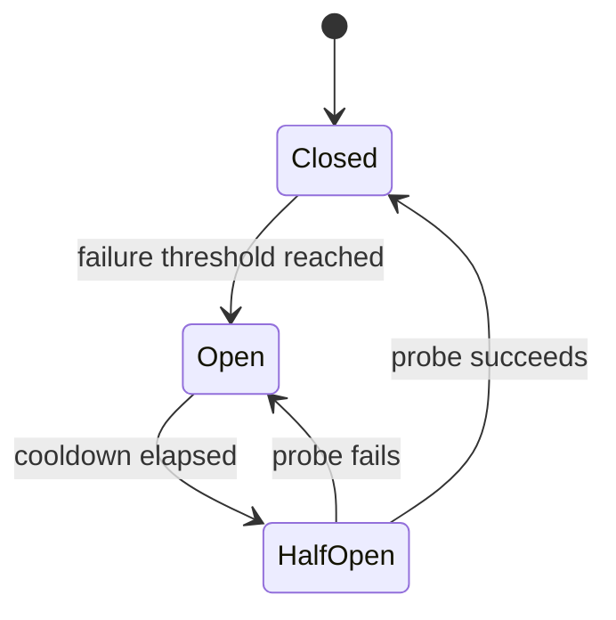
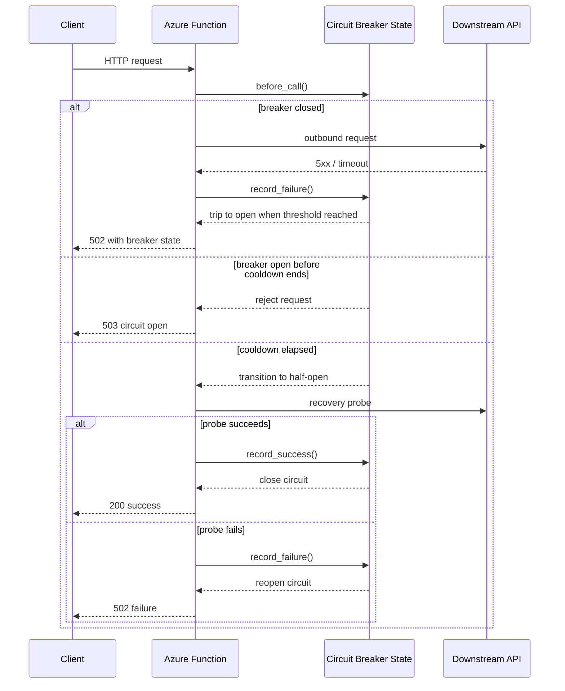

# Circuit Breaker

> **Trigger**: HTTP / Queue | **State**: stateful (circuit state) | **Guarantee**: at-least-once | **Difficulty**: intermediate

## Overview
The `examples/reliability/circuit_breaker/` sample shows a circuit breaker protecting outbound
HTTP calls from repeated downstream failures. Instead of sending every request into an unhealthy
dependency, the function tracks failures, trips the circuit to `open`, waits through a cooldown,
and then allows a limited `half-open` probe before returning to `closed`.

This pattern reduces cascading failures and gives a degraded dependency time to recover. The sample
uses in-memory state for readability, with logging that makes state transitions explicit.

## When to Use
- You call a downstream API that sometimes fails in bursts or becomes temporarily unavailable.
- You want fast rejection while a dependency is unhealthy instead of piling on more requests.
- You need a simple recovery path that gradually reintroduces traffic after a cooldown window.

## When NOT to Use
- Every request must always attempt the downstream call, regardless of previous failures.
- You need shared circuit state across scaled-out instances and cannot rely on per-worker memory.
- The downstream problem is primarily latency shaping or traffic smoothing rather than failure
  isolation.

## Architecture


## Behavior


## Prerequisites
- Python 3.10+
- Azure Functions Core Tools v4
- Internet access to reach a downstream test API, or a substitute URL you control

## Project Structure
```text
examples/reliability/circuit_breaker/
|-- function_app.py
|-- host.json
|-- local.settings.json.example
|-- requirements.txt
`-- README.md
```

## Implementation
The sample exposes an HTTP-triggered function that calls an external API and wraps the outbound
request with a circuit breaker. The breaker tracks consecutive failures, opens after the configured
threshold, and blocks new calls until the cooldown expires.

```python
allowed, reason = breaker.before_call()
if not allowed:
    return func.HttpResponse(status_code=503)

try:
    call_downstream_api()
except DownstreamServiceError:
    breaker.record_failure()
    return func.HttpResponse(status_code=502)

breaker.record_success()
return func.HttpResponse(status_code=200)
```

The cookbook example keeps state in memory so the transitions are easy to follow locally. For
multi-instance production workloads, replace that state holder with a durable store such as Durable
Entities, Redis, Cosmos DB, or another centralized coordination mechanism.

## Run Locally
```bash
cd examples/reliability/circuit_breaker
pip install -r requirements.txt
cp local.settings.json.example local.settings.json
func start
```

## Expected Output
```text
[INFO] Calling downstream URL https://httpstat.us/503
[WARNING] Downstream failure recorded. failure_count=3 threshold=3
[ERROR] Circuit opened after repeated downstream failures.
[WARNING] Circuit open; rejecting request during cooldown.
[INFO] Cooldown elapsed; circuit moved to half-open.
[INFO] Downstream probe succeeded; circuit closed.
```

## Production Considerations
- State management: in-memory state is per-process; use shared durable state when scale-out matters.
- Tuning: choose failure thresholds and cooldown periods based on actual downstream recovery times.
- Recovery: allow only a small number of half-open probes to avoid a thundering herd after recovery.
- Observability: log state transitions, cooldown timing, and downstream status codes for incident
  analysis.
- HTTP semantics: return fallback data or a clearer client-facing contract when `503` is preferable
  to `502`.

## Related Links
- [Reliable event processing](https://learn.microsoft.com/en-us/azure/azure-functions/functions-reliable-event-processing)
- [Azure Functions error handling and retries](https://learn.microsoft.com/en-us/azure/azure-functions/functions-bindings-error-pages)
- [Retry and Idempotency](./retry-and-idempotency.md)
