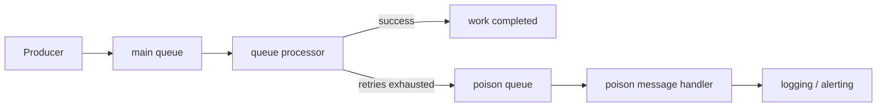
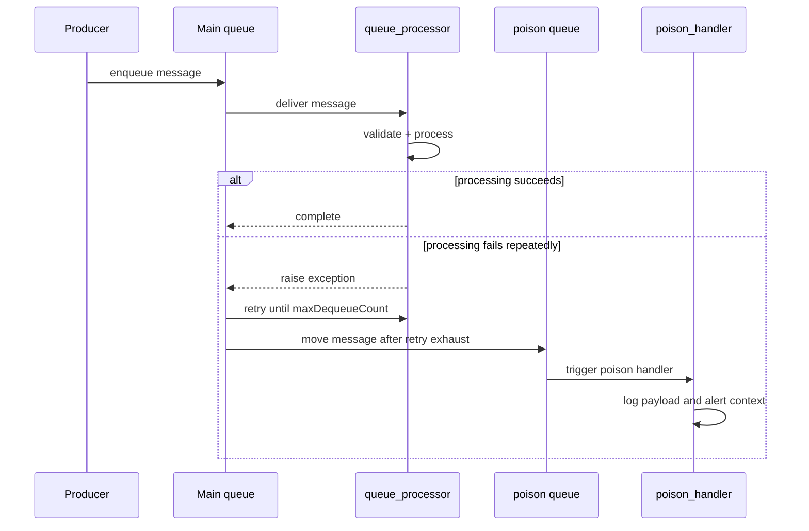

# Poison Message Handling

> **Trigger**: Queue Storage | **State**: stateless | **Guarantee**: at-least-once | **Difficulty**: beginner

## Overview
The `examples/reliability/poison_message_handling/` sample shows how Azure Functions queue triggers
handle repeatedly failing messages. When processing keeps throwing an exception and the dequeue limit
is exhausted, Queue Storage automatically moves the message to the poison queue for separate
inspection and follow-up handling.

This keeps the main queue flowing while still preserving failed payloads for monitoring, triage, and
manual replay.

## When to Use
- You process queue messages that can fail permanently because of bad payloads or unsupported state.
- You want automatic isolation of repeatedly failing messages instead of blocking the main queue.
- You need a simple operational pattern for logging or alerting on poison messages.

## When NOT to Use
- You need custom dead-letter routing logic beyond the built-in Queue Storage poison queue behavior.
- You must mutate or repair failed messages inline before the retry limit is reached.
- The workload requires exactly-once delivery guarantees instead of at-least-once processing.

## Architecture


## Behavior


## Prerequisites
- Python 3.10+
- Azure Functions Core Tools v4
- Azure Storage account or Azurite for queue triggers
- Queue `orders` available in the configured storage account

## Project Structure
```text
examples/reliability/poison_message_handling/
|-- function_app.py
|-- host.json
|-- local.settings.json.example
|-- requirements.txt
`-- README.md
```

## Implementation
The main queue trigger processes messages from `orders`. For demonstration, messages with
`"should_fail": true` raise an exception every time so you can watch the runtime retry and then move
the message to `orders-poison`.

The poison queue trigger listens to `orders-poison` and emits structured logs that can feed dashboard
queries, alerts, or incident workflows. This recipe keeps integration scope intentionally small:
logging only.

```python
@app.queue_trigger(arg_name="msg", queue_name="orders", connection="AzureWebJobsStorage")
def queue_processor(msg: func.QueueMessage) -> None:
    payload = json.loads(msg.get_body().decode("utf-8"))
    if payload.get("should_fail"):
        raise RuntimeError("Simulated processing failure")


@app.queue_trigger(arg_name="msg", queue_name="orders-poison", connection="AzureWebJobsStorage")
def poison_handler(msg: func.QueueMessage) -> None:
    logging.error("Poison message detected id=%s payload=%s", msg.id, msg.get_body().decode("utf-8"))
```

## Run Locally
```bash
cd examples/reliability/poison_message_handling
python -m venv .venv
source .venv/bin/activate
pip install -r requirements.txt
cp local.settings.json.example local.settings.json
func start
```

Enqueue a successful message:

```json
{"order_id": "A100", "should_fail": false}
```

Enqueue a poison-message demo payload:

```json
{"order_id": "A200", "should_fail": true}
```

## Expected Output
```text
[Information] Processing order_id=A100 dequeue_count=1
[Warning] Simulated failure for order_id=A200 dequeue_count=1
[Warning] Simulated failure for order_id=A200 dequeue_count=2
[Warning] Simulated failure for order_id=A200 dequeue_count=3
[Error] Poison message detected id=<message-id> payload={"order_id": "A200", "should_fail": true}
```

## Production Considerations
- Tune `maxDequeueCount` to balance transient retry tolerance against operational noise.
- Include message IDs, dequeue counts, and business keys in logs for easier replay decisions.
- Add alerting on poison-queue activity so failures do not stay silent.
- Separate permanent validation failures from transient dependency failures where possible.
- Build replay tooling carefully so poison messages can be fixed and re-submitted safely.

## Related Links
- [Queue Consumer](../messaging-and-pubsub/queue-consumer.md)
- [Retry and Idempotency](./retry-and-idempotency.md)
- [Error handling](https://learn.microsoft.com/en-us/azure/azure-functions/functions-bindings-error-pages)
