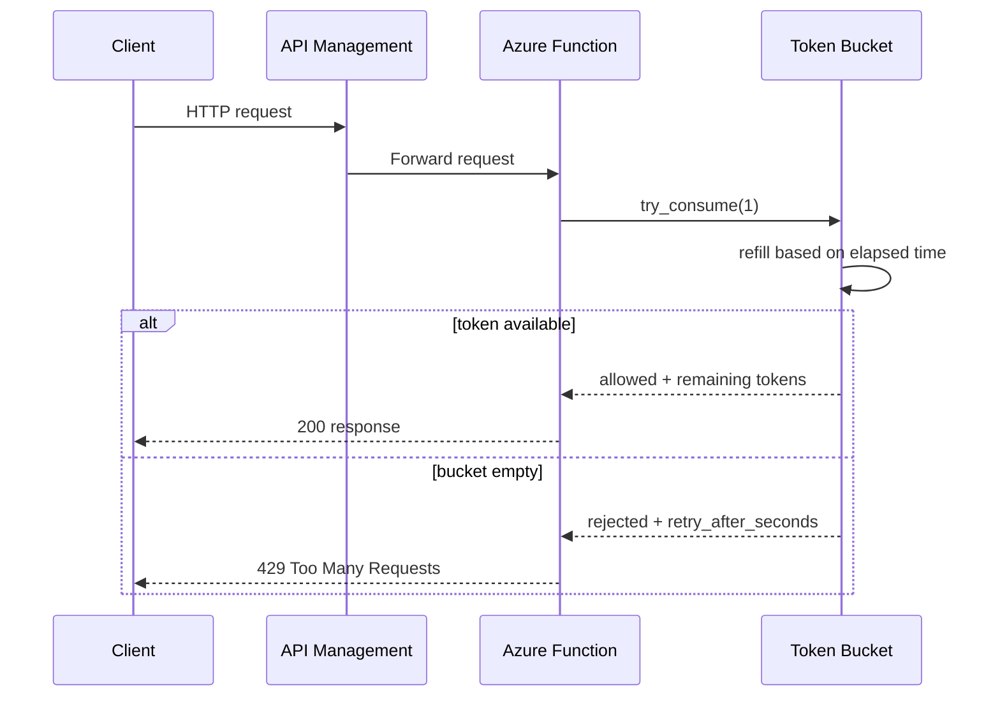
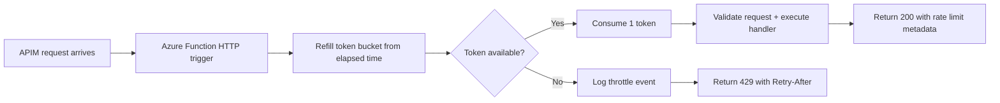

# Rate Limiting / Throttle

> **Trigger**: HTTP | **State**: stateful (counter) | **Guarantee**: request-response | **Difficulty**: intermediate

## Overview
The `examples/reliability/rate_limiting/` sample shows function-level throttling for an HTTP-triggered
Azure Function using an in-memory token bucket. Each request consumes a token from a bucket that is
refilled over time. When the bucket is empty, the function returns `429 Too Many Requests` instead of
accepting more work.

This pattern is useful when you want to protect a single function from bursts, preserve downstream
capacity, and keep throttling behavior close to the workload. The sample uses token bucket mechanics
for implementation, while also explaining sliding window as a common alternative when you need a
strict request count over a fixed interval.

## When to Use
- You need burst tolerance with a defined steady refill rate.
- You want to protect downstream services from sudden traffic spikes.
- You need a simple throttle at the Azure Function boundary before expensive processing starts.

## When NOT to Use
- You need a globally shared rate limit across many scaled-out instances without a shared store.
- You need tenant-wide or API-product-wide policies that are better enforced at API Management.
- You need hard fairness guarantees across callers instead of best-effort per-instance throttling.

## Architecture


## Behavior


## Prerequisites
- Python 3.10+
- Azure Functions Core Tools v4
- Optional: Azure API Management if you want to layer gateway throttling ahead of the function

## Project Structure
```text
examples/reliability/rate_limiting/
|-- function_app.py
|-- host.json
|-- local.settings.json.example
|-- pyproject.toml
`-- README.md
```

## Implementation
The sample exposes a single HTTP endpoint with validation, OpenAPI metadata, and structured logging.
For each request, the function:

1. refills tokens according to elapsed time and configured refill rate
2. consumes one token when capacity is available
3. returns `429` with `Retry-After` when capacity is exhausted

```python
snapshot = limiter.try_consume(cost=1)
if not snapshot.allowed:
    return func.HttpResponse(
        body=snapshot.model_dump_json(),
        status_code=429,
        headers={"Retry-After": str(snapshot.retry_after_seconds)},
        mimetype="application/json",
    )
```

Token bucket is a good fit when short bursts are acceptable as long as the long-term request rate is
bounded. If you instead need “no more than N requests in the last M seconds,” a sliding window or
rolling counter usually expresses that requirement more directly.

## Run Locally
```bash
cd examples/reliability/rate_limiting
pip install -e ".[dev]"
cp local.settings.json.example local.settings.json
func start
```

## Expected Output
```text
{"message":"Request accepted.","remaining_tokens":4.0}
{"message":"Rate limit exceeded.","retry_after_seconds":1.2}
```

## Production Considerations
- Scale-out: in-memory counters are per-worker; use Redis, Durable Entities, Cosmos DB, or APIM for shared limits.
- Layering: combine APIM product or subscription throttles with function-local limits for defense in depth.
- Identity: throttle by caller key, route, tenant, or JWT claim instead of one global bucket when isolation matters.
- Observability: log remaining tokens, retry delay, and caller identity so throttling incidents are explainable.
- Backpressure: pair `429` with a clear retry contract and optional client jitter to avoid synchronized retries.

## Related Links
- [API Management](https://learn.microsoft.com/en-us/azure/api-management/api-management-sample-flexible-throttling)
- [Azure Functions reliable event processing](https://learn.microsoft.com/en-us/azure/azure-functions/functions-reliable-event-processing)
- [Circuit Breaker](./circuit-breaker.md)
