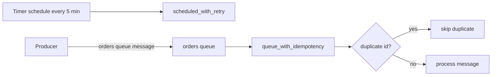
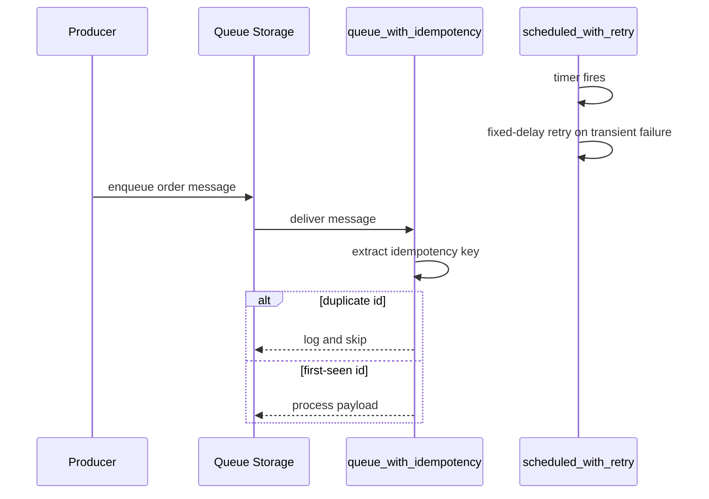

# Retry and Idempotency

> **Trigger**: Queue Storage | **State**: stateless | **Guarantee**: at-least-once | **Difficulty**: intermediate

## Overview
The `examples/reliability/retry_and_idempotency/` sample combines two resilience patterns in one app:
function-level retry on a timer function and idempotent queue processing for duplicate-safe handling.
It uses `@app.retry(...)` with a fixed-delay strategy and an in-memory `_seen_ids` set for dedupe.

These two ideas are complementary. Retry increases delivery success under transient failures, while
idempotency prevents duplicate side effects when retries or redeliveries occur.

## When to Use
- You want to tolerate transient failures without manual replay.
- You process at-least-once queue deliveries and need duplicate safety.
- You need clear examples of retry policy versus business idempotency logic.

## When NOT to Use
- You need distributed deduplication guarantees that cannot rely on in-memory state.
- The trigger is strictly synchronous HTTP and duplicate delivery is not part of the model.
- Permanent validation failures dominate and retries only increase noise.

## Architecture


## Behavior


## Prerequisites
- Python 3.10+
- Azure Functions Core Tools v4
- Azure Storage account or Azurite for queue trigger
- Queue `orders` available in the configured storage account

## Project Structure
```text
examples/reliability/retry_and_idempotency/
|-- function_app.py
|-- host.json
|-- local.settings.json.example
|-- requirements.txt
`-- README.md
```

## Implementation
The timer function demonstrates fixed-delay retry at function scope. This is useful when a transient
downstream dependency outage should be retried before the next schedule tick.

```python
@app.function_name(name="scheduled_with_retry")
@app.schedule(
    schedule="0 */5 * * * *",
    arg_name="timer",
    run_on_startup=False,
    use_monitor=True,
)
@app.retry(strategy="fixed_delay", max_retry_count="3", delay_interval="00:00:05")
def scheduled_with_retry(timer: func.TimerRequest) -> None:
    logging.info(
        "Timer fired. past_due=%s. This function retries up to 3 times every 5 seconds.",
        timer.past_due,
    )
```

The queue function parses JSON, extracts an idempotency key (`id`), and skips already-seen messages.
The in-memory set is for demonstration only; production should use durable dedupe storage.

```python
_seen_ids: set[str] = set()

@app.function_name(name="queue_with_idempotency")
@app.queue_trigger(arg_name="msg", queue_name="orders", connection="AzureWebJobsStorage")
def queue_with_idempotency(msg: func.QueueMessage) -> None:
    payload = json.loads(msg.get_body().decode("utf-8"))
    dedupe_id = str(payload.get("id", "")).strip()
    if dedupe_id in _seen_ids:
        logging.info("Duplicate message detected; skipping id=%s", dedupe_id)
        return
    _seen_ids.add(dedupe_id)
    logging.info("Processing idempotent message id=%s payload=%s", dedupe_id, payload)
```

## Run Locally
```bash
cd examples/reliability/retry_and_idempotency
pip install -r requirements.txt
func start
```

## Expected Output
```text
[Information] Timer fired. past_due=False. This function retries up to 3 times every 5 seconds.
[Information] Processing idempotent message id=order-123 payload={'id': 'order-123', 'amount': 42}
[Information] Duplicate message detected; skipping id=order-123
[Warning] Missing id field; cannot apply idempotency. payload={'amount': 10}
```

## Production Considerations
- Scaling: in-memory `_seen_ids` is per-instance; use Redis/Cosmos/SQL for distributed dedupe.
- Retries: configure retry count and interval based on downstream recovery characteristics.
- Idempotency: choose stable business keys and expiration strategy for dedupe records.
- Observability: tag logs with retry attempt and idempotency key to simplify incident analysis.
- Security: validate payload schema and sanitize logged fields to avoid leaking sensitive data.

## Related Links
- [Queue Consumer](../messaging-and-pubsub/queue-consumer.md)
- [Service Bus Worker](../messaging-and-pubsub/servicebus-worker.md)
- [host.json Tuning](../runtime-and-ops/host-json-tuning.md)
- [Azure Functions error handling and retries](https://learn.microsoft.com/en-us/azure/azure-functions/functions-bindings-error-pages)
