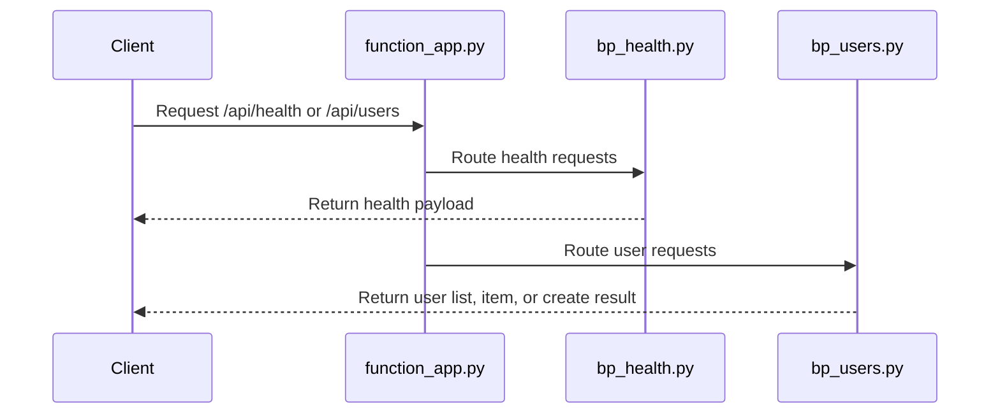

# Blueprint Modular App

> **Trigger**: HTTP | **State**: stateless | **Guarantee**: at-most-once | **Difficulty**: intermediate

## Overview
The `examples/runtime-and-ops/blueprint_modular_app/` example demonstrates how to split a function app into
multiple files using `func.Blueprint()`. `function_app.py` is reduced to composition logic and registers
`bp_health.py` plus `bp_users.py`, keeping routing concerns isolated from app bootstrap code.

This modular approach becomes important as endpoint count grows. Teams can own separate blueprints,
write focused tests, and avoid a single monolithic `function_app.py` file that becomes hard to review.

## When to Use
- Your app has multiple routes or domains and needs clean module boundaries.
- You want reusable route groups for internal platform patterns.
- You need maintainable structure for larger teams and code reviews.

## When NOT to Use
- Your app only has one or two trivial endpoints and modularization adds unnecessary indirection.
- You need shared mutable in-memory state across modules.
- Your team is still validating a tiny prototype and wants the smallest possible file count first.

## Architecture
```mermaid
flowchart TD
    A[function_app.py\nregister_blueprint()] --> B[bp_health.py\nGET /api/health]
    A --> C[bp_users.py\nGET /api/users\nGET /api/users/{id}\nPOST /api/users]
```

## Prerequisites
- Python 3.10+
- Azure Functions Core Tools v4
- HTTP client such as curl or Postman
- Local storage emulator for standard Functions runtime dependencies

## Project Structure
```text
examples/runtime-and-ops/blueprint_modular_app/
|-- function_app.py
|-- bp_health.py
|-- bp_users.py
|-- host.json
|-- local.settings.json.example
|-- requirements.txt
`-- README.md
```

## Implementation
The root file composes blueprints only. This keeps startup code explicit and easy to scan.

```python
import azure.functions as func
from bp_health import bp as health_bp
from bp_users import bp as users_bp

app = func.FunctionApp()
app.register_blueprint(health_bp)
app.register_blueprint(users_bp)
```

`bp_health.py` owns a focused readiness endpoint and returns a stable JSON payload.

```python
bp = func.Blueprint()

@bp.route(route="health", methods=["GET"])
def get_health(req: func.HttpRequest) -> func.HttpResponse:
    del req
    return func.HttpResponse(
        body='{"status": "healthy"}',
        mimetype="application/json",
        status_code=200,
    )
```

`bp_users.py` contains CRUD-like endpoints with validation and in-memory storage for simple local demos.

```python
bp = func.Blueprint()
_users: dict[str, dict[str, Any]] = {}

@bp.route(route="users", methods=["POST"])
def create_user(req: func.HttpRequest) -> func.HttpResponse:
    payload = req.get_json()
    user = {"id": str(payload.get("id", "")).strip(), "name": str(payload.get("name", "")).strip()}
    _users[user["id"]] = user
    return func.HttpResponse(body=json.dumps(user), mimetype="application/json", status_code=201)
```

## Behavior


## Run Locally
```bash
cd examples/runtime-and-ops/blueprint_modular_app
pip install -r requirements.txt
func start
```

## Expected Output
```text
GET  /api/health        -> 200 {"status": "healthy"}
GET  /api/users         -> 200 {"users": []}
POST /api/users         -> 201 {"id": "u1", "name": "Ada"}
GET  /api/users/u1      -> 200 {"id": "u1", "name": "Ada"}
GET  /api/users/missing -> 404 {"error": "user not found"}
```

## Production Considerations
- Scaling: keep route modules stateless; replace in-memory dict with durable storage.
- Retries: HTTP handlers should return deterministic status codes for client retry policies.
- Idempotency: enforce idempotency keys for create operations when clients can retry POSTs.
- Observability: add per-blueprint logging and correlation IDs for route-level telemetry.
- Security: apply auth levels and input validation consistently across each blueprint module.

## Related Links
- [Azure Functions Python blueprints reference](https://learn.microsoft.com/en-us/azure/azure-functions/functions-reference-python#blueprints)
