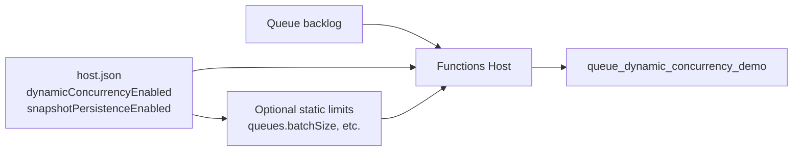
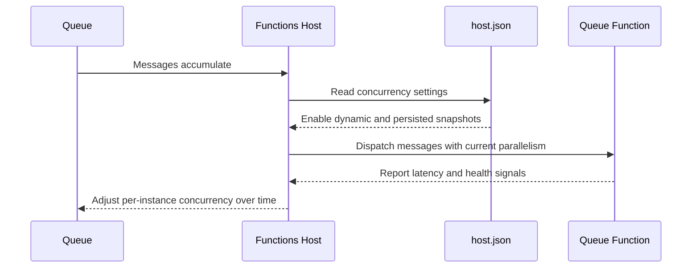

# Concurrency Tuning

> **Trigger**: N/A (config) | **State**: N/A | **Guarantee**: N/A | **Difficulty**: intermediate

## Overview
The `examples/runtime-and-ops/concurrency_tuning/` sample demonstrates host-level dynamic concurrency and
contrasts it with static extension controls such as queue `batchSize`. The function itself is minimal,
so runtime behavior can be studied without business logic noise.

Dynamic concurrency lets the runtime adapt parallelism based on health and latency signals.
Static tuning gives deterministic limits. Most production systems use a blend of both.

## When to Use
- Workload intensity changes over time and adaptive throughput is valuable.
- You need to compare automatic versus fixed concurrency strategies.
- You want safer scaling behavior for queue-triggered functions.

## When NOT to Use
- You need strict per-request ordering and deliberately low parallelism.
- Your bottleneck is application logic correctness rather than runtime throughput limits.
- You have not measured downstream capacity and cannot safely raise concurrency yet.

## Architecture


## Prerequisites
- Python 3.10+
- Azure Functions Core Tools v4
- Azure Storage account or Azurite with queue `work-items`
- Baseline load test plan to compare behavior under different settings

## Project Structure
```text
examples/runtime-and-ops/concurrency_tuning/
|-- function_app.py
|-- host.json
|-- local.settings.json.example
|-- requirements.txt
`-- README.md
```

## Implementation
The queue trigger is simple, while `host.json` carries the key behavior switches.

```python
@app.function_name(name="queue_dynamic_concurrency_demo")
@app.queue_trigger(
    arg_name="message",
    queue_name="work-items",
    connection="AzureWebJobsStorage",
)
def queue_dynamic_concurrency_demo(message: func.QueueMessage) -> None:
    body = message.get_body().decode("utf-8")
    logging.info("Processing queue item with dynamic concurrency enabled: %s", body)
```

Dynamic concurrency settings in `host.json`:

```json
{
  "version": "2.0",
  "concurrency": {
    "dynamicConcurrencyEnabled": true,
    "snapshotPersistenceEnabled": true
  }
}
```

Use dynamic mode for variable, I/O-heavy workloads. Use static limits like queue `batchSize` when
you need strict ceilings for CPU-bound handlers or fragile downstream dependencies.

## Behavior


## Run Locally
```bash
cd examples/runtime-and-ops/concurrency_tuning
pip install -r requirements.txt
func start
```

## Expected Output
```text
[Information] Processing queue item with dynamic concurrency enabled: work-item-001
[Information] Processing queue item with dynamic concurrency enabled: work-item-002
Runtime adapts per-instance parallelism as load and latency change
```

## Production Considerations
- Scaling: dynamic concurrency increases throughput adaptively but still depends on instance scale-out.
- Retries: higher concurrency can amplify transient downstream errors; pair with resilient retry policy.
- Idempotency: concurrent processing and retries increase duplicate risk if handlers are not idempotent.
- Observability: monitor queue age, function duration, and host throttle indicators together.
- Security: avoid over-broad storage access while tuning high-throughput queue consumers.

## Related Links
- [Azure Functions concurrency guidance](https://learn.microsoft.com/en-us/azure/azure-functions/functions-concurrency)
