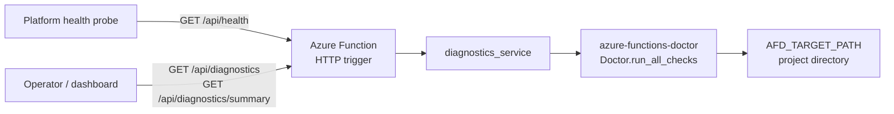

# Doctor Diagnostics Endpoint

> **Trigger**: HTTP | **State**: stateless | **Guarantee**: request-response | **Difficulty**: intermediate

## Overview
This recipe documents `examples/runtime-and-ops/doctor_diagnostics_endpoint/`.
It exposes [`azure-functions-doctor`](https://github.com/yeongseon/azure-functions-doctor-python)
checks over HTTP so operators can ask a deployed function app how healthy it is
without shelling into the container or re-running the CLI from a workstation.

Three endpoints cover three different consumers: a cheap anonymous liveness probe for
the platform, a full diagnostic dump for an engineer debugging a bad deploy, and a
compact pass/fail summary for a dashboard or alert rule.

## When to Use
- You deploy to an environment where you cannot open an interactive shell.
- You want post-deploy verification that checks the actual running app, not a build-time snapshot.
- You want a platform health probe and a deeper diagnostic surface from the same app.
- You already run `azure-functions-doctor` locally and want the same checks in Azure.

## When NOT to Use
- A plain liveness probe is enough; then ship only `/api/health` and skip the Doctor dependency.
- Your compliance posture forbids exposing environment and dependency metadata over HTTP at all.
- You need continuous metrics rather than on-demand checks. Use Application Insights for that.

## Architecture


> **Maps to** `examples/runtime-and-ops/doctor_diagnostics_endpoint/`: `app` = `function_app.py`
> registering `diagnostics_blueprint`, `svc` = `app/services/diagnostics_service.py`,
> `doctor` = the `Doctor` class from `azure-functions-doctor`.

## Prerequisites
- Python 3.11+
- Azure Functions Core Tools v4
- [Azurite](https://learn.microsoft.com/azure/storage/common/storage-use-azurite) for local Storage
- `azure-functions-doctor` installed in the function app environment

## Project Structure
```text
examples/runtime-and-ops/doctor_diagnostics_endpoint/
├── function_app.py
├── app/
│   ├── core/
│   │   └── logging.py
│   ├── functions/
│   │   └── diagnostics.py
│   └── services/
│       └── diagnostics_service.py
├── tests/
│   ├── test_diagnostics_endpoint.py
│   └── test_diagnostics_service.py
├── host.json
├── local.settings.json.example
├── pyproject.toml
└── README.md
```

## Implementation
The app defaults to `AuthLevel.FUNCTION` and the health route opts down to anonymous,
so forgetting a decorator fails closed rather than open.

```python
app = func.FunctionApp(http_auth_level=func.AuthLevel.FUNCTION)
app.register_functions(diagnostics_blueprint)
```

The blueprint keeps the HTTP layer thin and pushes every decision into the service module:

```python
@diagnostics_blueprint.route(
    route="health",
    methods=["GET"],
    auth_level=func.AuthLevel.ANONYMOUS,
)
def get_health(req: func.HttpRequest) -> func.HttpResponse:
    """Anonymous liveness probe. Does not invoke Doctor."""
    del req
    return func.HttpResponse(
        body=json.dumps(get_health_payload()),
        mimetype="application/json",
        status_code=200,
    )


@diagnostics_blueprint.route(route="diagnostics", methods=["GET"])
def get_diagnostics(req: func.HttpRequest) -> func.HttpResponse:
    """Return the full azure-functions-doctor SectionResult list as JSON."""
    del req
    sections = run_project_diagnostics()
    return func.HttpResponse(
        body=json.dumps({"sections": sections}),
        mimetype="application/json",
        status_code=200,
    )
```

The service resolves the scan target from the environment, which is what makes the
recipe testable and configurable in production:

```python
def resolve_target_path() -> str:
    """Return ``AFD_TARGET_PATH`` if set, otherwise the current working directory."""
    return os.getenv("AFD_TARGET_PATH") or os.getcwd()


def run_project_diagnostics(target_path: str | None = None) -> list[SectionResult]:
    path = target_path or resolve_target_path()
    doctor = Doctor(path=path)
    return doctor.run_all_checks()
```

Key behavior:

- `/api/health` never invokes Doctor, so it stays fast enough for a platform probe.
- `/api/diagnostics` returns the full `SectionResult` list exactly as Doctor produces it.
- `/api/diagnostics/summary` reduces that list to `overall` plus one status per section.
- `overall` is `pass` only when every section passes.

## Endpoints

| Method | Route | Auth level | Purpose |
| --- | --- | --- | --- |
| GET | `/api/health` | Anonymous | Liveness probe, returns `{"status": "healthy"}` |
| GET | `/api/diagnostics` | Function | Full `SectionResult[]` from Doctor |
| GET | `/api/diagnostics/summary` | Function | Compact pass/fail summary |

## Configuration

| Setting | Required | Default | Purpose |
| --- | --- | --- | --- |
| `AFD_TARGET_PATH` | No | current working directory | Project directory Doctor scans |
| `AzureWebJobsStorage` | Yes | `UseDevelopmentStorage=true` | Functions runtime storage |
| `FUNCTIONS_WORKER_RUNTIME` | Yes | `python` | Required by the Functions host |

## Run Locally
```bash
cd examples/runtime-and-ops/doctor_diagnostics_endpoint
python -m venv .venv
source .venv/bin/activate
pip install -e .[dev]
cp local.settings.json.example local.settings.json
func start
```

```bash
curl http://localhost:7071/api/health
curl "http://localhost:7071/api/diagnostics?code=$FUNCTION_KEY"
curl "http://localhost:7071/api/diagnostics/summary?code=$FUNCTION_KEY"
```

## Expected Output
```json
{"status": "healthy"}
```

```json
{
  "overall": "pass",
  "sections": [
    {"title": "Python Environment", "category": "python", "status": "pass"},
    {"title": "Project Structure", "category": "structure", "status": "pass"}
  ]
}
```

## Production Considerations
- Exposure: `/api/diagnostics` leaks environment and dependency metadata that helps an attacker
  fingerprint the app. `AuthLevel.FUNCTION` is the floor; prefer `AuthLevel.ADMIN` or gate the
  routes behind Azure Front Door or APIM with an IP allowlist.
- Cost: `run_all_checks()` touches the filesystem on every call. Do not point an aggressive
  monitor at `/api/diagnostics`; point it at `/api/health` and poll diagnostics on demand.
- Packaging: `azure-functions-doctor` must be a runtime dependency, not a dev-only one, or the
  diagnostics routes fail on import in Azure.
- Scan target: set `AFD_TARGET_PATH` explicitly in Azure. The working directory of a deployed
  function app is not always the project root.
- Caching: if you alert on the summary, cache it for a short window so a flapping dashboard does
  not drive the check rate.

## Related Links
- [azure-functions-doctor](https://github.com/yeongseon/azure-functions-doctor-python)
- [Azure Functions HTTP trigger reference](https://learn.microsoft.com/azure/azure-functions/functions-bindings-http-webhook-trigger)
- [Health checks in Azure App Service](https://learn.microsoft.com/azure/app-service/monitor-instances-health-check)
- [Observability Tracing](observability-tracing.md)
