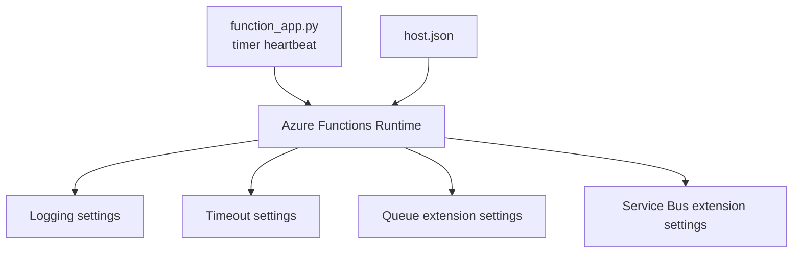
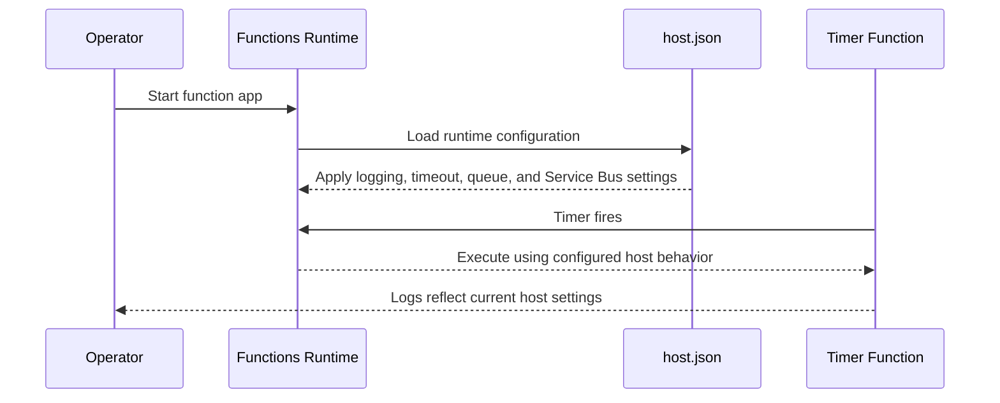

# host.json Tuning

> **Trigger**: N/A (config) | **State**: N/A | **Guarantee**: N/A | **Difficulty**: intermediate

## Overview
The `examples/runtime-and-ops/host_json_tuning/` project pairs a timer function with a heavily configured
`host.json` to demonstrate operational controls for logging, timeout, queue extension behavior,
and Service Bus extension settings.

Unlike code-level decorators, `host.json` defines runtime-wide defaults and extension behavior.
Understanding these levers is critical when balancing latency, throughput, reliability, and cost.

## When to Use
- You need to tune runtime behavior without changing function code.
- You are troubleshooting noisy logs, timeouts, or message-processing bottlenecks.
- You want environment-specific host settings for production hardening.

## When NOT to Use
- You need per-function business logic changes rather than runtime-wide configuration changes.
- You are trying to fix correctness bugs that belong in handler code, retries, or storage design.
- You want identical settings across all environments without any operational tuning.

## Architecture


## Prerequisites
- Python 3.10+
- Azure Functions Core Tools v4
- Understanding of queue/service bus workloads in your environment
- Application Insights configured for telemetry validation

## Project Structure
```text
examples/runtime-and-ops/host_json_tuning/
|-- function_app.py
|-- host.json
|-- local.settings.json.example
|-- requirements.txt
`-- README.md
```

## Implementation
The timer function is intentionally simple and logs that host-level settings are the primary focus.

```python
@app.function_name(name="host_config_demo_timer")
@app.schedule(
    schedule="0 */10 * * * *",
    arg_name="timer",
    run_on_startup=False,
    use_monitor=True,
)
def host_config_demo_timer(timer: func.TimerRequest) -> None:
    logging.info("host_json_tuning timer fired. past_due=%s", timer.past_due)
    logging.info("This project demonstrates logging, timeout, queues, and serviceBus host settings.")
```

`host.json` contains representative tuning values:

```json
{
  "logging": {
    "logLevel": {
      "default": "Information",
      "Host.Results": "Error",
      "Function": "Information",
      "Host.Aggregator": "Trace"
    }
  },
  "functionTimeout": "00:10:00",
  "extensions": {
    "queues": {
      "maxPollingInterval": "00:00:02",
      "visibilityTimeout": "00:00:30",
      "batchSize": 16,
      "maxDequeueCount": 5
    },
    "serviceBus": {
      "prefetchCount": 100,
      "messageHandlerOptions": { "maxConcurrentCalls": 32 }
    }
  }
}
```

Change logging when debugging incidents, timeout for legitimate long work, queue values for
latency-vs-throughput balance, and Service Bus options for lock/concurrency behavior.

## Behavior


## Run Locally
```bash
cd examples/runtime-and-ops/host_json_tuning
pip install -r requirements.txt
func start
```

## Expected Output
```text
[Information] host_json_tuning timer fired. past_due=False
[Information] This project demonstrates logging, timeout, queues, and serviceBus host settings.
[Trace] Host.Aggregator events visible when trace logging is enabled
```

## Production Considerations
- Scaling: aggressive concurrency raises throughput but can overload downstream dependencies.
- Retries: `maxDequeueCount` and lock renewal settings influence retry and dead-letter outcomes.
- Idempotency: host-level retries and redeliveries require idempotent handlers at business layer.
- Observability: tune sampling to control telemetry cost without losing incident visibility.
- Security: avoid logging sensitive payloads when increasing verbosity during troubleshooting.

## Related Links
- [Azure Functions host.json reference](https://learn.microsoft.com/en-us/azure/azure-functions/functions-host-json)
