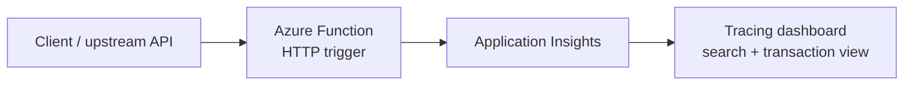
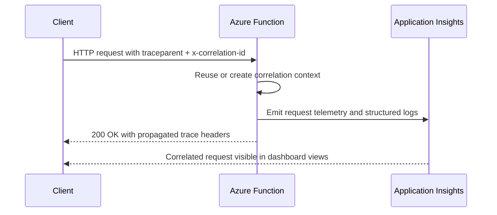

# Observability Tracing

> **Trigger**: HTTP | **State**: stateless | **Guarantee**: request-response | **Difficulty**: intermediate

## Overview
This recipe documents end-to-end request tracing in `examples/runtime-and-ops/observability_tracing/`.
It shows how an HTTP-triggered Azure Function can preserve correlation metadata,
emit structured logs,
and return trace headers that line up with Application Insights and OpenTelemetry-style propagation.

The Integration Matrix for this recipe is intentionally narrow: logging only.
Instead of introducing a separate telemetry SDK,
the function relies on Azure Functions runtime telemetry plus structured application logs.

## When to Use
- You need a simple HTTP recipe that preserves correlation across upstream and downstream calls.
- You want Application Insights-friendly request tracing without adding a large observability stack.
- You need structured logs that can be filtered by correlation ID or trace ID during incident response.

## When NOT to Use
- You need full custom span creation for many downstream dependencies inside one request path.
- You need message-based tracing across queues, topics, or event streams rather than request-response HTTP.
- You need a vendor-specific telemetry SDK pattern instead of Azure Functions runtime-native logging.

## Architecture


## Prerequisites
- Python 3.10+
- Azure Functions Core Tools v4
- Application Insights connection string for Azure-side telemetry validation
- Familiarity with HTTP headers such as `traceparent` and `x-correlation-id`

## Project Structure
```text
examples/runtime-and-ops/observability_tracing/
├── function_app.py
├── host.json
├── local.settings.json.example
├── pyproject.toml
└── README.md
```

## Implementation
The function accepts inbound correlation headers,
reuses them when present,
and generates safe defaults when they are missing.
It then logs request metadata as structured fields and echoes the correlation context back in the response.

```python
@app.route(route="trace-demo", methods=["GET", "POST"], auth_level=func.AuthLevel.ANONYMOUS)
@with_context
def trace_demo(req: func.HttpRequest) -> func.HttpResponse:
    traceparent, trace_id, span_id, generated = _extract_or_create_traceparent(req)
    correlation_id = _extract_or_create_correlation_id(req)

    logger.info(
        "Processed traced request.",
        extra={
            "correlation_id": correlation_id,
            "trace_id": trace_id,
            "span_id": span_id,
            "generated_traceparent": generated,
        },
    )

    return func.HttpResponse(
        body=json.dumps({"correlation_id": correlation_id, "traceparent": traceparent}),
        mimetype="application/json",
        headers={"x-correlation-id": correlation_id, "traceparent": traceparent},
    )
```

Key behavior:

- `traceparent` is preserved if the caller already started a distributed trace.
- `x-correlation-id` is reused when available and generated otherwise.
- Structured logs carry `correlation_id`, `trace_id`, `span_id`, and request metadata.
- Application Insights can correlate request telemetry with these logs.
- OpenTelemetry-compatible tools can stitch the same request path via W3C trace context.

## Behavior


## Run Locally
```bash
cd examples/runtime-and-ops/observability_tracing
pip install -e ".[dev]"
func start
```

Then call the endpoint with explicit correlation headers:

```bash
curl -i \
  -H "traceparent: 00-4bf92f3577b34da6a3ce929d0e0e4736-00f067aa0ba902b7-01" \
  -H "x-correlation-id: checkout-req-42" \
  "http://localhost:7071/api/trace-demo"
```

## Expected Output
```text
[Information] Received traced HTTP request. correlation_id=checkout-req-42 trace_id=4bf92f3577b34da6a3ce929d0e0e4736
[Information] Emitted custom telemetry event. telemetry_type=custom_event event_name=observability_trace_demo
HTTP/1.1 200 OK
x-correlation-id: checkout-req-42
traceparent: 00-4bf92f3577b34da6a3ce929d0e0e4736-00f067aa0ba902b7-01
```

## Production Considerations
- Sampling: verify Application Insights sampling so traces remain useful during peak load.
- Privacy: avoid logging request bodies or sensitive headers alongside correlation fields.
- Consistency: standardize one correlation header name across callers and downstream services.
- Downstream calls: forward `traceparent`, `tracestate`, and correlation headers when calling other APIs.
- Dashboards: build saved queries around `operation_Id`, `trace_id`, and `correlation_id`.

## Related Links
- [Monitor Azure Functions](https://learn.microsoft.com/en-us/azure/azure-functions/functions-monitoring)
