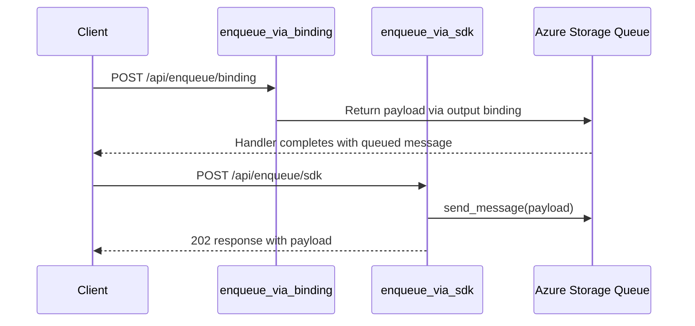

# Output Binding vs SDK

> **Trigger**: HTTP | **State**: stateless | **Guarantee**: at-most-once | **Difficulty**: beginner

## Overview
The `examples/runtime-and-ops/output_binding_vs_sdk/` sample compares two ways to enqueue the same message
to Azure Storage Queue: declarative output binding and explicit SDK client usage.
`enqueue_via_binding` returns a string bound to queue output, while `enqueue_via_sdk` uses
`QueueClient.send_message(...)` with a connection setting.

Both options are valid. Output binding is concise and easy for simple flows; SDK calls provide full
API access when you need advanced controls, explicit error handling, or richer queue operations.

## When to Use
- You need to choose between minimal binding code and explicit SDK behavior.
- You want side-by-side examples for team conventions and code reviews.
- You need a migration reference from binding-first to SDK-first implementations.

## When NOT to Use
- You need guaranteed delivery semantics beyond a simple HTTP request-response flow.
- You are performing complex queue management operations that already require the SDK everywhere.
- You need a background workflow where the caller should not wait for enqueue confirmation.

## Architecture
```mermaid
flowchart LR
    A[HTTP POST /api/enqueue/binding] --> B[enqueue_via_binding\n@app.queue_output]
    C[HTTP POST /api/enqueue/sdk] --> D[enqueue_via_sdk\nQueueClient SDK]
    B --> E[(work-items queue)]
    D --> E
```

## Prerequisites
- Python 3.10+
- Azure Functions Core Tools v4
- Azure Storage account or Azurite with queue `work-items`
- `StorageConnection` app setting for both binding and SDK paths

## Project Structure
```text
examples/runtime-and-ops/output_binding_vs_sdk/
|-- function_app.py
|-- host.json
|-- local.settings.json.example
|-- pyproject.toml
`-- README.md
```

## Implementation
Both endpoints share `_build_payload` to normalize input. The binding path is compact and declarative.

```python
@app.function_name(name="enqueue_via_binding")
@app.route(route="enqueue/binding", methods=["POST"])
@app.queue_output(
    arg_name="output_message",
    queue_name="work-items",
    connection="StorageConnection",
)
def enqueue_via_binding(req: func.HttpRequest) -> str:
    payload = _build_payload(req)
    payload["method"] = "binding"
    return json.dumps(payload)
```

The SDK path is verbose but explicit. It can validate configuration and use any client feature.

```python
@app.function_name(name="enqueue_via_sdk")
@app.route(route="enqueue/sdk", methods=["POST"])
def enqueue_via_sdk(req: func.HttpRequest) -> func.HttpResponse:
    payload = _build_payload(req)
    payload["method"] = "sdk"
    connection_string = os.getenv("StorageConnection", "")
    queue_client_module = __import__("azure.storage.queue", fromlist=["QueueClient"])
    queue_client_class: Any = getattr(queue_client_module, "QueueClient")
    client = queue_client_class.from_connection_string(conn_str=connection_string, queue_name="work-items")
    client.send_message(json.dumps(payload))
    return func.HttpResponse(body=json.dumps(payload), mimetype="application/json", status_code=202)
```

Choose binding for straightforward fan-out. Choose SDK when you need advanced retries,
message visibility control, and richer diagnostics.

## Behavior


## Run Locally
```bash
cd examples/runtime-and-ops/output_binding_vs_sdk
pip install -e ".[dev]"
func start
```

## Expected Output
```text
POST /api/enqueue/binding -> 200 with queued payload {"task": "demo-task", "method": "binding"}
POST /api/enqueue/sdk     -> 202 with queued payload {"task": "demo-task", "method": "sdk"}
Queue work-items receives both messages with consistent schema
```

## Production Considerations
- Scaling: both approaches scale similarly; downstream queue throughput is the primary limiter.
- Retries: SDK route can implement custom retry policy; binding route relies on runtime behaviors.
- Idempotency: include a deterministic message key in payload for dedupe at consumer side.
- Observability: annotate payload with method field (`binding` or `sdk`) for comparative telemetry.
- Security: prefer managed identity patterns over raw connection strings where possible.

## Related Links
- [Azure Functions triggers and bindings overview](https://learn.microsoft.com/en-us/azure/azure-functions/functions-triggers-bindings)
