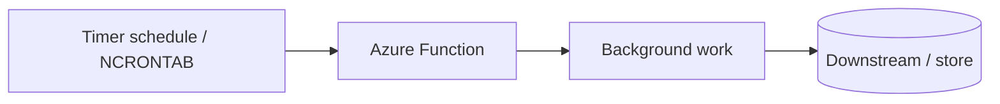

# Scheduled & Background

Use this category for recurring jobs and autonomous background execution. These recipes focus on work that starts from time-based schedules rather than user-facing requests.

## Category map

| Recipe | Trigger | Difficulty |
| --- | --- | --- |
| [Timer Cron Job](./timer-cron-job.md) | Timer | Beginner |
| Coming Soon | Timer / scheduled background work | Coming Soon |
