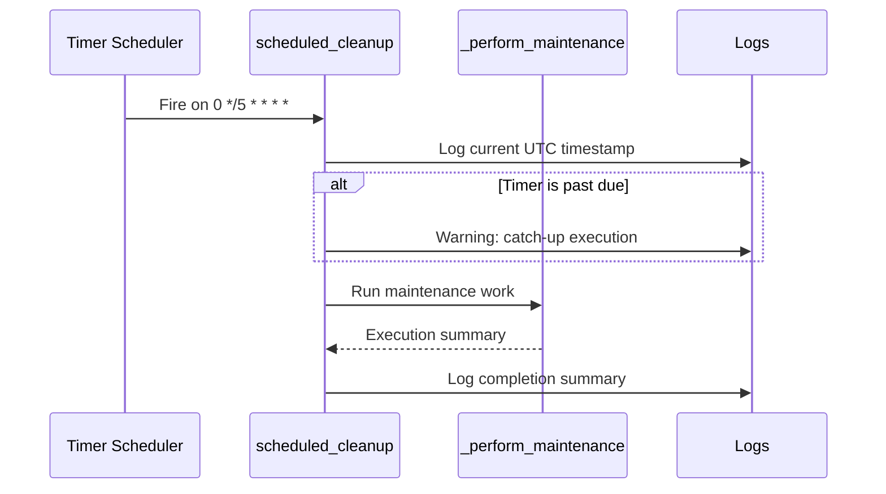

# Timer Cron Job

> **Trigger**: Timer | **State**: stateless | **Guarantee**: at-least-once | **Difficulty**: beginner

## Overview
This recipe explains the scheduled maintenance function in `examples/scheduled-and-background/timer_cron_job/`.
It demonstrates a timer trigger using a six-field NCRONTAB expression,
past-due detection,
UTC timestamp logging,
and clean separation of trigger logic from maintenance work.

The schedule runs every 5 minutes,
which makes it useful for recurring housekeeping tasks
such as cache cleanup,
temporary file pruning,
or routine consistency checks.

Unlike HTTP-triggered functions,
this pattern is host-driven and runs without direct client calls.

## When to Use
- You need periodic background jobs on a fixed cron-like schedule.
- You want to detect and log delayed executions via `timer.past_due`.
- You need a starter pattern for maintenance tasks in Azure Functions.

## When NOT to Use
- You need user-driven or request/response execution semantics.
- You need per-item buffering, backpressure, or dead-letter handling from a queue.
- You cannot make the maintenance step safe to rerun after host restarts or delays.

## Architecture
```mermaid
flowchart LR
    scheduler[Azure Functions Host\nTimer Scheduler] -->|every 5 minutes| trigger[scheduled_cleanup(timer)]
    trigger -->|checks timer.past_due| worker[_perform_maintenance()]
    worker --> logs[Structured logs with UTC timestamps]
    trigger --> logs
```

## Behavior


## Implementation
The trigger binding is declared with `@app.timer_trigger` using NCRONTAB syntax.
The function body handles timing context,
then calls a helper for actual maintenance behavior.

### Prerequisites
- Python 3.10+
- Azure Functions Core Tools v4
- `azure-functions` dependency from `pyproject.toml`
- Logging sink (console locally, Application Insights in Azure)
- Operational ownership of schedule frequency and overlap strategy

### Project Structure
```text
examples/scheduled-and-background/timer_cron_job/
├── function_app.py
├── host.json
├── local.settings.json.example
├── pyproject.toml
└── README.md
```

Timer declaration and schedule details:

```python
@app.timer_trigger(schedule="0 */5 * * * *", arg_name="timer", run_on_startup=False)
def scheduled_cleanup(timer: func.TimerRequest) -> None:
    """Run maintenance every 5 minutes.

    The NCRONTAB expression ``0 */5 * * * *`` uses six fields:
    {second} {minute} {hour} {day} {month} {day-of-week}.
    """
```

Runtime behavior from handler body:

```python
utc_now = datetime.now(tz=timezone.utc).isoformat()

if timer.past_due:
    logger.warning("Timer is past due - running catch-up at %s", utc_now)

result = _perform_maintenance()
logger.info("Scheduled cleanup complete at %s: %s", utc_now, result)
```

Maintenance helper:

```python
def _perform_maintenance() -> str:
    """Simulate a maintenance task (for example, purge expired cache entries)."""
    return "Maintenance complete - 0 stale entries purged"
```

Schedule interpretation:

- `0` seconds mark aligns execution to minute boundaries.
- `*/5` in minute field triggers at minute 0,5,10,15,...
- Remaining wildcards allow all hours,
  days,
  months,
  and weekdays.
- `run_on_startup=False` avoids immediate execution when the host boots.

## Run Locally
```bash
cd examples/scheduled-and-background/timer_cron_job
pip install -e ".[dev]"
func start
```

## Expected Output
```text
Functions:

    scheduled_cleanup: timerTrigger

[Information] Executing 'Functions.scheduled_cleanup' (Reason='Timer fired at ...')
[Information] Scheduled cleanup complete at 2026-03-14T10:15:00+00:00: Maintenance complete - 0 stale entries purged
[Information] Executed 'Functions.scheduled_cleanup' (Succeeded, Duration=...ms)

[Warning] Timer is past due - running catch-up at 2026-03-14T10:20:03+00:00
```

## Production Considerations
- Scaling: Timer triggers typically run on one active instance per schedule; validate singleton behavior for your hosting plan.
- Retries: Timer retries differ from queue semantics; design maintenance steps to tolerate reruns after host restarts.
- Idempotency: Ensure cleanup jobs can execute repeatedly without corrupting state or double-deleting critical data.
- Observability: Emit start/end timestamps, duration, and counts of affected records for operational dashboards.
- Security: Restrict secrets used by maintenance tasks via managed identity and least-privilege access to dependent services.

## Related Links
- Microsoft Learn: https://learn.microsoft.com/en-us/azure/azure-functions/functions-bindings-timer
- [Queue Consumer](../messaging-and-pubsub/queue-consumer.md)
- [Queue Producer](../messaging-and-pubsub/queue-producer.md)
- [Hello HTTP Minimal](../apis-and-ingress/hello-http-minimal.md)
