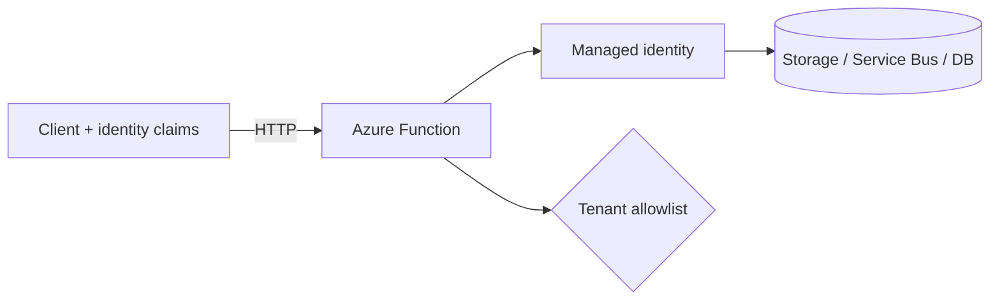

# Security & Tenancy

Use this category for identity-first integration and tenant-aware isolation. These recipes focus on managed identity, secret reduction, and access boundaries in multi-tenant systems.

## Category map

| Recipe | Trigger | Difficulty |
| --- | --- | --- |
| [Managed Identity Storage](./managed-identity-storage.md) | Queue trigger + Azure Storage via managed identity | Intermediate |
| [Managed Identity Service Bus](./managed-identity-servicebus.md) | Service Bus trigger via managed identity | Intermediate |
| [Secretless Key Vault](./secretless-keyvault.md) | HTTP + Key Vault + managed identity | Intermediate |
| [Tenant Isolation](./tenant-isolation.md) | HTTP + tenant context | Advanced |
