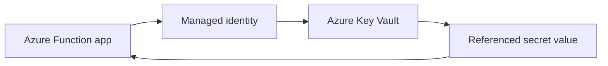
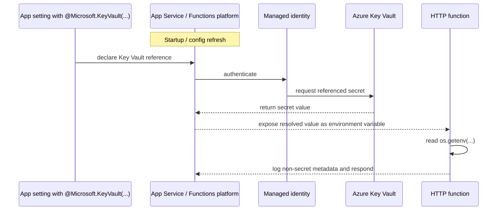

# Secretless Key Vault

> **Trigger**: HTTP | **State**: stateless | **Guarantee**: request-response | **Difficulty**: beginner

## Overview
The `examples/security-and-tenancy/secretless_keyvault/` recipe demonstrates a simple HTTP-triggered
Azure Function that reads secrets from environment variables already backed by Azure Key Vault references.
The function code does not call the Key Vault SDK. Instead, the Functions platform resolves the reference
through managed identity and injects the secret value into the app setting before the function reads it.

This pattern keeps secret retrieval out of application code, reduces SDK and credential complexity, and
fits beginner-friendly request-response workloads.

## When to Use
- You want Azure Functions code to read secrets with `os.getenv(...)` only.
- Your platform team prefers App Service Key Vault references over direct SDK calls.
- You need a low-friction way to consume secrets such as API keys or connection fragments.

## When NOT to Use
- You need to enumerate, rotate, or version secrets dynamically at runtime.
- You must fetch secrets from multiple vaults based on per-request tenant context.
- Your app requires advanced Key Vault features that depend on the SDK.

## Integration Matrix

| Concern | Used | Notes |
| --- | --- | --- |
| Logging | Yes | Uses `azure_functions_logging` to emit structured, non-secret metadata. |
| Key Vault SDK | No | Secrets arrive through app settings resolved by the platform. |
| Stateful storage | No | The function only reads configuration and returns a response. |

## Architecture


## Behavior


## Prerequisites
- Python 3.10+
- Azure Functions Core Tools v4
- Azure Function App with a system-assigned or user-assigned managed identity
- Azure Key Vault secret such as `demo-api-key`
- Key Vault access allowing the function app identity to read the secret

## Project Structure
```text
examples/security-and-tenancy/secretless_keyvault/
|-- function_app.py
|-- host.json
|-- local.settings.json.example
|-- requirements.txt
`-- README.md
```

## Implementation
The code stays intentionally small. The function reads a value from environment variables and logs whether
the platform resolved it successfully.

```python
upstream_api_key = os.getenv("UPSTREAM_API_KEY", "")
secret_loaded = bool(upstream_api_key)

logger.info(
    "Key Vault-backed setting loaded",
    extra={"secret_name": secret_name, "secret_loaded": secret_loaded},
)
```

In Azure, configure the app setting as a Key Vault reference instead of storing the raw secret directly.

```text
UPSTREAM_API_KEY=@Microsoft.KeyVault(SecretUri=https://<vault-name>.vault.azure.net/secrets/demo-api-key/)
```

At startup or config refresh time, the Functions platform resolves that reference through managed identity
and makes the resulting secret available to the function as a normal environment variable.

## Run Locally
```bash
cd examples/security-and-tenancy/secretless_keyvault
pip install -r requirements.txt
func start
```

For local development, place a placeholder or test-only value in `local.settings.json`. In Azure, replace
that value with the Key Vault reference syntax shown above.

## Expected Output
```text
[Information] Executing 'Functions.secretless_keyvault'
[Information] Key Vault-backed setting loaded: True
[Information] Executed 'Functions.secretless_keyvault' (Succeeded)
```

## Production Considerations
- Caching: Key Vault references are platform-resolved, so secret refresh is not per-request.
- Logging: never emit the secret itself; log only presence, name, version hints, or source metadata.
- Availability: a broken reference or missing identity permission becomes a configuration issue, not code logic.
- Security: prefer least-privilege access policies or RBAC scoped to the exact secrets required.
- Rotation: rotate the secret in Key Vault while preserving the app setting name consumed by code.

## Related Links
- [Key Vault references](https://learn.microsoft.com/en-us/azure/app-service/app-service-key-vault-references)
- [Managed Identity Storage](./managed-identity-storage.md)
- [Managed Identity Service Bus](./managed-identity-servicebus.md)
