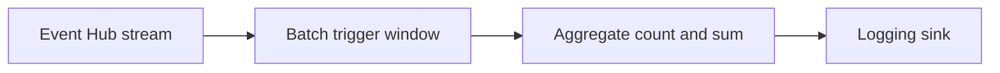
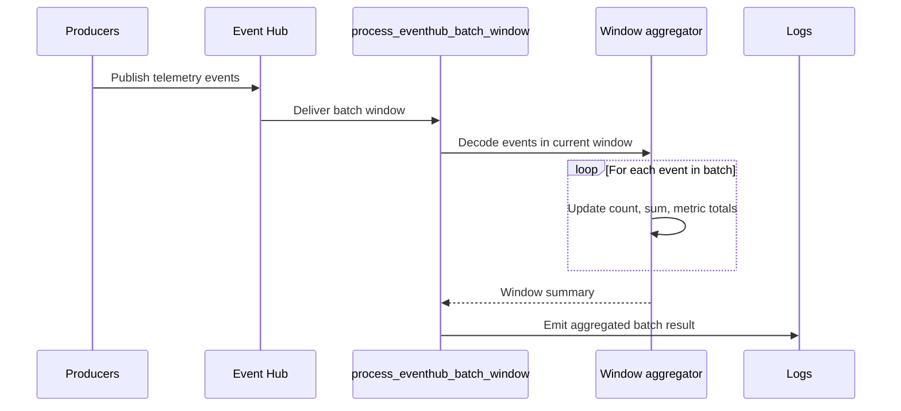

# Event Hub Batch Window

> **Trigger**: Event Hub (batch) | **State**: stateless | **Guarantee**: at-least-once | **Difficulty**: intermediate

## Overview
The `examples/streams-and-telemetry/eventhub_batch_window/` project demonstrates batch-oriented stream
processing with `@app.event_hub_message_trigger` configured for `cardinality=func.Cardinality.MANY`.
Each invocation receives a window of Event Hub messages, parses numeric telemetry values, and writes a
single aggregated log entry for the batch.

Use this pattern when per-event side effects are too noisy or expensive, and your downstream sink only
needs a rolling summary such as total count, sum, or per-metric breakdown for each processing window.

## When to Use
- You want to reduce log or sink volume by aggregating many events into one window result.
- You process append-only telemetry where replay-safe summaries are acceptable.
- You need lightweight batch analytics before forwarding data to another system.

## When NOT to Use
- You need immediate per-event actions with strict low-latency handling.
- You require exactly-once guarantees for counters or financial totals.
- You need durable cross-batch state instead of stateless window summaries.

## Architecture


## Behavior


## Implementation
The trigger receives `list[func.EventHubEvent]` and processes the full batch in one invocation. Each
event body is decoded as JSON when possible; malformed payloads are preserved as raw text so one bad
message does not fail the whole window.

### Prerequisites
- Python 3.10+
- Azure Functions Core Tools v4
- Azure Event Hubs namespace and hub `telemetry`
- `EventHubConnection` app setting for trigger binding

### Project Structure
```text
examples/streams-and-telemetry/eventhub_batch_window/
|-- function_app.py
|-- host.json
|-- local.settings.json.example
|-- requirements.txt
`-- README.md
```

```python
@app.event_hub_message_trigger(
    arg_name="events",
    event_hub_name="telemetry",
    connection="EventHubConnection",
    cardinality=func.Cardinality.MANY,
)
def process_eventhub_batch_window(events: list[func.EventHubEvent]) -> None:
    summary = aggregate_batch(events)
    logger.info(
        "Window processed: event_count=%s total_value=%s metrics=%s",
        summary["event_count"],
        summary["total_value"],
        summary["metrics"],
    )
```

The aggregation step is intentionally stateless. Azure Functions may replay a batch after failures, so
the logged summary should be treated as at-least-once output unless a downstream sink deduplicates on
Event Hub metadata.

## Run Locally
```bash
cd examples/streams-and-telemetry/eventhub_batch_window
pip install -r requirements.txt
func start
```

## Expected Output
```text
[Information] Processing Event Hub batch size=3 partition_keys=['device-a', 'device-a', 'device-b']
[Information] Window processed: event_count=3 total_value=39.7 metrics={'temperature': {'count': 2, 'sum': 25.2}, 'pressure': {'count': 1, 'sum': 14.5}}
```

## Production Considerations
- Batch sizing: tune Event Hub and host settings to balance latency versus throughput.
- Replay handling: use sequence numbers or offsets if downstream consumers must deduplicate summaries.
- Memory: very large batches increase per-invocation memory usage during aggregation.
- Observability: log batch size, partition keys, and aggregate values for replay analysis.
- Security: prefer managed identity or least-privilege shared access policies for Event Hub access.

## Related Links
- [Event Hub trigger](https://learn.microsoft.com/en-us/azure/azure-functions/functions-bindings-event-hubs-trigger)
- [Azure Functions local development](https://learn.microsoft.com/en-us/azure/azure-functions/functions-run-local)
- [Event Hub Consumer](./eventhub-consumer.md)
